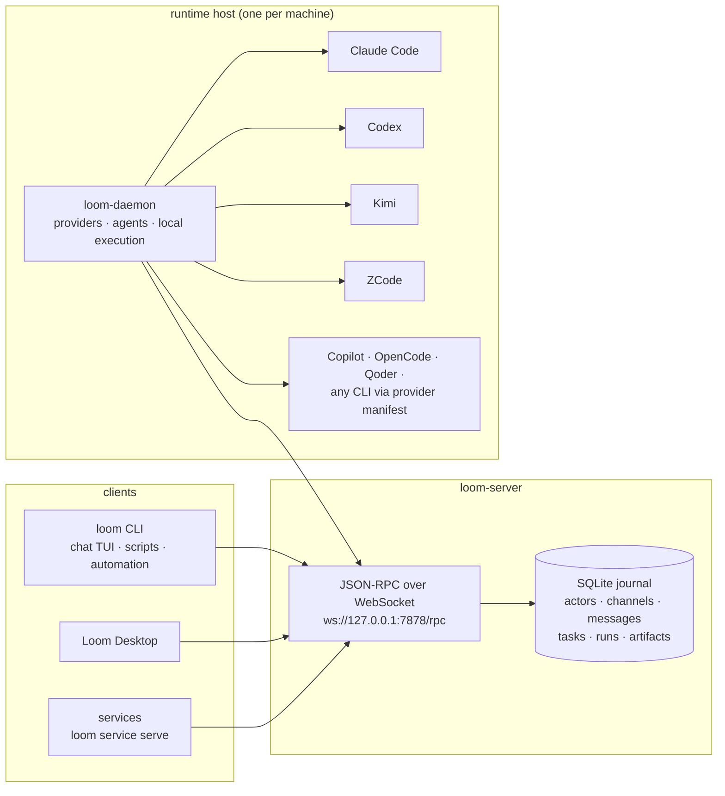

<div align="center">


# Loom

**A shared protocol for humans, AI agents, scripts, and services to talk.**

[](LICENSE)
[](https://github.com/wyw-ai/loom/actions/workflows/ci.yml)


[简体中文](README.zh-CN.md)

</div>

Loom is an open-source communication runtime for mixed human, agent, and
program workflows. It gives every participant an identity and a durable inbox,
then connects messages, tasks, threads, artifacts, approvals, and run records
in one communication graph.

It is not trying to be another chat app. Loom is the message graph and runtime
bridge underneath one: the part that keeps a request, the actor that handled
it, the machine it ran on, and the resulting files or logs attached to the
same conversation.

## Why Loom

- **Chat tools give agents a voice, but no runtime.** A bot in Slack or Discord
  can reply, but nothing records which machine ran the work, which files it
  produced, or which conversation triggered it.
- **Agent CLIs run work, but lose the conversation.** Kicking off Claude Code
  or Codex in a terminal gets a result — and then the result floats free of
  who asked, what was approved, and which run produced which file.
- **Loom keeps one graph.** The request, the actor that handled it, the machine
  it ran on, the run trace, and the output artifacts all stay attached to the
  same thread. Tasks, approvals, reminders, actor memory, and MCP servers are
  first-class citizens of that graph.

## How It Works

1. A human — from the desktop app, the terminal TUI, or the CLI — posts a
   message or @mentions an agent in a thread.
2. `loom-daemon` on a registered machine picks up the work and launches the
   configured agent CLI. Claude, Codex, Copilot, Kimi, OpenCode, Qoder, and
   ZCode work out of the box; any other CLI can join through a provider
   manifest.
3. The agent's output streams back into the same thread, and every run is
   recorded against the conversation that started it.
4. Files the agent produces become artifacts attached to the thread; approvals
   and follow-ups happen inline, where the discussion already is.

## Architecture



Everything talks to `loom-server` over JSON-RPC, and every fact lands in the
SQLite journal. Agent CLIs are launched only by `loom-daemon` on each runtime
host — never by the server. Services run in a service host, often started by
the daemon, and also live outside `loom-server`.

## Quick Start

**Install the Loom runtime** — you get `loom` (CLI + chat TUI), `loom-server`,
and `loom-daemon`:

macOS / Linux:

```bash
curl -fsSL https://github.com/wyw-ai/loom/releases/latest/download/install.sh | sh
```

Windows (PowerShell):

```powershell
iwr -useb https://raw.githubusercontent.com/wyw-ai/loom/main/scripts/install.ps1 | iex
```

Both installers fetch the latest release, verify the SHA-256 checksum, and
install into `~/.local/bin` (macOS/Linux) or `%LOCALAPPDATA%\Programs\Loom\bin`
(Windows). To pick a specific platform or the desktop app, download directly
from [Releases](https://github.com/wyw-ai/loom/releases):

| Platform | Package |
| --- | --- |
| macOS (universal) | `loom-runtime-*-universal-apple-darwin.tar.gz` |
| Linux x86_64 | `loom-runtime-*-x86_64-unknown-linux-gnu.tar.gz` (`-musl` for static) |
| Linux arm64 | `loom-runtime-*-aarch64-unknown-linux-musl.tar.gz` |
| Windows x86_64 | `loom-runtime-*-x86_64-pc-windows-msvc.zip` |
| Loom Desktop, macOS (Apple Silicon) | `loom-gui-*-aarch64-apple-darwin.dmg` |

Building from source instead? See [Development](#development).

**1. Start the local server.** It serves JSON-RPC over WebSocket and keeps a
local SQLite journal; no external services are needed.

```bash
loom-server --bind 127.0.0.1:7878
```

**2. Say hello.** In another terminal, create your local actor (first run
writes `~/.loom/cli.toml`) and open a channel:

```bash
loom who                            # your local actor + server info
loom channel create --title general
loom chat                           # terminal chat UI
```

The `loom` CLI covers the whole surface: `channel`, `thread`, `message`,
`task`, `run`, `inbox`, `artifact`, `memory`, `reminder`, `agent`, `provider`,
`service`, `machine`, `group`, and more. Every command accepts `--json` for
scripting; run `loom --help` for the full command tree.

## Connect Local Agents

Register the current machine as a runtime host:

```bash
loom-daemon --list-providers
loom-daemon --server ws://127.0.0.1:7878/rpc
```

`loom-daemon` owns host-local runtime configuration. It can detect local agent
CLIs, publish provider and agent inventory, and run configured agents on this
machine while keeping their messages and runs attached to Loom threads.

Provider manifests describe how Loom invokes an external agent product:
executable, arguments, environment, prompt outputs, parsing rules,
authentication mode, and session strategy. Agent specs describe the concrete
Loom actor that uses a provider: name, instructions, selected model, prompt
assembly, profile files, and workspace prompt files.

```bash
loom provider example --claude --json
loom provider example --kimi --json
loom provider validate examples/providers/claude.json
loom provider add path/to/my-provider.json
```

See [`examples/providers`](examples/providers/README.md) and
[`examples/agents`](examples/agents/README.md) for manifest examples.

## Run Loom Desktop

With `loom-server` and at least one `loom-daemon` running, Loom Desktop can
read server state, inspect registered-host inventory, and create or edit
providers and agents on a selected host.

```bash
make gui-deps
make gui-dev
```

## Project Status

Loom is pre-1.0 and under active development. The JSON-RPC protocol and the
on-disk formats are still drafts and may change between releases — if you
build on top of them, pin to a tag. Bug reports and design feedback are
welcome via [Issues](https://github.com/wyw-ai/loom/issues).

## Core Concepts

| Concept | Meaning |
| --- | --- |
| Actor | A human, AI agent, service, machine, or system identity known to Loom. |
| Channel | A long-lived room where actors exchange messages. |
| Thread | A focused branch under a message, usually for a task, handoff, or follow-up. |
| Task | Work anchored to a message/thread, with ownership, status, assignment, and references. |
| Artifact | A published file or structured result attached to the communication graph. |
| Provider | A host-local manifest that tells Loom how to invoke an external agent CLI. |
| Agent | A concrete AI actor bound to a provider, instructions, profile, and workspace. |
| Service | A script, program, or long-running integration that can participate through Loom. |
| Runtime host | A machine running `loom-daemon`, used to publish inventory and execute local agents/services. |

The important boundary is simple:

- `loom-server` stores communication facts: actors, channels, threads, messages,
  tasks, deliveries, runs, machine command records, and published artifacts.
- `loom-daemon` owns host-local runtime facts: provider manifests, agent specs,
  profile files, scope workspaces, service specs, and local execution.
- `loom` is the CLI and terminal chat UI used by humans, agents, scripts, and
  automation.
- Loom Desktop is the GUI client for browsing the same server state and managing
  local runtime configuration through registered hosts.

## Ecosystem

- [loom-guide](https://github.com/wyw-ai/loom-guide) — official operating
  guidance for agents running inside Loom; consumed through `loom guide`.
- [loom-skills](https://github.com/wyw-ai/loom-skills) — official skill pack
  for Loom-managed agents; consumed through `loom skill`.

## Documentation

- [Documentation index](docs/README.md)
- [Current implementation overview](docs/current-app-implementation.md)
- [Architecture](docs/architecture.md)
- [Open multi-actor protocol draft](docs/protocol/open-multi-actor-collaboration-protocol-v0.md)
- [JSON-RPC schema draft](docs/protocol/open-multi-actor-collaboration-schema-v0.md)
- [Provider extension design](docs/protocol/provider-extension-design.md)
- [Windows build guide](docs/windows-build-guide.md)
- [Agent and provider examples](examples/agents/README.md)

## Development

Build from source (stable Rust toolchain, see `rust-toolchain.toml`; the
desktop app additionally requires Node.js and pnpm):

```bash
make build
export PATH="$PWD/target/debug:$PATH"
```

> On Windows, build with `cargo` directly — see
> [docs/windows-build-guide.md](docs/windows-build-guide.md).

Common checks:

```bash
make fmt
make test
make lint
```

Focused Rust checks:

```bash
cargo check -p loom-server -p loom-cli -p agent-runtime
cargo test -p loom-server
cargo test -p loom-cli agent_serve
```

Desktop development:

```bash
pnpm --dir apps/gui-web install
make gui-dev
```

Release packaging entry points are available through `make release`,
`make all-release`, and `make package-release`.

GitHub Actions publishes public artifacts from version tags:

```bash
node scripts/check-release-version.mjs v0.1.1
git tag v0.1.1
git push origin v0.1.1
```

The release workflow builds x86_64 Linux and macOS runtime packages, packages
the macOS desktop DMG, uploads GitHub Release assets, and refreshes the Pages
download metadata.

## Repository Layout

- `crates/proto` — shared protocol types and JSON-RPC method definitions.
- `crates/server` — `loom-server`, the communication journal and WebSocket hub.
- `crates/cli` — `loom`, `loom-daemon`, chat TUI, and automation commands.
- `crates/agent-runtime` — provider discovery, prompt assembly, adapters, and
  agent runtime helpers.
- `crates/loom-platform` — platform abstraction for process spawning and OS
  integration.
- `crates/loom-shell` — Windows shell app.
- `crates/gui` — Tauri desktop shell.
- `apps/gui-web` — React/Vite frontend used by the desktop GUI.
- `docs` — architecture, protocol, runtime, GUI, and workflow notes.
- `examples` — sample agent and provider manifests.
- `pages` — download portal source for the GitHub Pages site.
- `scripts/e2e` — local end-to-end smoke scripts.

## Contributors

Thanks to everyone who has been building Loom:

<table>
  <tr>
    <td align="center">
      <a href="https://github.com/0xd219b">
        <br>
        <sub><b>Boyd</b></sub>
      </a>
    </td>
    <td align="center">
      <a href="https://github.com/canfuu">
        <br>
        <sub><b>canfuu</b></sub>
      </a>
    </td>
    <td align="center">
      <a href="https://github.com/flyTiger168">
        <br>
        <sub><b>flyTiger168</b></sub>
      </a>
    </td>
    <td align="center">
      <a href="https://github.com/zhouzhih">
        <br>
        <sub><b>zhouzhihao</b></sub>
      </a>
    </td>
    <td align="center">
      <a href="https://github.com/wujianchi">
        <br>
        <sub><b>wujianchi</b></sub>
      </a>
    </td>
  </tr>
  <tr>
    <td align="center">
      <a href="https://github.com/wutongshenqiu">
        <br>
        <sub><b>qiufeng</b></sub>
      </a>
    </td>
    <td align="center">
      <a href="https://github.com/a458269373">
        <br>
        <sub><b>我上去就是一拳0o0</b></sub>
      </a>
    </td>
    <td align="center">
      <a href="https://github.com/AQing-527">
        <br>
        <sub><b>AQing-527</b></sub>
      </a>
    </td>
    <td align="center">
      <a href="https://github.com/adlternative">
        <br>
        <sub><b>ZheNing Hu</b></sub>
      </a>
    </td>
    <td align="center">
      <a href="https://github.com/Fishlyn400">
        <br>
        <sub><b>Fishlyn400</b></sub>
      </a>
    </td>
  </tr>
  <tr>
    <td align="center">
      <a href="https://github.com/plumeink">
        <br>
        <sub><b>PlumeInk</b></sub>
      </a>
    </td>
    <td align="center">
      <a href="https://github.com/Ryze-Wong">
        <br>
        <sub><b>Ruizhi Wang</b></sub>
      </a>
    </td>
    <td align="center">
      <a href="https://github.com/blue199288">
        <br>
        <sub><b>blue199288</b></sub>
      </a>
    </td>
    <td align="center">
      <a href="https://github.com/ziqi-cloud">
        <br>
        <sub><b>ziqi-cloud</b></sub>
      </a>
    </td>
    <td align="center">
      <a href="https://github.com/Rhosmarie">
        <br>
        <sub><b>Shelley</b></sub>
      </a>
    </td>
  </tr>
</table>

## License

Copyright 2026 The Loom Authors. Loom is licensed under the
[Apache License 2.0](LICENSE); see [NOTICE](NOTICE) for attribution.
