# Loom

[简体中文](README.zh-CN.md)


Loom is an open-source collaboration workspace and runtime for humans, AI
agents, machines, and services. It gives every participant the same protocol
surface for channels, threads, tasks, artifacts, approvals, and agent runs.

Most AI collaboration tools split conversation, runtime state, and operational
logs into separate places. Loom keeps them attached to the same message graph:
a human can discuss work in a channel, wake or assign an agent, inspect which
machine and provider will run it, and keep the result connected to the thread
where the work started.

> Status: Loom is an early pre-1.0 project. The protocol, runtime
> configuration, and Desktop UX are still changing. It is best suited for local
> experiments, protocol/runtime development, and product exploration.

## What You Can Do

- Run a local WebSocket JSON-RPC collaboration server.
- Use channels, threads, direct messages, mentions, and task-oriented delivery.
- Register machines as runtime hosts for local agents and services.
- Add provider manifests on a registered host for tools such as Claude, Codex,
  Copilot, OpenCode, and Qoder.
- Create concrete agents with their own identity, provider binding,
  instructions, prompt assembly, profile files, and scope workspaces.
- Use the CLI, terminal chat UI, or Loom Desktop against the same server.
- Keep messages, tasks, artifacts, run traces, and host-side workspace files
  connected to the collaboration context that produced them.

## Core Model

| Surface | What it does |
| --- | --- |
| `loom-server` | The protocol hub you connect everything to. It persists collaboration facts and fans events out over JSON-RPC/WebSocket, but does not read agent runtime config or start provider CLIs. |
| `loom-daemon` | The host process for a machine. It registers the machine with the server, owns host-local runtime config and data, publishes provider/agent inventory, and runs local agents. |
| `loom` | The command line and terminal chat UI. Humans use it directly; agents use it as a stable tool belt for messages, tasks, artifacts, memory, and workspace files. |
| Loom Desktop | The human-facing GUI. It reads server state and registered-host inventory, then sends machine commands to the selected host when creating or editing providers and agents. |
| Communication | Channels are long-lived shared rooms. Threads are focused branches under messages for task work or handoffs. Messages, tasks, deliveries, runs, and artifacts stay attached to that communication graph. |
| Actors Management | Loom treats humans, agents, services, machines, and system identities as actors. Registered Hosts, Providers, Agents, and Services are managed together here: a host advertises runtime capability, providers define external agent products, agents are concrete AI actors, and services are long-running integrations. |

The key boundary is intentional: communication facts live in `loom-server`;
runtime definitions, prompt files, profile data, scope workspaces, and local
execution live on registered hosts.

## Data Ownership

| Data | Owner |
| --- | --- |
| Actors, channels, threads, messages, tasks, deliveries, runs, machine command records | `loom-server`, persisted in its `--data-dir` SQLite journal |
| Published artifact bodies and server-side scope projections | `loom-server`, under its `--data-dir`; this is not the agent runtime workspace |
| Host identity and server connection | the daemon's local `LOOM_CONFIG_DIR/daemon.toml` |
| Custom ProviderManifest files | the target host's `LOOM_CONFIG_DIR/providers/<provider_id>.json` |
| AgentSpec files | the target host's `LOOM_CONFIG_DIR/agents/<actor_id>/spec.json` |
| Agent profile files and channel-scoped workspace files | the target host's data root, defaulting to `~/.agentx` |
| ServiceSpec files and private service state | the service host; specs come from `LOOM_CONFIG_DIR/services`, while cursors/dedupe/logs live under the service-host data root |

## Quick Start

Build the core binaries:

```bash
make build
export PATH="$PWD/target/debug:$PATH"
```

If you do not want to modify `PATH`, replace commands such as `loom-server`
with `./target/debug/loom-server`.

Start the collaboration server:

```bash
loom-server --bind 127.0.0.1:7878
```

In another terminal, initialize a local actor identity and create a channel.
The CLI defaults to `ws://127.0.0.1:7878/rpc` and stores local identity in
`~/.loom/cli.toml`.

```bash
loom who
loom channel create --title general
loom channel list
loom chat
```

Optionally register the current machine as a host for agents and services:

```bash
loom-daemon --list-providers
loom-daemon --server ws://127.0.0.1:7878/rpc
```

With `loom-server` and at least one `loom-daemon` running, the GUI can connect
to the same server, read registered-host inventory, and create agents on a
selected host.

Run Loom Desktop in development mode:

```bash
make gui-deps
make gui-dev
```

## Providers And Agents

Provider manifests describe how a host connects Loom to an agent product. They
own the runtime integration details: executable, arguments, environment
variables, prompt outputs, parsing rules, authentication mode, and session
strategy.

Agent specs describe the concrete Loom actor that uses a provider. They own the
human-facing identity, instructions, selected model, provider mode, prompt
assembly choices, profile files, and workspace prompt files.

Generate and validate provider examples:

```bash
loom provider example --claude --json
loom provider example --codex --json
loom provider validate examples/providers/claude.json
```

To add a provider on the current host, create a manifest with a non-built-in
provider id and register it:

```bash
loom provider add path/to/my-provider.json
```

See [`examples/providers`](examples/providers/README.md) and
[`examples/agents`](examples/agents/README.md) for current manifest shapes.

## Architecture

```mermaid
flowchart LR
  cli["loom CLI / chat TUI"] --> server["loom-server"]
  gui["Loom Desktop"] --> server
  daemon["loom-daemon"] --> server
  service["loom service serve"] --> server
  daemon --> runtime["agent-runtime"]
  runtime --> providers["local provider CLIs"]
  daemon --> hostdata["host config / AgentSpecs / profiles / scope workspaces"]
  service --> svcstate["ServiceSpecs / cursors / dedupe / logs"]
  server --> store["SQLite journal"]
  server --> files["server artifacts / scope projections"]
```



The server is deliberately not an agent launcher. Agent execution happens under
`loom-daemon`; service execution happens in a service host, often started by
the daemon. Both run outside `loom-server`.

## Documentation

- [Documentation index](docs/README.md)
- [Current implementation overview](docs/current-app-implementation.md)
- [Architecture](docs/architecture.md)
- [Open multi-actor collaboration protocol](docs/protocol/open-multi-actor-collaboration-protocol-v0.md)
- [JSON-RPC schema draft](docs/protocol/open-multi-actor-collaboration-schema-v0.md)
- [Provider extension design](docs/protocol/provider-extension-design.md)
- [Agent and provider examples](examples/agents/README.md)

## Repository Layout

- `crates/proto` - shared protocol types and JSON-RPC method definitions.
- `crates/server` - `loom-server`, the collaboration journal and WebSocket hub.
- `crates/cli` - `loom`, `loom-daemon`, chat TUI, and automation commands.
- `crates/agent-runtime` - provider discovery, prompt assembly, adapters, and
  agent runtime helpers.
- `crates/gui` - Tauri desktop shell.
- `apps/gui-web` - React/Vite frontend used by the desktop GUI.
- `docs` - architecture, protocol, runtime, GUI, and workflow notes.
- `examples` - sample agent and provider manifests.
- `scripts/e2e` - local end-to-end smoke scripts.

## Development

Common checks:

```bash
make fmt
make test
make lint
```

Focused Rust checks:

```bash
cargo check -p loom-server -p loom-cli -p agent-runtime
cargo test -p loom-server
cargo test -p loom-cli agent_serve
```

Desktop development:

```bash
pnpm --dir apps/gui-web install
make gui-dev
```

Release packaging entry points are available through `make release`,
`make all-release`, and `make package-release`.

## License

Loom is licensed under the [Apache License 2.0](LICENSE).
