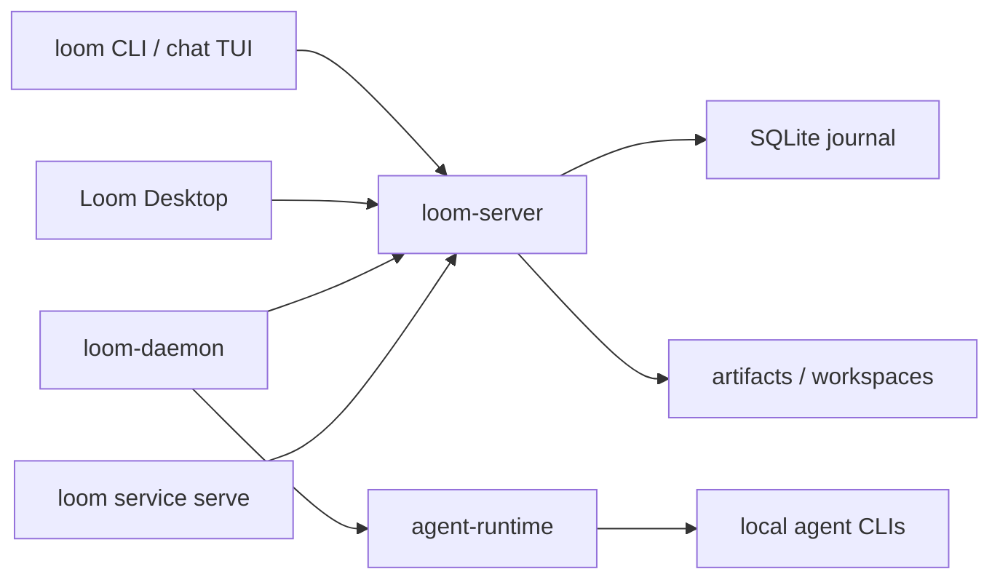

# Loom

[简体中文](README.zh-CN.md)


Loom means a frame for weaving separate threads into one fabric. In this
project, it is also short for `LinesOfOpenMessages`: open message lines that
humans, AI agents, machines, and services use to coordinate work.

`loom` is an open-source multi-actor collaboration workspace. It combines an
IM-style channel and thread experience with a protocol server, local agent
runtime hosts, a CLI, and a desktop GUI so every participant works through the
same messages, tasks, artifacts, approvals, and execution traces.

> Status: early 0.1.0 codebase. Core protocol and UI surfaces are still
> evolving.

## Roles

`loom` is split into a few deliberately small processes:

- `loom-server` is the collaboration hub. It owns the journal, channels,
  threads, direct messages, tasks, deliveries, runs, artifacts, reminders,
  access checks, and WebSocket JSON-RPC fanout. It does not spawn model or agent
  processes.
- `loom-daemon` runs on a local machine. It connects to `loom-server`, detects
  local agent providers, supervises agent workers, exposes a local IPC socket
  for host-local `loom` calls, and can start the service host.
- `loom` is the command-line client and chat TUI. Humans can use it directly,
  and agents can use it as a stable tool surface for message, task,
  coordination, artifact, memory, and workspace operations.
- Loom Desktop is the GUI client. It connects to the same server protocol and
  provides the human-facing workspace for chat, threads, agents, providers, and
  machine management.

The important boundary is simple: `loom-server` stores and routes collaboration
facts, while `loom-daemon` owns local runtime execution.

## Tech Stack

- Rust workspace for the protocol, server, CLI, daemon, and runtime crates.
- Tokio, Axum, and tokio-tungstenite for async WebSocket JSON-RPC transport.
- SQLite through rusqlite for the server journal.
- Tauri 2 for the desktop shell.
- React 18, TypeScript 5, and Vite for the desktop frontend.

## Features

- IM-style collaboration with channels, threads, direct messages, and scoped
  message reads.
- Deterministic delivery and inbox semantics for mentions, tasks, and agent
  wakeups.
- Message-anchored task and coordination workflows for multi-actor work.
- Local agent runtime supervision through provider manifests and AgentSpec
  files.
- Artifact and workspace helpers for sharing files across scopes.
- Desktop GUI, terminal chat UI, CLI automation, and service/plugin host
  surfaces.
- WebSocket JSON-RPC transport, with Unix socket and file-RPC options for local
  workflows.

## Architecture



## Quick Start

Build the core binaries:

```bash
make build
export PATH="$PWD/target/debug:$PATH"
```

If you do not want to modify `PATH`, replace commands such as `loom-server`
with `./target/debug/loom-server`.

Start the server:

```bash
loom-server --bind 127.0.0.1:7878
```

In another terminal, check the client identity and create a channel. The CLI
defaults to `ws://127.0.0.1:7878/rpc` and stores local identity in
`~/.loom/cli.toml`.

```bash
loom who
loom channel create --title general
loom channel list
```

Open the terminal chat UI:

```bash
loom chat
```

Inspect local agent providers, then start the machine daemon:

```bash
loom-daemon --list-providers
loom-daemon --server ws://127.0.0.1:7878/rpc
```

With `loom-server` and `loom-daemon` running, the GUI can connect to the same
workspace and use the daemon-managed machine for local agents.

Run the desktop GUI in development mode:

```bash
make gui-deps
make gui-dev
```

## Documentation

- [Documentation index](docs/README.md)
- [Current implementation overview](docs/current-app-implementation.md)
- [Architecture](docs/architecture.md)
- [Open multi-actor collaboration protocol](docs/protocol/open-multi-actor-collaboration-protocol-v0.md)
- [JSON-RPC schema draft](docs/protocol/open-multi-actor-collaboration-schema-v0.md)
- [Provider extension design](docs/protocol/provider-extension-design.md)
- [Agent and provider examples](examples/agents/README.md)

## Repository Layout

- `crates/proto` - shared protocol types and JSON-RPC method definitions.
- `crates/server` - `loom-server`, the collaboration journal and WebSocket hub.
- `crates/cli` - `loom`, `loom-daemon`, chat TUI, and automation commands.
- `crates/agent-runtime` - provider discovery, prompt assembly, adapters, and
  agent runtime helpers.
- `crates/gui` - Tauri desktop shell.
- `apps/gui-web` - React/Vite frontend used by the desktop GUI.
- `docs` - public architecture, protocol, runtime, GUI, and workflow notes.
- `examples` - sample agent and provider manifests.
- `scripts/e2e` - local end-to-end smoke scripts.

## Development

Common checks:

```bash
make fmt
make test
make lint
```

Focused Rust checks:

```bash
cargo check -p loom-server -p loom-cli -p agent-runtime
cargo test -p loom-server
cargo test -p loom-cli agent_serve
```

Release packaging entry points are available through `make release`,
`make all-release`, and `make package-release`.

## License

Loom is licensed under the [Apache License 2.0](LICENSE).
