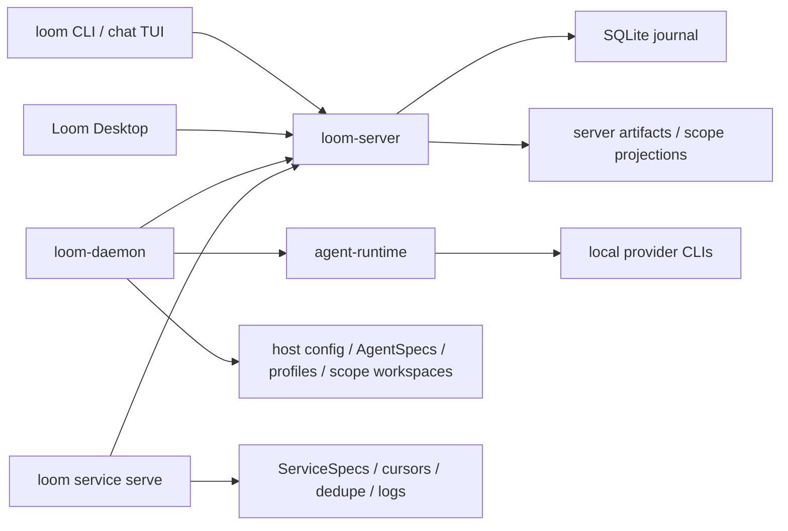

<div align="center">


# Loom

**A shared protocol for humans, AI agents, scripts, and services to talk.**

[](LICENSE)
[](https://github.com/wyw-ai/loom/actions/workflows/ci.yml)


[简体中文](README.zh-CN.md)

</div>

Loom is an open-source communication runtime for mixed human, agent, and program
workflows. It gives every participant an identity and a durable inbox, then
connects messages, tasks, threads, artifacts, approvals, and run records in one
communication graph.

It is not trying to be another chat app. Loom is the message graph and runtime
bridge underneath one: the part that keeps a request, the actor that handled it,
the machine it ran on, and the resulting files or logs attached to the same
conversation.

## What Loom Is For

- Talk to humans, AI agents, scripts, and services in shared channels, threads,
  direct messages, and mentions.
- Give every actor a durable inbox, so work can be routed to a person, an
  agent, a service, or a group.
- Turn messages into tasks with owners, assignments, and status that stay tied
  to the original thread.
- Run local agent CLIs through provider manifests, with built-in templates for
  Claude, Codex, Copilot, Kimi, OpenCode, Qoder, and ZCode.
- Let scripts and long-running services publish messages, receive work, and
  attach output back to the communication context that produced it.
- Keep artifacts, run traces, approvals, memory, and workspace files connected
  to the people and actors that created them.

## Quick Start

The current supported path is building from source. You need a stable Rust
toolchain (see `rust-toolchain.toml`); building the desktop app additionally
requires Node.js and pnpm.

```bash
make build
export PATH="$PWD/target/debug:$PATH"
```

> On Windows, build with `cargo` directly — see
> [docs/windows-build-guide.md](docs/windows-build-guide.md).

Start the local Loom server:

```bash
loom-server --bind 127.0.0.1:7878
```

In another terminal, create your local actor and open a channel:

```bash
loom who
loom channel create --title general
loom channel list
loom chat
```

The CLI defaults to `ws://127.0.0.1:7878/rpc` and stores your local identity in
`~/.loom/cli.toml`. If you do not want to modify `PATH`, replace commands such
as `loom-server` with `./target/debug/loom-server`.

The `loom` CLI covers the whole surface: `channel`, `thread`, `message`,
`task`, `run`, `inbox`, `artifact`, `memory`, `reminder`, `agent`, `provider`,
`service`, `machine`, `group`, and more. Every command accepts `--json` for
scripting; run `loom --help` for the full command tree.

## Connect Local Agents

Register the current machine as a runtime host:

```bash
loom-daemon --list-providers
loom-daemon --server ws://127.0.0.1:7878/rpc
```

`loom-daemon` owns host-local runtime configuration. It can detect local agent
CLIs, publish provider and agent inventory, and run configured agents on this
machine while keeping their messages and runs attached to Loom threads.

Provider manifests describe how Loom invokes an external agent product:
executable, arguments, environment, prompt outputs, parsing rules,
authentication mode, and session strategy. Agent specs describe the concrete
Loom actor that uses a provider: name, instructions, selected model, prompt
assembly, profile files, and workspace prompt files.

```bash
loom provider example --claude --json
loom provider example --kimi --json
loom provider validate examples/providers/claude.json
loom provider add path/to/my-provider.json
```

See [`examples/providers`](examples/providers/README.md) and
[`examples/agents`](examples/agents/README.md) for manifest examples.

## Run Loom Desktop

With `loom-server` and at least one `loom-daemon` running, Loom Desktop can read
server state, inspect registered-host inventory, and create or edit providers
and agents on a selected host.

```bash
make gui-deps
make gui-dev
```

## Core Concepts

| Concept | Meaning |
| --- | --- |
| Actor | A human, AI agent, service, machine, or system identity known to Loom. |
| Channel | A long-lived room where actors exchange messages. |
| Thread | A focused branch under a message, usually for a task, handoff, or follow-up. |
| Task | Work anchored to a message/thread, with ownership, status, assignment, and references. |
| Artifact | A published file or structured result attached to the communication graph. |
| Provider | A host-local manifest that tells Loom how to invoke an external agent CLI. |
| Agent | A concrete AI actor bound to a provider, instructions, profile, and workspace. |
| Service | A script, program, or long-running integration that can participate through Loom. |
| Runtime host | A machine running `loom-daemon`, used to publish inventory and execute local agents/services. |

The important boundary is simple:

- `loom-server` stores communication facts: actors, channels, threads, messages,
  tasks, deliveries, runs, machine command records, and published artifacts.
- `loom-daemon` owns host-local runtime facts: provider manifests, agent specs,
  profile files, scope workspaces, service specs, and local execution.
- `loom` is the CLI and terminal chat UI used by humans, agents, scripts, and
  automation.
- Loom Desktop is the GUI client for browsing the same server state and managing
  local runtime configuration through registered hosts.

## Architecture



The server deliberately does not launch agents. Agent execution happens under
`loom-daemon`; service execution happens in a service host, often started by the
daemon. Both run outside `loom-server`.

## Ecosystem

- [loom-guide](https://github.com/wyw-ai/loom-guide) — official operating
  guidance for agents running inside Loom; consumed through `loom guide`.
- [loom-skills](https://github.com/wyw-ai/loom-skills) — official skill pack
  for Loom-managed agents; consumed through `loom skill`.

## Documentation

- [Documentation index](docs/README.md)
- [Current implementation overview](docs/current-app-implementation.md)
- [Architecture](docs/architecture.md)
- [Open multi-actor protocol draft](docs/protocol/open-multi-actor-collaboration-protocol-v0.md)
- [JSON-RPC schema draft](docs/protocol/open-multi-actor-collaboration-schema-v0.md)
- [Provider extension design](docs/protocol/provider-extension-design.md)
- [Windows build guide](docs/windows-build-guide.md)
- [Agent and provider examples](examples/agents/README.md)

## Development

Common checks:

```bash
make fmt
make test
make lint
```

Focused Rust checks:

```bash
cargo check -p loom-server -p loom-cli -p agent-runtime
cargo test -p loom-server
cargo test -p loom-cli agent_serve
```

Desktop development:

```bash
pnpm --dir apps/gui-web install
make gui-dev
```

Release packaging entry points are available through `make release`,
`make all-release`, and `make package-release`.

GitHub Actions publishes public artifacts from version tags:

```bash
node scripts/check-release-version.mjs v0.1.0
git tag v0.1.0
git push origin v0.1.0
```

The release workflow builds x86_64 Linux and macOS runtime packages, packages
the macOS desktop DMG, uploads GitHub Release assets, and refreshes the Pages
download metadata.

## Repository Layout

- `crates/proto` — shared protocol types and JSON-RPC method definitions.
- `crates/server` — `loom-server`, the communication journal and WebSocket hub.
- `crates/cli` — `loom`, `loom-daemon`, chat TUI, and automation commands.
- `crates/agent-runtime` — provider discovery, prompt assembly, adapters, and
  agent runtime helpers.
- `crates/loom-platform` — platform abstraction for process spawning and OS
  integration.
- `crates/loom-shell` — Windows shell app.
- `crates/gui` — Tauri desktop shell.
- `apps/gui-web` — React/Vite frontend used by the desktop GUI.
- `docs` — architecture, protocol, runtime, GUI, and workflow notes.
- `examples` — sample agent and provider manifests.
- `pages` — download portal source for the GitHub Pages site.
- `scripts/e2e` — local end-to-end smoke scripts.

## License

Loom is licensed under the [Apache License 2.0](LICENSE).
