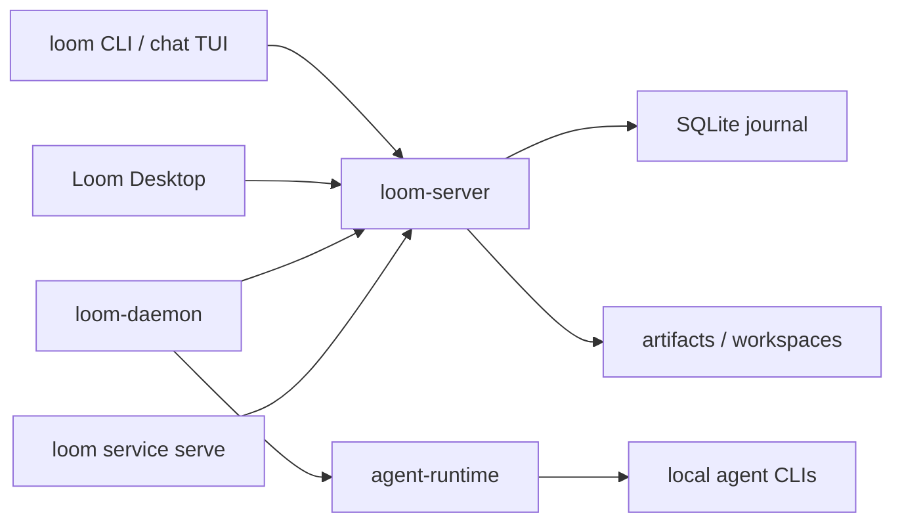

# Loom

[English](README.md)


Loom 的表层含义是织布机：把一根根线织成一块布。在这个项目里，Loom 也来自
`LinesOfOpenMessages`，表示由开放消息线交织出来的人、AI agent、机器和服务之间的
协作网络。

`loom` 是一个开源的多 actor 协作工作台。它把 IM 风格的频道和 thread 体验、协议
server、本机 agent runtime host、CLI 和桌面 GUI 放在同一套协作模型里，让每个参与者
都通过同一组消息、任务、artifact、审批和执行轨迹来工作。

> 状态：当前仍是早期 0.1.0 代码库，核心协议和 UI 形态还在演进。

## 进程定位

`loom` 被拆成几个边界清晰的小进程：

- `loom-server` 是协作枢纽。它负责 journal、频道、thread、私信、任务、投递、run、
  artifact、提醒、权限校验和 WebSocket JSON-RPC fanout。它不启动模型或 agent 进程。
- `loom-daemon` 运行在本机。它连接 `loom-server`，探测本机 agent provider，托管
  agent worker，给本机 `loom` 调用暴露 IPC socket，也可以启动 service host。
- `loom` 是命令行客户端和 chat TUI。人可以直接使用它，agent 也可以把它作为稳定工具面
  来做消息、任务、协作、artifact、memory 和 workspace 操作。
- Loom Desktop 是 GUI 客户端。它连接同一套 server 协议，提供面向人的聊天、thread、
  agent、provider 和机器管理界面。

核心边界很简单：`loom-server` 存储并路由协作事实，`loom-daemon` 负责本机 runtime
执行。

## 技术栈

- Rust workspace 承载协议、server、CLI、daemon 和 runtime crate。
- Tokio、Axum 和 tokio-tungstenite 负责异步 WebSocket JSON-RPC transport。
- server journal 使用 rusqlite 访问 SQLite。
- 桌面壳使用 Tauri 2。
- 桌面前端使用 React 18、TypeScript 5 和 Vite。

## 功能

- IM 风格协作：频道、thread、私信和按 scope 读取消息。
- 面向 mention、任务和 agent 唤醒的确定性 delivery / inbox 语义。
- 以消息为锚点的任务和多 actor 协作流程。
- 通过 ProviderManifest 和 AgentSpec 托管本机 agent runtime。
- 面向不同 scope 的 artifact 和 workspace 文件辅助能力。
- 桌面 GUI、终端 chat UI、CLI 自动化和 service/plugin host。
- WebSocket JSON-RPC transport，并提供 Unix socket 和 file-RPC 等本地工作流选项。

## 架构



## 快速开始

构建核心二进制：

```bash
make build
export PATH="$PWD/target/debug:$PATH"
```

如果不想修改 `PATH`，可以把下面的 `loom-server` 替换成
`./target/debug/loom-server`，其他二进制同理。

启动 server：

```bash
loom-server --bind 127.0.0.1:7878
```

另开一个终端，检查 CLI 身份并创建频道。CLI 默认连接
`ws://127.0.0.1:7878/rpc`，本机身份会保存到 `~/.loom/cli.toml`。

```bash
loom who
loom channel create --title general
loom channel list
```

打开终端聊天界面：

```bash
loom chat
```

查看本机可用 agent provider，然后启动 machine daemon：

```bash
loom-daemon --list-providers
loom-daemon --server ws://127.0.0.1:7878/rpc
```

当 `loom-server` 和 `loom-daemon` 都在运行时，GUI 可以连接到同一个 workspace，并使用
daemon 管理的本机 agent。

以开发模式运行桌面 GUI：

```bash
make gui-deps
make gui-dev
```

## 文档

- [文档索引](docs/README.md)
- [当前实现总览](docs/current-app-implementation.md)
- [架构说明](docs/architecture.md)
- [开放多 actor 协作协议](docs/protocol/open-multi-actor-collaboration-protocol-v0.md)
- [JSON-RPC schema 草案](docs/protocol/open-multi-actor-collaboration-schema-v0.md)
- [Provider 扩展设计](docs/protocol/provider-extension-design.md)
- [Agent 和 provider 示例](examples/agents/README.md)

## 仓库结构

- `crates/proto` - 共享协议类型和 JSON-RPC method 定义。
- `crates/server` - `loom-server`，协作 journal 和 WebSocket hub。
- `crates/cli` - `loom`、`loom-daemon`、chat TUI 和自动化命令。
- `crates/agent-runtime` - provider 探测、prompt 组装、adapter 和 agent runtime 辅助逻辑。
- `crates/gui` - Tauri 桌面壳。
- `apps/gui-web` - 桌面 GUI 使用的 React/Vite 前端。
- `docs` - 公开的架构、协议、runtime、GUI 和 workflow 文档。
- `examples` - agent 和 provider manifest 示例。
- `scripts/e2e` - 本地端到端 smoke 脚本。

## 开发

常用检查：

```bash
make fmt
make test
make lint
```

聚焦 Rust 检查：

```bash
cargo check -p loom-server -p loom-cli -p agent-runtime
cargo test -p loom-server
cargo test -p loom-cli agent_serve
```

发布打包入口包括 `make release`、`make all-release` 和 `make package-release`。

## 许可证

Loom 使用 [Apache License 2.0](LICENSE) 开源协议。
