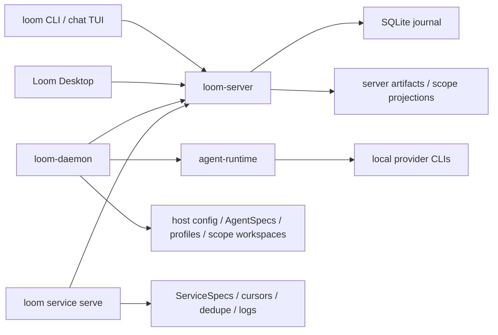

# Loom

[English](README.md)


Loom 是一个开源的协作工作台和运行时，用来让人、AI agent、机器和服务在同一套协议里
协作。它把频道、thread、任务、artifact、审批和 agent 运行记录放进同一套协作协议。

很多 AI 协作工具会把对话、运行状态和操作日志拆在不同地方。Loom 的核心思路是把它们
绑定在同一张消息图上：人可以在频道里讨论工作，唤醒或指派 agent，查看它会在哪台机器
上用哪个 provider 运行，并把结果继续留在发起工作的 thread 里。

> 状态：Loom 仍是早期 pre-1.0 项目。协议、runtime 配置和 Desktop UX 还在变化中。
> 当前更适合本地实验、协议/runtime 开发和产品形态探索，不建议作为生产关键协作系统使用。

## 可以做什么

- 启动本地 WebSocket JSON-RPC 协作 server。
- 使用频道、thread、私信、mention 和面向任务的投递模型。
- 把机器注册成 runtime host，用来运行本机 agent 和 service。
- 在 registered host 上为 Claude、Codex、Copilot、OpenCode、Qoder 等工具添加 provider
  manifest。
- 创建具体 agent，并配置它自己的身份、provider 绑定、instructions、prompt 组装和
  profile 文件、scope workspace。
- 用 CLI、终端 chat UI 或 Loom Desktop 连接同一个 server。
- 让消息、任务、artifact、运行轨迹和 host 侧 workspace 文件都能回到产生它们的协作上下文。

## 核心模型

| 入口 / 区域 | 作用 |
| --- | --- |
| `loom-server` | 所有端连接的协议枢纽。它持久化协作事实，并通过 JSON-RPC/WebSocket fanout 事件，但不读取 agent runtime 配置，也不启动 provider CLI。 |
| `loom-daemon` | 一台机器上的 host 进程。它把机器注册到 server，拥有 host-local runtime 配置和数据，发布 provider / agent inventory，并运行本机 agent。 |
| `loom` | 命令行和终端 chat UI。人可以直接用；agent 也把它当作稳定工具带，用来处理消息、任务、artifact、memory 和 workspace 文件。 |
| Loom Desktop | 面向人的 GUI。它读取 server 状态和 registered-host inventory；创建或编辑 provider / agent 时，向选中的 host 发送 machine command。 |
| Communication | Channel 是长期共享房间；thread 是某条消息下面的聚焦分支，用来承载任务或 handoff。Message、task、delivery、run、artifact 都挂在这张通信图上。 |
| Actors Management | Loom 把人、agent、service、machine、system 都视为 actor。Registered Host、Provider、Agent、Service 在这里一起管理：host 表示运行承载能力，provider 定义外部 agent 产品接入，agent 是具体 AI actor，service 是长运行集成。 |

最重要的运行边界是：通信事实属于 `loom-server`；runtime 定义、prompt 文件、profile
数据、scope workspace 和本机执行属于 registered host。

## 数据归属

| 数据 | 归属 |
| --- | --- |
| Actor、channel、thread、message、task、delivery、run、machine command 记录 | `loom-server`，持久化在它的 `--data-dir` SQLite journal 中 |
| 已发布 artifact 文件和 server 侧 scope projection | `loom-server`，位于它的 `--data-dir` 下；这不是 agent runtime workspace |
| Host 身份和 server 连接 | daemon 本机的 `LOOM_CONFIG_DIR/daemon.toml` |
| 自定义 ProviderManifest 文件 | 目标 host 的 `LOOM_CONFIG_DIR/providers/<provider_id>.json` |
| AgentSpec 文件 | 目标 host 的 `LOOM_CONFIG_DIR/agents/<actor_id>/spec.json` |
| Agent profile 文件和 channel-scoped workspace 文件 | 目标 host 的 data root，默认是 `~/.agentx` |
| ServiceSpec 文件和 service 私有状态 | service host；spec 默认来自 `LOOM_CONFIG_DIR/services`，cursor/dedupe/logs 位于 service-host data root |

## 快速开始

构建核心二进制：

```bash
make build
export PATH="$PWD/target/debug:$PATH"
```

如果不想修改 `PATH`，可以把下面的 `loom-server` 替换成
`./target/debug/loom-server`，其他二进制同理。

启动协作 server：

```bash
loom-server --bind 127.0.0.1:7878
```

另开一个终端，初始化本地 actor 身份并创建频道。CLI 默认连接
`ws://127.0.0.1:7878/rpc`，本机身份会保存到 `~/.loom/cli.toml`。

```bash
loom who
loom channel create --title general
loom channel list
loom chat
```

可选：把当前机器注册成 agent / service 的运行 host：

```bash
loom-daemon --list-providers
loom-daemon --server ws://127.0.0.1:7878/rpc
```

当 `loom-server` 和至少一个 `loom-daemon` 在运行时，GUI 就可以连接同一个 server，
读取 registered-host inventory，并在选中的 host 上创建 agent。

以开发模式运行 Loom Desktop：

```bash
make gui-deps
make gui-dev
```

## Provider 和 Agent

Provider manifest 描述某台 host 如何让 Loom 对接一款 agent 产品。它负责 runtime
接入细节：executable、arguments、environment variables、prompt outputs、解析规则、
鉴权方式和 session 策略。

Agent spec 描述使用某个 provider 的具体 Loom actor。它负责面向人的身份、instructions、
模型选择、provider mode、prompt 组装选择、profile 文件和 workspace prompt 文件。

生成和校验 provider 示例：

```bash
loom provider example --claude --json
loom provider example --codex --json
loom provider validate examples/providers/claude.json
```

如果要在当前 host 添加 provider，需要创建一个不与内置 provider 重名的 manifest，然后注册它：

```bash
loom provider add path/to/my-provider.json
```

当前 manifest 形态见 [`examples/providers`](examples/providers/README.md) 和
[`examples/agents`](examples/agents/README.md)。

## 架构



server 有意不负责启动 agent。agent 执行发生在 `loom-daemon` 下；service 执行发生在
service host 中，通常可以由 daemon 启动。两者都在 `loom-server` 外部运行。

## 文档

- [文档索引](docs/README.md)
- [当前实现总览](docs/current-app-implementation.md)
- [架构说明](docs/architecture.md)
- [开放多 actor 协作协议](docs/protocol/open-multi-actor-collaboration-protocol-v0.md)
- [JSON-RPC schema 草案](docs/protocol/open-multi-actor-collaboration-schema-v0.md)
- [Provider 扩展设计](docs/protocol/provider-extension-design.md)
- [Agent 和 provider 示例](examples/agents/README.md)

## 仓库结构

- `crates/proto` - 共享协议类型和 JSON-RPC method 定义。
- `crates/server` - `loom-server`，协作 journal 和 WebSocket hub。
- `crates/cli` - `loom`、`loom-daemon`、chat TUI 和自动化命令。
- `crates/agent-runtime` - provider 探测、prompt 组装、adapter 和 agent runtime 辅助逻辑。
- `crates/gui` - Tauri 桌面壳。
- `apps/gui-web` - 桌面 GUI 使用的 React/Vite 前端。
- `docs` - 架构、协议、runtime、GUI 和 workflow 文档。
- `examples` - agent 和 provider manifest 示例。
- `scripts/e2e` - 本地端到端 smoke 脚本。

## 开发

常用检查：

```bash
make fmt
make test
make lint
```

聚焦 Rust 检查：

```bash
cargo check -p loom-server -p loom-cli -p agent-runtime
cargo test -p loom-server
cargo test -p loom-cli agent_serve
```

桌面开发：

```bash
pnpm --dir apps/gui-web install
make gui-dev
```

发布打包入口包括 `make release`、`make all-release` 和 `make package-release`。

## 许可证

Loom 使用 [Apache License 2.0](LICENSE) 开源协议。
