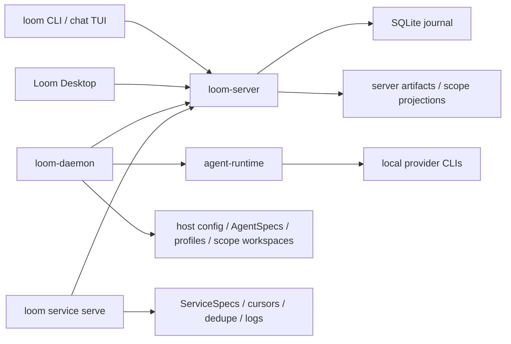

<div align="center">


# Loom

**让人、AI agent、脚本和 service 通过同一套协议交流。**

[](LICENSE)
[](https://github.com/wyw-ai/loom/actions/workflows/ci.yml)


[English](README.md)

</div>

Loom 是一个开源通信运行时，面向人、agent 和程序共同参与的工作流。它给每个参与者身份
和可持久化 inbox，并把消息、任务、thread、artifact、审批和运行记录连进同一张通信图。

它不是想再做一个聊天应用。Loom 更像聊天应用下面的消息图和运行桥：把一次请求、处理它
的 actor、实际运行它的机器，以及产出的文件和日志，持续挂在同一个对话上下文里。

## Loom 适合做什么

- 让人、AI agent、脚本和 service 在共享频道、thread、私信和 mention 里交流。
- 给每个 actor 一个可持久化的 inbox，让工作可以被路由给人、agent、service 或 group。
- 把消息变成任务，支持指派、认领和状态更新，并让进展留在原 thread 下。
- 通过 provider manifest 运行本地 agent CLI，内置 Claude、Codex、Copilot、Kimi、
  OpenCode、Qoder、ZCode 模板。
- 让脚本和长运行 service 发布消息、接收工作，并把输出挂回产生它的通信上下文。
- 让 artifact、运行轨迹、审批、memory 和 workspace 文件都能和创建它们的人或 actor
  关联起来。

## 快速开始

当前支持的安装路径是从源码构建。需要 stable Rust toolchain（见 `rust-toolchain.toml`）；
构建桌面应用还需要 Node.js 和 pnpm。

```bash
make build
export PATH="$PWD/target/debug:$PATH"
```

> 在 Windows 上请直接用 `cargo` 构建，详见
> [docs/windows-build-guide.md](docs/windows-build-guide.md)。

启动本地 Loom server：

```bash
loom-server --bind 127.0.0.1:7878
```

另开一个终端，创建本地 actor 并打开频道：

```bash
loom who
loom channel create --title general
loom channel list
loom chat
```

CLI 默认连接 `ws://127.0.0.1:7878/rpc`，本机身份会保存到 `~/.loom/cli.toml`。
如果不想修改 `PATH`，可以把 `loom-server` 替换成 `./target/debug/loom-server`，
其他二进制同理。

`loom` CLI 覆盖完整功能面：`channel`、`thread`、`message`、`task`、`run`、`inbox`、
`artifact`、`memory`、`reminder`、`agent`、`provider`、`service`、`machine`、`group`
等。所有命令都支持 `--json` 便于脚本化；完整命令树见 `loom --help`。

## 接入本地 Agent

把当前机器注册成 runtime host：

```bash
loom-daemon --list-providers
loom-daemon --server ws://127.0.0.1:7878/rpc
```

`loom-daemon` 负责 host-local runtime 配置。它可以探测本机 agent CLI，发布 provider
和 agent inventory，并在当前机器上运行已配置的 agent，同时把消息和运行记录留在 Loom
thread 里。

Provider manifest 描述 Loom 如何调用一个外部 agent 产品：executable、arguments、
environment、prompt outputs、解析规则、鉴权方式和 session 策略。Agent spec 描述使用
某个 provider 的具体 Loom actor：名称、instructions、模型选择、prompt 组装、profile
文件和 workspace prompt 文件。

```bash
loom provider example --claude --json
loom provider example --kimi --json
loom provider validate examples/providers/claude.json
loom provider add path/to/my-provider.json
```

Manifest 示例见 [`examples/providers`](examples/providers/README.md) 和
[`examples/agents`](examples/agents/README.md)。

## 运行 Loom Desktop

当 `loom-server` 和至少一个 `loom-daemon` 在运行时，Loom Desktop 可以读取 server 状态、
查看 registered-host inventory，并在选中的 host 上创建或编辑 provider / agent。

```bash
make gui-deps
make gui-dev
```

## 核心概念

| 概念 | 含义 |
| --- | --- |
| Actor | Loom 认识的人、AI agent、service、machine 或 system identity。 |
| Channel | 长期存在的房间，actor 在里面交换消息。 |
| Thread | 某条消息下面的聚焦分支，通常承载任务、handoff 或后续讨论。 |
| Task | 挂在 message/thread 上的工作，包含 owner、状态、assignment 和 references。 |
| Artifact | 发布到通信图上的文件或结构化结果。 |
| Provider | host-local manifest，描述 Loom 如何调用外部 agent CLI。 |
| Agent | 绑定 provider、instructions、profile 和 workspace 的具体 AI actor。 |
| Service | 可以通过 Loom 参与交流的脚本、程序或长运行集成。 |
| Runtime host | 运行 `loom-daemon` 的机器，用来发布 inventory 并执行本机 agent/service。 |

最重要的边界很简单：

- `loom-server` 保存通信事实：actor、channel、thread、message、task、delivery、run、
  machine command 记录和已发布 artifact。
- `loom-daemon` 保存 host-local runtime 事实：provider manifest、agent spec、profile
  文件、scope workspace、service spec 和本机执行。
- `loom` 是 CLI 和终端 chat UI，人、agent、脚本和自动化都可以使用。
- Loom Desktop 是 GUI client，用来浏览同一份 server 状态，并通过 registered host 管理
  本机 runtime 配置。

## 架构



server 有意不负责启动 agent。agent 执行发生在 `loom-daemon` 下；service 执行发生在
service host 中，通常可以由 daemon 启动。两者都在 `loom-server` 外部运行。

## 生态

- [loom-guide](https://github.com/wyw-ai/loom-guide) — Loom 内 agent 的官方运行指南，
  通过 `loom guide` 使用。
- [loom-skills](https://github.com/wyw-ai/loom-skills) — Loom 托管 agent 的官方技能包，
  通过 `loom skill` 使用。

## 文档

- [文档索引](docs/README.md)
- [当前实现总览](docs/current-app-implementation.md)
- [架构说明](docs/architecture.md)
- [开放多 actor 协议草案](docs/protocol/open-multi-actor-collaboration-protocol-v0.md)
- [JSON-RPC schema 草案](docs/protocol/open-multi-actor-collaboration-schema-v0.md)
- [Provider 扩展设计](docs/protocol/provider-extension-design.md)
- [Windows 构建指南](docs/windows-build-guide.md)
- [Agent 和 provider 示例](examples/agents/README.md)

## 开发

常用检查：

```bash
make fmt
make test
make lint
```

聚焦 Rust 检查：

```bash
cargo check -p loom-server -p loom-cli -p agent-runtime
cargo test -p loom-server
cargo test -p loom-cli agent_serve
```

桌面开发：

```bash
pnpm --dir apps/gui-web install
make gui-dev
```

发布打包入口包括 `make release`、`make all-release` 和 `make package-release`。

GitHub Actions 会从版本 tag 发布公开产物：

```bash
node scripts/check-release-version.mjs v0.1.0
git tag v0.1.0
git push origin v0.1.0
```

发布工作流会构建 x86_64 Linux 和 macOS runtime 包、打包 macOS Desktop DMG、
上传 GitHub Release assets，并刷新 Pages 下载元数据。

## 仓库结构

- `crates/proto` — 共享协议类型和 JSON-RPC method 定义。
- `crates/server` — `loom-server`，通信 journal 和 WebSocket hub。
- `crates/cli` — `loom`、`loom-daemon`、chat TUI 和自动化命令。
- `crates/agent-runtime` — provider 探测、prompt 组装、adapter 和 agent runtime 辅助逻辑。
- `crates/loom-platform` — 进程启动和 OS 集成的平台抽象层。
- `crates/loom-shell` — Windows shell 应用。
- `crates/gui` — Tauri 桌面壳。
- `apps/gui-web` — 桌面 GUI 使用的 React/Vite 前端。
- `docs` — 架构、协议、runtime、GUI 和 workflow 文档。
- `examples` — agent 和 provider manifest 示例。
- `pages` — GitHub Pages 下载门户源码。
- `scripts/e2e` — 本地端到端 smoke 脚本。

## 许可证

Loom 使用 [Apache License 2.0](LICENSE) 开源协议。
