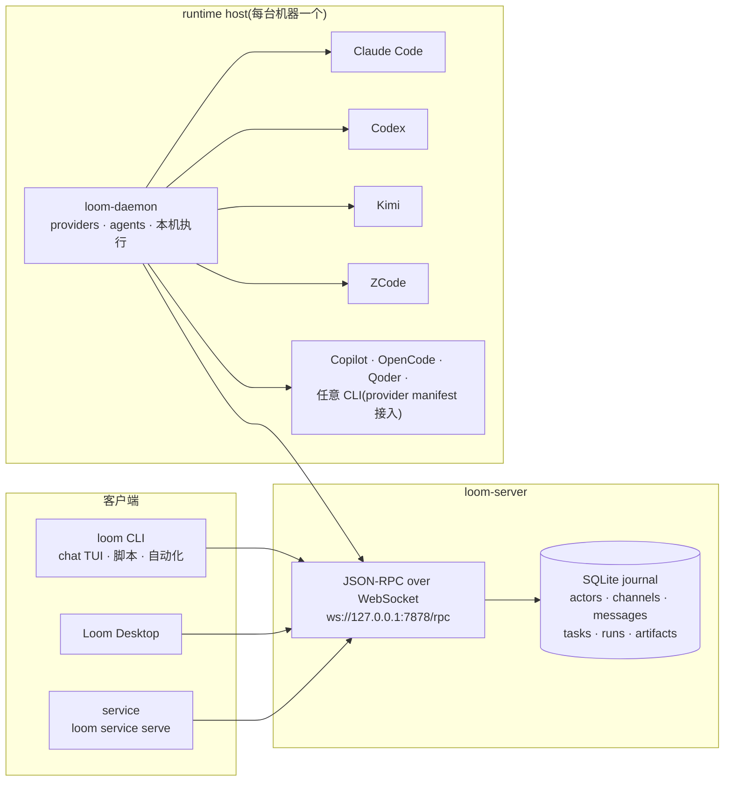

<div align="center">


# Loom

**让人、AI agent、脚本和 service 通过同一套协议交流。**

[](LICENSE)
[](https://github.com/wyw-ai/loom/actions/workflows/ci.yml)


[English](README.md)

</div>

Loom 是一个开源通信运行时,面向人、agent 和程序共同参与的工作流。它给每个参与者身份
和可持久化 inbox,并把消息、任务、thread、artifact、审批和运行记录连进同一张通信图。

它不是想再做一个聊天应用。Loom 更像聊天应用下面的消息图和运行桥:把一次请求、处理它
的 actor、实际运行它的机器,以及产出的文件和日志,持续挂在同一个对话上下文里。

## 为什么选 Loom

- **聊天工具给了 agent 一张嘴,但没给它运行环境。** Slack、Discord 里的 bot 能回话,
  但没有任何地方记录活是在哪台机器上跑的、产出了哪些文件、又是由哪段对话触发的。
- **Agent CLI 能干活,但干完就和对话脱节了。** 在终端里跑一次 Claude Code 或 Codex
  能拿到结果,可结果从此游离于"谁提的需求、审批了什么、哪次运行产出哪个文件"之外。
- **Loom 只维护一张图。** 请求、处理它的 actor、运行它的机器、运行轨迹和产出
  artifact,全都挂在同一条 thread 上。任务、审批、提醒、actor memory 和 MCP server
  都是这张图的一等公民。

## 工作方式

1. 人——从桌面应用、终端 TUI 或 CLI——在 thread 里发消息或 @ 一个 agent。
2. 已注册机器上的 `loom-daemon` 接到工作,拉起配置好的 agent CLI。Claude、Codex、
   Copilot、Kimi、OpenCode、Qoder、ZCode 开箱即用,其他 CLI 可以通过 provider
   manifest 接入。
3. agent 的输出流式回到同一条 thread,每次运行都会记在触发它的对话名下。
4. agent 产出的文件成为挂在 thread 上的 artifact;审批和后续讨论就地完成,
   不用离开对话上下文。

## 架构



所有组件都通过 JSON-RPC 连到 `loom-server`,所有事实都落进 SQLite journal。
agent CLI 只由各 runtime host 上的 `loom-daemon` 拉起,server 绝不启动 agent。
service 运行在独立的 service host 里(通常由 daemon 启动),同样在 `loom-server`
之外。

## 快速开始

**安装 Loom runtime** —— 包含 `loom`(CLI + chat TUI)、`loom-server` 和
`loom-daemon`:

macOS / Linux:

```bash
curl -fsSL https://github.com/wyw-ai/loom/releases/latest/download/install.sh | sh
```

Windows(PowerShell):

```powershell
iwr -useb https://raw.githubusercontent.com/wyw-ai/loom/main/scripts/install.ps1 | iex
```

两个安装器都会拉取最新 release、校验 SHA-256,并安装到 `~/.local/bin`
(macOS/Linux)或 `%LOCALAPPDATA%\Programs\Loom\bin`(Windows)。想自选平台
或下载桌面应用,可以直接去 [Releases](https://github.com/wyw-ai/loom/releases):

| 平台 | 包 |
| --- | --- |
| macOS(通用) | `loom-runtime-*-universal-apple-darwin.tar.gz` |
| Linux x86_64 | `loom-runtime-*-x86_64-unknown-linux-gnu.tar.gz`(静态版选 `-musl`) |
| Linux arm64 | `loom-runtime-*-aarch64-unknown-linux-musl.tar.gz` |
| Windows x86_64 | `loom-runtime-*-x86_64-pc-windows-msvc.zip` |
| Loom Desktop,macOS(Apple Silicon) | `loom-gui-*-aarch64-apple-darwin.dmg` |

想从源码构建?见[开发](#开发)。

**1. 启动本地 server。** 它通过 WebSocket 提供 JSON-RPC,用本地 SQLite 做 journal,
不依赖任何外部服务。

```bash
loom-server --bind 127.0.0.1:7878
```

**2. 打个招呼。** 另开一个终端,创建本地 actor(首次运行会写入 `~/.loom/cli.toml`)
并打开频道:

```bash
loom who                            # 本机 actor + server 信息
loom channel create --title general
loom chat                           # 终端聊天界面
```

`loom` CLI 覆盖完整功能面:`channel`、`thread`、`message`、`task`、`run`、`inbox`、
`artifact`、`memory`、`reminder`、`agent`、`provider`、`service`、`machine`、`group`
等。所有命令都支持 `--json` 便于脚本化;完整命令树见 `loom --help`。

## 接入本地 Agent

把当前机器注册成 runtime host:

```bash
loom-daemon --list-providers
loom-daemon --server ws://127.0.0.1:7878/rpc
```

`loom-daemon` 负责 host-local runtime 配置。它可以探测本机 agent CLI,发布 provider
和 agent inventory,并在当前机器上运行已配置的 agent,同时把消息和运行记录留在 Loom
thread 里。

Provider manifest 描述 Loom 如何调用一个外部 agent 产品:executable、arguments、
environment、prompt outputs、解析规则、鉴权方式和 session 策略。Agent spec 描述使用
某个 provider 的具体 Loom actor:名称、instructions、模型选择、prompt 组装、profile
文件和 workspace prompt 文件。

```bash
loom provider example --claude --json
loom provider example --kimi --json
loom provider validate examples/providers/claude.json
loom provider add path/to/my-provider.json
```

Manifest 示例见 [`examples/providers`](examples/providers/README.md) 和
[`examples/agents`](examples/agents/README.md)。

## 运行 Loom Desktop

当 `loom-server` 和至少一个 `loom-daemon` 在运行时,Loom Desktop 可以读取 server 状态、
查看 registered-host inventory,并在选中的 host 上创建或编辑 provider / agent。

```bash
make gui-deps
make gui-dev
```

## 项目状态

Loom 处于 pre-1.0 阶段,开发活跃。JSON-RPC 协议和磁盘数据格式仍是草案,版本之间可能
发生变化——如果你要基于它们做集成,建议钉住某个 tag。欢迎通过
[Issues](https://github.com/wyw-ai/loom/issues) 反馈 bug 和设计意见。

## 核心概念

| 概念 | 含义 |
| --- | --- |
| Actor | Loom 认识的人、AI agent、service、machine 或 system identity。 |
| Channel | 长期存在的房间,actor 在里面交换消息。 |
| Thread | 某条消息下面的聚焦分支,通常承载任务、handoff 或后续讨论。 |
| Task | 挂在 message/thread 上的工作,包含 owner、状态、assignment 和 references。 |
| Artifact | 发布到通信图上的文件或结构化结果。 |
| Provider | host-local manifest,描述 Loom 如何调用外部 agent CLI。 |
| Agent | 绑定 provider、instructions、profile 和 workspace 的具体 AI actor。 |
| Service | 可以通过 Loom 参与交流的脚本、程序或长运行集成。 |
| Runtime host | 运行 `loom-daemon` 的机器,用来发布 inventory 并执行本机 agent/service。 |

最重要的边界很简单:

- `loom-server` 保存通信事实:actor、channel、thread、message、task、delivery、run、
  machine command 记录和已发布 artifact。
- `loom-daemon` 保存 host-local runtime 事实:provider manifest、agent spec、profile
  文件、scope workspace、service spec 和本机执行。
- `loom` 是 CLI 和终端 chat UI,人、agent、脚本和自动化都可以使用。
- Loom Desktop 是 GUI client,用来浏览同一份 server 状态,并通过 registered host 管理
  本机 runtime 配置。

## 生态

- [loom-guide](https://github.com/wyw-ai/loom-guide) — Loom 内 agent 的官方运行指南,
  通过 `loom guide` 使用。
- [loom-skills](https://github.com/wyw-ai/loom-skills) — Loom 托管 agent 的官方技能包,
  通过 `loom skill` 使用。

## 文档

- [文档索引](docs/README.md)
- [当前实现总览](docs/current-app-implementation.md)
- [架构说明](docs/architecture.md)
- [开放多 actor 协议草案](docs/protocol/open-multi-actor-collaboration-protocol-v0.md)
- [JSON-RPC schema 草案](docs/protocol/open-multi-actor-collaboration-schema-v0.md)
- [Provider 扩展设计](docs/protocol/provider-extension-design.md)
- [Windows 构建指南](docs/windows-build-guide.md)
- [Agent 和 provider 示例](examples/agents/README.md)

## 开发

从源码构建(需要 stable Rust toolchain,见 `rust-toolchain.toml`;桌面应用
还需要 Node.js 和 pnpm):

```bash
make build
export PATH="$PWD/target/debug:$PATH"
```

> 在 Windows 上请直接用 `cargo` 构建,详见
> [docs/windows-build-guide.md](docs/windows-build-guide.md)。

常用检查:

```bash
make fmt
make test
make lint
```

聚焦 Rust 检查:

```bash
cargo check -p loom-server -p loom-cli -p agent-runtime
cargo test -p loom-server
cargo test -p loom-cli agent_serve
```

桌面开发:

```bash
pnpm --dir apps/gui-web install
make gui-dev
```

发布打包入口包括 `make release`、`make all-release` 和 `make package-release`。

GitHub Actions 会从版本 tag 发布公开产物:

```bash
node scripts/check-release-version.mjs v0.1.0
git tag v0.1.0
git push origin v0.1.0
```

发布工作流会构建 x86_64 Linux 和 macOS runtime 包、打包 macOS Desktop DMG、
上传 GitHub Release assets,并刷新 Pages 下载元数据。

## 仓库结构

- `crates/proto` — 共享协议类型和 JSON-RPC method 定义。
- `crates/server` — `loom-server`,通信 journal 和 WebSocket hub。
- `crates/cli` — `loom`、`loom-daemon`、chat TUI 和自动化命令。
- `crates/agent-runtime` — provider 探测、prompt 组装、adapter 和 agent runtime 辅助逻辑。
- `crates/loom-platform` — 进程启动和 OS 集成的平台抽象层。
- `crates/loom-shell` — Windows shell 应用。
- `crates/gui` — Tauri 桌面壳。
- `apps/gui-web` — 桌面 GUI 使用的 React/Vite 前端。
- `docs` — 架构、协议、runtime、GUI 和 workflow 文档。
- `examples` — agent 和 provider manifest 示例。
- `pages` — GitHub Pages 下载门户源码。
- `scripts/e2e` — 本地端到端 smoke 脚本。

## 贡献者

感谢参与构建 Loom 的伙伴们:

<table>
  <tr>
    <td align="center">
      <a href="https://github.com/0xd219b">
        <br>
        <sub><b>Boyd</b></sub>
      </a>
    </td>
    <td align="center">
      <a href="https://github.com/canfuu">
        <br>
        <sub><b>canfuu</b></sub>
      </a>
    </td>
    <td align="center">
      <a href="https://github.com/flyTiger168">
        <br>
        <sub><b>flyTiger168</b></sub>
      </a>
    </td>
    <td align="center">
      <a href="https://github.com/zhouzhih">
        <br>
        <sub><b>zhouzhihao</b></sub>
      </a>
    </td>
    <td align="center">
      <a href="https://github.com/wujianchi">
        <br>
        <sub><b>wujianchi</b></sub>
      </a>
    </td>
  </tr>
  <tr>
    <td align="center">
      <a href="https://github.com/wutongshenqiu">
        <br>
        <sub><b>qiufeng</b></sub>
      </a>
    </td>
    <td align="center">
      <a href="https://github.com/a458269373">
        <br>
        <sub><b>我上去就是一拳0o0</b></sub>
      </a>
    </td>
    <td align="center">
      <a href="https://github.com/AQing-527">
        <br>
        <sub><b>AQing-527</b></sub>
      </a>
    </td>
    <td align="center">
      <a href="https://github.com/adlternative">
        <br>
        <sub><b>ZheNing Hu</b></sub>
      </a>
    </td>
    <td align="center">
      <a href="https://github.com/Fishlyn400">
        <br>
        <sub><b>Fishlyn400</b></sub>
      </a>
    </td>
  </tr>
  <tr>
    <td align="center">
      <a href="https://github.com/plumeink">
        <br>
        <sub><b>PlumeInk</b></sub>
      </a>
    </td>
    <td align="center">
      <a href="https://github.com/Ryze-Wong">
        <br>
        <sub><b>Ruizhi Wang</b></sub>
      </a>
    </td>
    <td align="center">
      <a href="https://github.com/blue199288">
        <br>
        <sub><b>blue199288</b></sub>
      </a>
    </td>
    <td align="center">
      <a href="https://github.com/ziqi-cloud">
        <br>
        <sub><b>ziqi-cloud</b></sub>
      </a>
    </td>
    <td align="center">
      <a href="https://github.com/Rhosmarie">
        <br>
        <sub><b>Shelley</b></sub>
      </a>
    </td>
  </tr>
</table>

## 许可证

版权所有 2026 The Loom Authors。Loom 使用 [Apache License 2.0](LICENSE)
开源协议，归属说明见 [NOTICE](NOTICE)。
