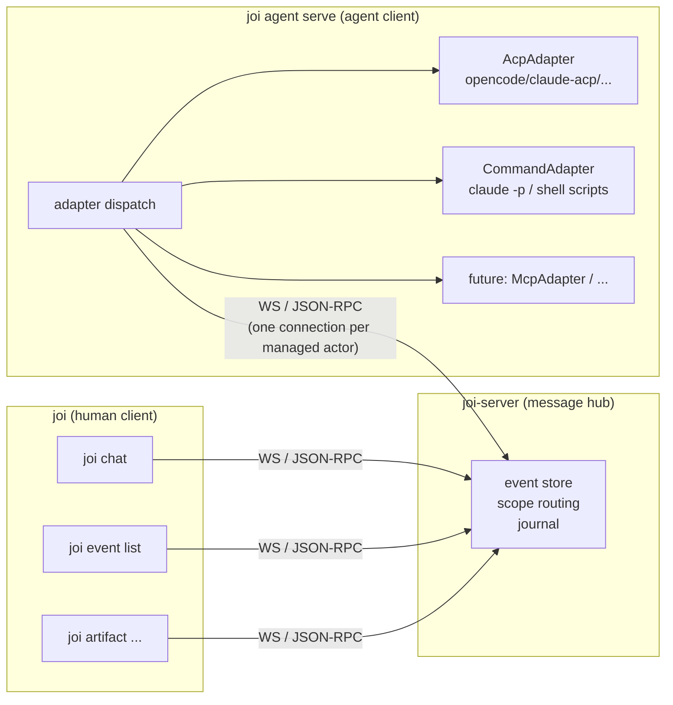
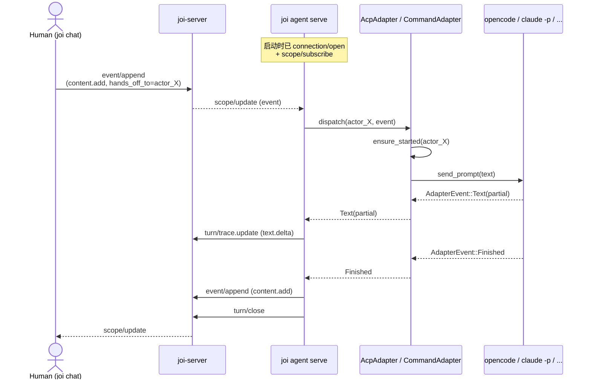
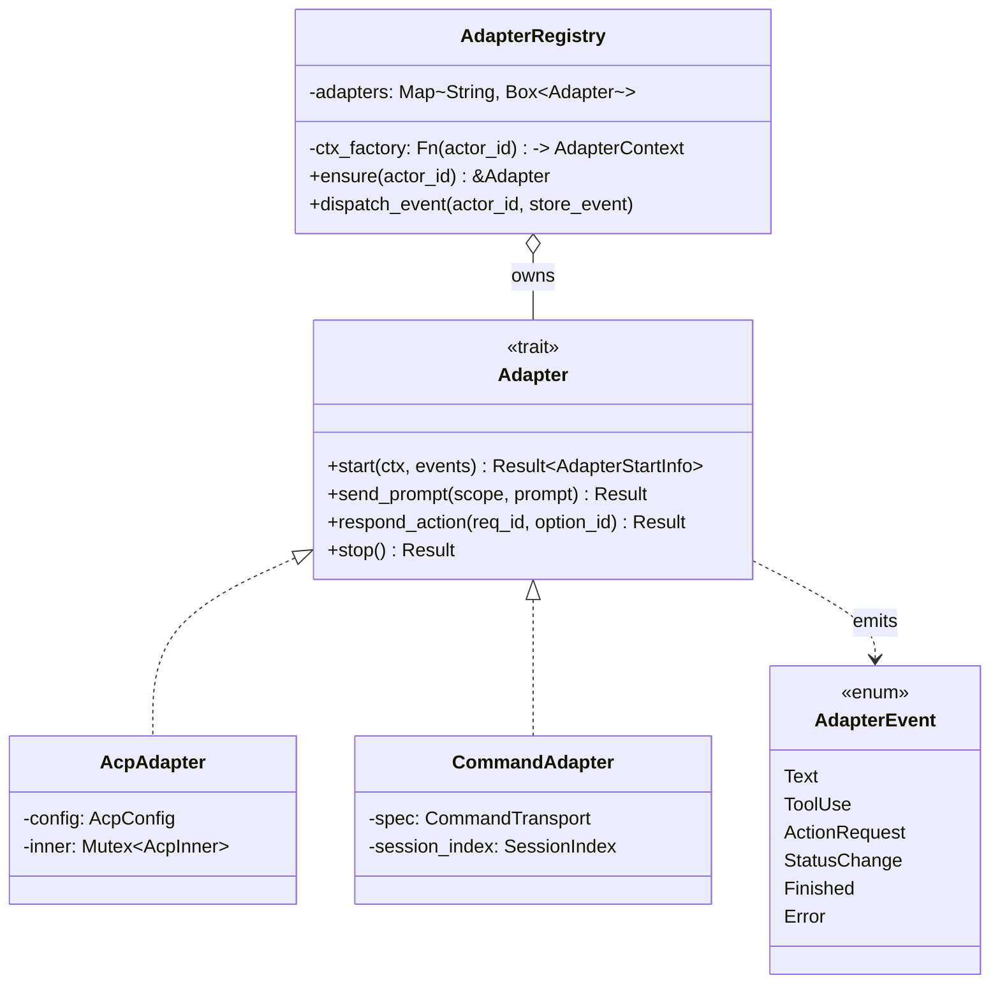
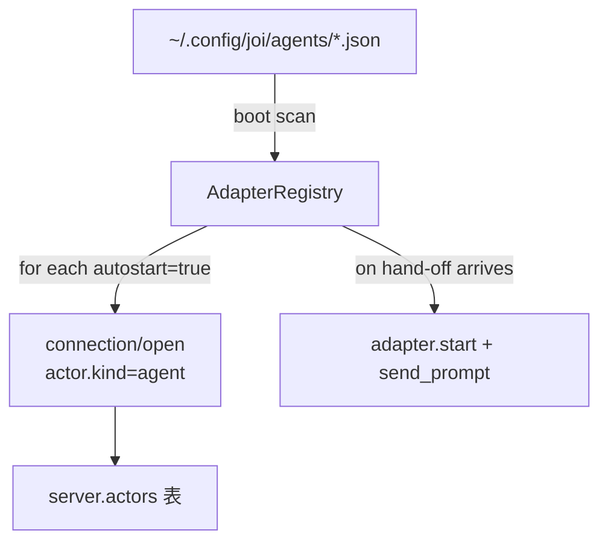
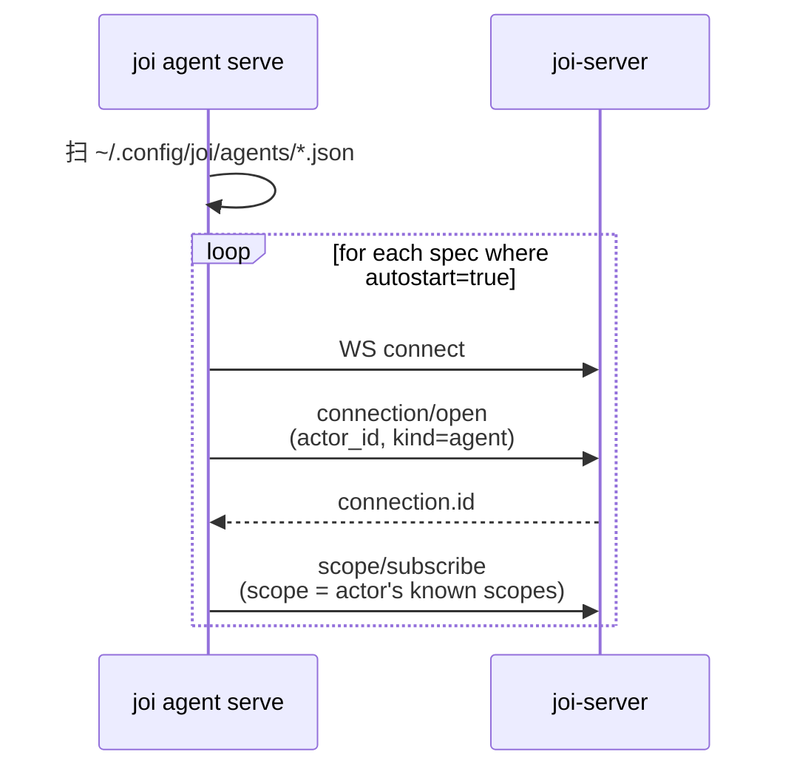
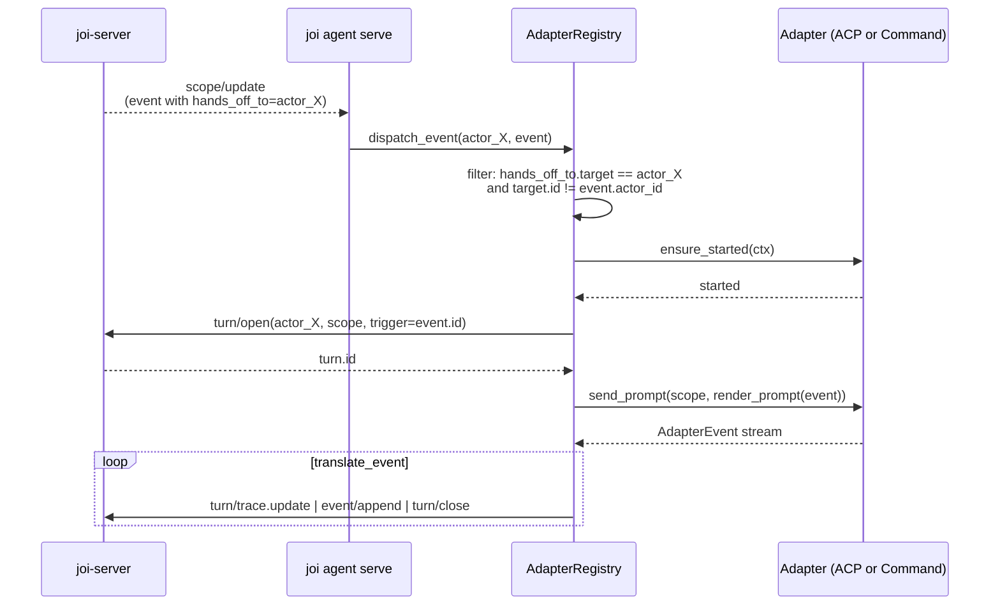

# 架构 v1：Agent Client 拆分 + Adapter 模型

> **状态**：phase E1–E3 已落代码（`refactor: extract trait Adapter`、
> `feat(server): add CommandAdapter`、`refactor: extract agent-runtime crate`、
> `feat(server): hooks for external agent client`、
> `feat(cli): joi agent serve external runtime client`）。E4（删除 server 内嵌
> runtime）延后——v0 嵌入路径与 v1 外置路径目前并存，由
> `JOI_DISABLE_EMBEDDED_RUNTIME=1` 环境变量在 server 端切换。
> 配套规范见 [docs/command-transport-v0.md](command-transport-v0.md)。
> v0 当前实现见 [docs/architecture.md](architecture.md) 与
> [docs/current-app-implementation.md](current-app-implementation.md)。

## TL;DR — v1 部署快速上手

```bash
# 终端 1：启动 server，关掉嵌入 supervisor
JOI_DISABLE_EMBEDDED_RUNTIME=1 cargo run -p joi-server

# 终端 2：把 v0 的 agent spec 拷到 client 配置目录
mkdir -p ~/.config/joi/agents
cp data/agents/*.json ~/.config/joi/agents/

# 终端 3：跑 agent client；它会为每个 spec 起一条 ws 连接
cargo run -p joi-cli -- agent serve

# 终端 4：照常使用 chat
cargo run -p joi-cli -- chat --in <thread_id>
```

不设 `JOI_DISABLE_EMBEDDED_RUNTIME` 时 server 仍然内嵌 supervisor，跟 v0 行为一
致；同时跑 `joi agent serve` 会和内嵌 supervisor 竞争 `turn/open`，所以两者只能
二选一。

---

## 1. 背景：为什么拆 agent runtime 出去

### 1.1 v0 的耦合点

当前 `joi-server` 同时承担两个角色：

1. **消息枢纽**：维护 `Channel` / `Thread` / `Event` / `Relation` 这套协议对象，做
   scope routing、subscription、journal 持久化。
2. **Agent supervisor**：内嵌一整套 ACP runtime（`crates/server/src/runtime/`），
   按需 spawn ACP 子进程、把 `hands_off_to` 事件翻译成 `session/prompt`、再把 ACP
   流回的 `session/update` 翻译成 `content.add` / `action.request` / trace 帧。

这两个职责通过 [`RuntimeManager`](../crates/server/src/runtime/mod.rs#L85-L469)
+ [`spawn_supervisor`](../crates/server/src/runtime/wakeup.rs#L21-L34) 共享同一个
内存对象图：server 启动时 `load_disk_specs()` 直接读 `agents/*.json`、
`spawn_supervisor` 直接 `store.subscribe()`、`adapter.send_prompt` 直接走进程内
mpsc channel。

### 1.2 这套耦合带来的问题

- **异构 agent 接入只能往 `runtime/` 里塞**。新增一种 transport（比如 `claude -p`
  这种命令式 CLI）就要改 server 二进制。
- **部署形态被锁死**。即便用户只想把 `joi-server` 跑在云上、本地只跑 agent，也做
  不到——因为 agent 的 spec、子进程、stdio 全都长在 server 上。
- **协议层被拉低**。本来 `event/append` + `connection/open` + `scope/subscribe`
  已经足够描述一个 actor 的接入；现在却需要 `agent/register` / `agent/start` /
  `agent/stop` / `agent/log` 这一堆只为内嵌 runtime 服务的 RPC。

### 1.3 v1 的目标

把 agent runtime 从 server 里剥出来，独立成一个进程（`joi agent serve`），通过
**Adapter trait** 抽象不同的 agent 接入方式。Server 退化为纯消息枢纽，不再感知
agent 怎么被调度。

---

## 2. 目标拓扑

### 2.1 三节点示意



三类客户端用同一套 wire 协议跟 server 对话：`connection/open` 上线、
`scope/subscribe` 听流、`event/append` 写事件、`turn/open|close` 打开和关闭 turn、
`scope/read` 拉历史。**Server 不区分对面是人还是 agent**。

### 2.2 节点职责

| 节点 | 职责 |
| --- | --- |
| `joi-server` | 持久化 + scope fanout + actor 注册 + journal 重放 |
| `joi <subcmd>`（人） | TUI / 一次性命令；每个进程持有人类 actor 的连接 |
| `joi agent serve`（agent client） | 读本地 agent 配置、按需 spawn agent runtime、为每个被管理的 actor 维护一条到 server 的连接、把 adapter 输出翻译成事件 |

### 2.3 端到端 sequence（典型 wakeup）



关键点：

- Server 既不感知 adapter 类型，也不感知 ACP/command 子进程是否存在。它只看到
  `actor_X` 上线了一条连接，写了一条事件。
- agent client 持有 `(actor_X) → adapter` 的内存映射，wakeup 完全在 client 进程
  内闭环。

---

## 3. 进程与二进制边界

### 3.1 一份产物，多个子命令

继续维持单 `joi` 二进制，子命令分发：

```
joi who                         # 当前 cli + 配置
joi chat --in <thread>          # 人类 TUI
joi event list --in <scope>     # 一次性命令
joi artifact publish --name ... # 一次性命令
joi agent serve                 # ★ 新增：agent client 常驻进程
joi agent install <id>          # （仍然存在，归属由 server 改成 client 本地）
joi agent list                  # 列出本地 agent client 管理的 agent
```

理由：

- agent client 与 human client 共享 `crates/cli/src/{client,config}.rs`——同一份
  连接管理、同一份 `~/.config/joi/config.toml` 解析。
- 部署只需要分发一个文件。
- 同一台机器上 `joi chat` 和 `joi agent serve` 可以共存，无端口冲突；它们各自向
  server 发起独立的 WebSocket 连接。

### 3.2 `joi agent serve` 的进程模型

```
joi agent serve
  ├─ tokio runtime
  ├─ AdapterRegistry
  │    ├─ actor_X ─ AcpAdapter ─ ACP child process
  │    ├─ actor_Y ─ CommandAdapter ─ (per-prompt: spawn `claude -p ...`)
  │    └─ ...
  ├─ ConnectionPool
  │    └─ for each managed actor: 1 WebSocket → joi-server
  └─ SignalHandler (SIGINT/SIGTERM → graceful shutdown 所有子进程)
```

每个被管理的 actor 在 server 上都有一条独立连接（`connection/open` 给出该 actor
id 与 `actor.kind = "agent"`）。这样 server 端 `subscribe::bind_actor` 的逻辑可
以直接复用，scope fanout 自动覆盖。

### 3.3 配置位置

| 内容 | v0 位置 | v1 位置（已实现） |
| --- | --- | --- |
| Agent spec（`*.json`） | `<server-data>/agents/` 由 server 扫描 | `~/.config/joi/agents/` 由 agent client 扫描；`--specs <dir>` 可覆盖 |
| Marketplace catalog | server `assets/marketplace.json`（编译进二进制） | 暂未搬迁；仍由 server 暴露 `agent/marketplace`，`joi agent install` 走 server RPC（E4 之后再搬） |
| Agent workspace（`{agent.workspace}` 等模板变量） | `<server-data>/agents/<id>/{workspace,cache,logs}` | `~/.local/share/joi/agent-client/agents/<id>/{workspace,cache,logs}` |
| Command session 簿记 | （v0 没有 command transport） | `~/.local/share/joi/agent-client/sessions/<actor_id>/<scope_id>.json` |

> **迁移工具**：尚未提供专门的 `migrate-from-server` 命令；当前用法是手工
> `cp <server-data>/agents/*.json ~/.config/joi/agents/`，因为 spec 文件结构本身没变。
> phase E4 清理 server 时再考虑是否需要正式迁移工具。

---

## 4. Adapter 抽象

### 4.1 Trait 形态（草案）

```rust
// 所在 crate（建议）：crates/agent-client/src/adapter/mod.rs
#[async_trait]
pub trait Adapter: Send + Sync {
    /// 启动 agent 进程或建立连接。返回的 Sender 用于 send_prompt 的 sentinel；
    /// 真正的事件流通过传入的 mpsc::Sender 异步推回。
    async fn start(
        &self,
        ctx: AdapterContext,
        events: mpsc::UnboundedSender<AdapterEvent>,
    ) -> Result<AdapterStartInfo, AdapterError>;

    /// 把一段 prompt 文本送给 agent。command transport 下这一次调用就是一次完整
    /// 的子进程生命周期；ACP 下是往 long-lived 子进程发 session/prompt。
    async fn send_prompt(&self, scope: &ScopeRef, prompt: &str)
        -> Result<(), AdapterError>;

    /// 转发 action.response（ACP permission reply / command transport 下可能 no-op）。
    async fn respond_action(&self, request_id: &str, option_id: &str)
        -> Result<(), AdapterError>;

    /// 优雅停止。
    async fn stop(&self) -> Result<(), AdapterError>;
}

pub struct AdapterContext {
    pub actor_id: String,
    pub workspace: PathBuf,   // {agent.workspace}
    pub cache: PathBuf,       // {agent.cache}
    pub logs: PathBuf,        // {agent.logs}
    pub server_url: String,   // JOI_SERVER
    /// agent 自己回头要 shell 出 joi 时，PATH 上带的 cli 目录
    pub cli_dir: Option<PathBuf>,
}
```

### 4.2 `AdapterEvent`：跨 transport 的统一事件

直接复用 v0
[`AgentEvent`](../crates/server/src/runtime/acp.rs#L40-L66) 的七变体，重命名为
`AdapterEvent`：

```rust
pub enum AdapterEvent {
    Text { content: String, is_partial: bool },
    ToolUse { tool_name: String, input: Value },
    ActionRequest {
        id: String,
        request_type: String,
        title: String,
        description: String,
        choices: Vec<ActionChoice>,
    },
    StatusChange { status: String },
    Finished { success: bool, summary: String },
    Error { message: String },
}
```

每个 adapter 实现自己内部到 `AdapterEvent` 的翻译；`AdapterRegistry` 收到
`AdapterEvent` 之后跑统一翻译层（直接挪用 v0
[`translate_event`](../crates/server/src/runtime/wakeup.rs#L174-L339)），把它们
变成 `event/append` / `turn/trace.update` / `turn/close` RPC 调用发回 server。

不同 transport 的保真度差异通过填充 `AdapterEvent` 子集来表达：

| Transport | 通常会发出 |
| --- | --- |
| ACP | 全部七种（包括 ToolUse / StatusChange / partial Text） |
| Command (`text` 输出) | 仅 `Finished` 收尾时一次 `Text { is_partial: false }` |
| Command (`*_stream_json` 输出) | Text(partial) + ToolUse + Finished |
| MCP（未来） | Text + ToolUse + Finished |

### 4.3 类图



为什么用 trait 而不是 enum：第三方也能 ship 自己的 adapter（比如某团队内部的
gRPC agent 服务），不需要修改 joi 的代码。

### 4.4 `transport.kind` 取值

[`AgentTransport.kind`](../crates/proto/src/methods.rs#L394-L406) 字段从
`"acp_stdio"` 单值扩展为：

| 值 | 对应 adapter | 说明 |
| --- | --- | --- |
| `"acp_stdio"` | `AcpAdapter` | v0 的实现，行为不变 |
| `"command"` | `CommandAdapter` | v1 新增，详见 [docs/command-transport-v0.md](command-transport-v0.md) |

后续可继续追加（`"mcp_stdio"`、`"http_sse"` 等）。Agent client 启动时按
`transport.kind` 选择 adapter 实现并分发。

---

## 5. Agent Registry 归属

### 5.1 v0 的归属

Server boot 时调用
[`RuntimeManager::load_disk_specs`](../crates/server/src/runtime/mod.rs#L127-L144)
扫描 `agents/`，每个 spec → `register_loaded` 写进 `Mutex<HashMap>` →
`store.upsert_actor`。前端通过 `agent/list` / `agent/get` / `agent/save` 等 RPC
访问这张表。

### 5.2 v1 的归属

Agent client **持有** registry。Server 不再维护 agent 列表。



- Agent client 启动 → 扫 `~/.config/joi/agents/*.json` → 对每个 `autostart: true`
  的 spec 立刻 `connection/open(actor_id, kind=agent)`，把这个 actor 在 server 上
  上线。Server 端
  [`subscriptions.bind_actor`](../crates/server/src/handlers/mod.rs#L98-L135)
  自动建立 actor↔connection 映射。
- Server 端 `agent/*` RPC（`list`/`get`/`save`/`start`/`stop`/`log`/`install`/
  `marketplace`）大致两条出路：
  1. **彻底删掉**（最干净）。前端要列 agent，调 `actor/list` 过滤
     `kind == "agent"` 即可；要管理 agent 配置，连 agent client 自己暴露的本地
     管理接口（见下）。
  2. **退化为只读视图**。`agent/list` 仍然存在，但实现改成"扫 server.actors 中
     `kind=agent` 的项 + 关联 connection 是否在线"，不再持有任何 spec。安装/启
     停操作迁到 agent client。

倾向方案 2：保留只读 `agent/list` 给 GUI 展示用，写操作（install/start/stop）走
agent client 本地接口。

### 5.3 Agent client 本地管理面

`joi agent serve` 进程之外，仍然要让用户能 `joi agent install foo` /
`joi agent stop bar`。两条选择：

- **a)** agent client 在 `~/.local/share/joi/agent-client.sock` 起 unix socket，
  `joi agent <op>` 命令通过它管理本地 registry。
- **b)** 不起 socket，`joi agent install` 直接写 `~/.config/joi/agents/foo.json`，
  agent client 监听文件目录变更（notify crate）做 hot reload。

倾向 **b)**：少一条进程间协议，部署面最小。`start`/`stop`/`log` 这种"对运行中
进程的实时操作"留到第二迭代再加 socket。

### 5.4 Marketplace

`assets/marketplace.json` 编目格式不变（6 个 ACP agent + 后续可加 command 类的
agent），但读取者从 server 改成 cli crate。`joi agent install foo --prefer command`
可以让用户显式装 command 版本（比如 `claude` 而不是 `claude-acp`）。

---

## 6. Wakeup 流（v1 详细）

### 6.1 启动阶段



注：`autostart=false` 的 agent 不在启动时连 server——只有当外部调用
`joi agent start <id>` 或 hot reload 触发时才上线。

### 6.2 收到 hand-off



判断哪些事件触发哪个 actor，逻辑直接挪用 v0
[`handle_store_event`](../crates/server/src/runtime/wakeup.rs#L36-L60)：只看
`relations[].kind == HandsOffTo` 且 target 是该 client 管理的 actor 之一。

### 6.3 与 v0 的关键差别

| 步骤 | v0 | v1 |
| --- | --- | --- |
| 监听 store | `store.subscribe()`（进程内 broadcast） | `scope/subscribe`（跨进程 RPC） |
| 起 turn | `store.open_turn(...)`（直接调 store） | `turn/open` RPC |
| 写 trace | `store.append_trace_frame(...)` | `turn/trace.update` RPC |
| 写 content.add | `store.append_event(...)` | `event/append` RPC |
| 关闭 turn | `store.close_turn(...)` + `store.append_event("turn.close",...)` | `turn/close` RPC |

注意 server 端这些 RPC 在 v0 已经存在（GUI 也用同一组），所以**协议侧零改动**。

---

## 7. 迁移路径

四个 phase，每个都可以独立验证、独立合并。

### Phase E1：抽 trait（同进程内重构） ✅ 已合

提交：`refactor: extract trait Adapter`。

- ~~在 `crates/server/src/runtime/` 下新增 `adapter.rs`，定义 `trait Adapter` 与
  `AdapterEvent`（即 v0 `AgentEvent` 改名）。~~
- ~~把现有 `AcpAdapter` 套上 trait。~~
- ~~`RuntimeManager` 从 `Option<Arc<AcpAdapter>>` 改成 `Option<Arc<dyn Adapter>>`。~~

实际落点：trait 与 `AdapterEvent` 现在在 `crates/agent-runtime` crate 中，
`AcpAdapter` 实现了它；server 端 `RuntimeManager` 通过 `Arc<dyn Adapter>` 持有。

### Phase E2：实现 `CommandAdapter` ✅ 已合

提交：`feat(server): add CommandAdapter`。

- `AgentTransport::kind` 增加 `"command"` 分支；
- 新增 [`CommandAdapter`](../crates/agent-runtime/src/adapter/command.rs)，
  实现 spec 见 [docs/command-transport-v0.md](command-transport-v0.md)。
- 端到端跑通"人发 hand-off → adapter spawn 子进程 → 输出 → 写回 content.add"。

### Phase E3：搬出去 ✅ 已合（分三步）

- **E3a**（`refactor: extract agent-runtime crate`）：把
  `runtime/{adapter,acp,command}` 整体提取到独立 crate `crates/agent-runtime/`，
  让 server 与 cli 都能依赖。
- **E3b**（`feat(server): hooks for external agent client`）：server 端加
  `JOI_DISABLE_EMBEDDED_RUNTIME` 环境变量（`true|1|yes` 时跳过 supervisor 启动），
  允许外部 client 接管 actor 上线。
- **E3c**（`feat(cli): joi agent serve external runtime client`）：新增
  [`crates/cli/src/cmd/agent_serve.rs`](../crates/cli/src/cmd/agent_serve.rs)
  实现 `joi agent serve [--specs <dir>]`：扫 `~/.config/joi/agents/`，每个 spec 起
  一条 WS、用 `connection/open(actor_id, kind=agent)` 上线，监听通知、把
  `hands_off_to` 翻译成 `turn/open` + `send_prompt` + 流式 trace + `turn/close`。

### Phase E4：清理 server ⏳ 延后

提交：尚未落地，**v0 嵌入路径与 v1 外置路径目前并存**。切换方式：在 server 端
设置 `JOI_DISABLE_EMBEDDED_RUNTIME=1` 即让 server 退化为纯消息枢纽，由
`joi agent serve` 接管 supervisor。两者**不能同时运行**——会在 `turn/open`
上抢占。

后续 E4 真正落地时要做：

- 默认部署不再启用嵌入 supervisor，删除 `crates/server/src/runtime/`（或缩成
  feature flag `legacy-runtime` 并默认 off）。
- `agent/*` RPC 退化为只读（基于 connection 视图），或彻底移除。
- `crates/proto/src/methods.rs` 中 `AgentSpec` / `AgentTransport` 移到独立 mod
  表明它们不属于 server 协议。

延后理由：当前 GUI / 旧 CLI 仍然有路径走 `agent/list` `agent/install` 等 RPC，
彻底删除会断掉 marketplace 流程；先让两路并存，等 v1 deploy 跑稳再清理。

每个 phase 都满足"可灰度"：E1/E2 没有协议变更；E3 让 server 同时能跑两种部署模
式；E4 才是 breaking change。

---

## 8. 不动的部分

明确这些**不**在本设计的改动范围内，避免 review 时产生混淆：

- **Wire 协议**（`connection/open` / `scope/subscribe` / `event/append` /
  `turn/open` / `turn/close` / `turn/trace.update` / `scope/read` /
  `artifact/*` / `receipt/record` / `action/respond`）：字段、行为、语义都不变。
- **Trace 帧形状**：`turn/trace.update` 的 `kind`（text.delta / tool.start /
  tool.update / tool.end / status / error）与 payload 不变。变的只是发送方从
  server 内部变成 agent client。
- **Journal 格式**：server 端 [`journal.rs`](../crates/server/src/journal.rs) 不
  受影响。Agent client 不需要自己持久化事件流——它只是一个上游 producer。
- **Store 模型**：`Channel` / `Thread` / `Turn` / `Event` / `Relation` /
  `Artifact` / `Receipt` / `Membership` / `Delivery` 表全部不动。

---

## 9. 开放问题

留给实现期决定，不在本文档强制：

1. **Agent client 与 server 的认证**。v0 默认同机无认证。v1 即便仍然同机，agent
   client 在 `connection/open` 时用什么凭证证明它有权代表 `actor_X`？
   - 候选：本地共享 secret（写在 `~/.config/joi/auth.toml`）；或 server 启动时
     生成 token 写到 `<data>/agent-client.token`，agent client 启动时读。
2. **多实例**。允许同一台 server + 多个 agent client 进程吗？同一个 actor id 同
   时被两个 client 持有时如何决定 routing？
   - 倾向：禁止；server 端 `subscriptions.bind_actor` 要求每个 actor 一个 owner，
     第二次 `connection/open` 抢占或拒绝。
3. **Hot reload**。`~/.config/joi/agents/` 下加新 spec 时是否自动起 connection？
   倾向：用 notify crate 做文件监听；新增/更新立即生效；删除等当前 in-flight
   prompt 完成后停。
4. **失败重连**。Agent client 与 server 的 WS 断开时的重连策略；ACP 子进程异常
   退出时是否自动重启。倾向：指数退避重连；ACP 子进程崩溃只在下一次 hand-off
   到来时重启（lazy）。
5. **多 server**。agent client 配置里允许多个 server URL，让同一台机器上的 agent
   同时驻留多个 joi 实例？v1 不优先支持，但 spec 字段留空间（spec 顶层加
   `target_server` 可选字段）。

---

## 10. 引用代码索引

| 概念 | 现有位置 | 在 v1 中的对应 |
| --- | --- | --- |
| `AgentEvent` 七变体 | [crates/server/src/runtime/acp.rs:40-66](../crates/server/src/runtime/acp.rs#L40-L66) | `AdapterEvent`（重命名，跨 transport 共用） |
| `RuntimeManager` 状态机 | [crates/server/src/runtime/mod.rs:85-469](../crates/server/src/runtime/mod.rs#L85-L469) | client 侧 `AdapterRegistry`（去掉 disk-spec 加载，加上 connection 管理） |
| `AcpAdapter` 实现 | [crates/server/src/runtime/acp.rs:89-…](../crates/server/src/runtime/acp.rs#L89) | E1 阶段套上 trait，实现层不动 |
| `spawn_supervisor` / `wake_agent` | [crates/server/src/runtime/wakeup.rs:21-98](../crates/server/src/runtime/wakeup.rs#L21-L98) | 移到 agent client；`store.subscribe()` 换成 `scope/subscribe` 流 |
| `translate_event` | [crates/server/src/runtime/wakeup.rs:174-339](../crates/server/src/runtime/wakeup.rs#L174-L339) | 整段挪过去；`store.append_*` 换成 RPC 调用 |
| `seed_manifest`（首次 prompt 注入的 cli 提示） | [crates/server/src/runtime/wakeup.rs:117-156](../crates/server/src/runtime/wakeup.rs#L117-L156) | 移到 agent client；逻辑不变 |
| `forward_action_response` | [crates/server/src/runtime/wakeup.rs:380-411](../crates/server/src/runtime/wakeup.rs#L380-L411) | 客户端订阅自身相关 `action.response` 事件后调 `adapter.respond_action` |
| `AgentSpec` / `AgentTransport` schema | [crates/proto/src/methods.rs:393-414](../crates/proto/src/methods.rs#L393-L414) | `transport.kind` 增加 `"command"`；其余字段保留 |
| 现有 spec 范例 | [agents/actor_opencode.json](../agents/actor_opencode.json) | E3 阶段迁到 `~/.config/joi/agents/` |
| Marketplace 编目 | [assets/marketplace.json](../assets/marketplace.json) | 编目格式不变；`joi agent install` 改由 cli 写本地文件 |
| `connection/open` handler | [crates/server/src/handlers/mod.rs:98-135](../crates/server/src/handlers/mod.rs#L98-L135) | 不变；agent client 用同一接口上线每个被管理的 actor |
| `agent/*` handler 集合 | [crates/server/src/handlers/mod.rs:397-461](../crates/server/src/handlers/mod.rs#L397-L461) | E4 阶段退化为只读视图或彻底移除 |

---

## 11. Review checklist

文档评审重点（写完之后给到 review 人对照看）：

- [ ] §2 拓扑图与 §3 进程边界是否一致？是否漏掉了任何"server 必须知道 agent
      细节"的隐性依赖？
- [ ] §4 trait 形态是否真的够覆盖 ACP 与 command 两类 transport？
- [ ] §6 wakeup 流相比 v0 的 `wakeup.rs` 是否丢了任何 corner case（特别是
      `take_seed_slot` / `set_active_turn` / `take_text_buffer` 这些跨调用状态）？
- [ ] §7 phase 切分是否真的可以独立合并、独立验证？
- [ ] §9 开放问题是否都标注了"倾向"或"留到 v2"，没有遗留"待讨论"？
