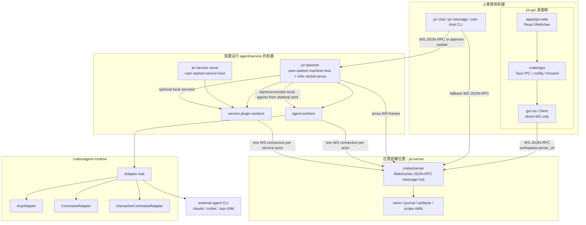

# 架构说明

本文档描述当前 Rust 实现的职责边界。结论很简单：

- `joi-server` 是纯消息枢纽。
- `joi daemon` 是 machine-scoped agent runtime supervisor。
- GUI / CLI / daemon 都通过同一套 WebSocket JSON-RPC 协议连接 server。

旧的 server-hosted runtime、server 侧 agent registry、`agent/*` runtime RPC 已删除。

## 0. 当前拓扑图

关键边界：

- `joi-server` 可以在本机、内网机器或远端机器；GUI 只读取 workspace 的
  `server_url` 并连接它。
- GUI 启动时只补齐自身前端运行环境（debug 下的 Vite dev server），不启动
  `joi-server`，也不启动 `joi daemon`。
- `joi daemon`、`joi service serve` 都是 server 的外部客户端，
  由用户在需要运行 agent/service 的机器上显式配置和启动。

## 1. 进程边界

### 1.1 joi-server

`joi-server` 只负责协作协议层：

- WebSocket JSON-RPC 连接管理
- actor 上线登记
- channel / thread / turn / event / relation 持久化
- scope 订阅与事件 fanout
- directed delivery 与 pending delivery
- receipt / action request 记录
- artifact 元数据与文件存储
- turn trace 读写与 owner-only 访问控制

server 不读取 agent machine 配置，不安装 agent，不 spawn agent 子进程，也不链接
`agent-runtime` crate。任何 adapter 生命周期都不应该进入 `crates/server`。

### 1.2 joi daemon

`joi daemon` 是本机 agent client / supervisor：

- 读取 `~/.joi-apps/desktop.toml` 里的 machine agent 配置
- 自动探测 PATH 上的 provider CLI，并在内存里合成 runtime `AgentSpec`
- 为每个启用的 agent 建立一条到 server 的 WebSocket 连接
- 使用 `connection/open(actorKind=agent)` 把 agent 注册为普通 actor
- 订阅 agent 所属 scope，接收 handoff / directed delivery
- 打开 turn，调用 adapter，把 adapter 输出翻译为协议 event
- 处理 `action.request` / `action.response`
- 处理取消：收到 server fanout 的 `turn.close(cancelled)` 后取消本地 adapter

runtime 代码集中在：

- `crates/agent-runtime/`
- `crates/cli/src/cmd/agent_serve.rs`

### 1.3 GUI / chat CLI

人类客户端只负责交互：

- 打开或订阅 channel / thread
- 追加消息 event
- 通过 `HandsOffTo` relation 显式把任务交给 agent
- 渲染 timeline、turn、trace、receipt、artifact
- 响应 agent 发出的 `action.request`；选择/补信息由 `joi ask-user-question`
  阻塞返回给当前 agent 进程，批准/拒绝由 `joi request-approval` 处理

列出 agent 时使用 `actor/list` 并过滤 `ActorKind::Agent`，不再调用 server 侧
`agent/list`。

## 2. 数据归属

| 数据 | 归属 | 默认位置 |
| --- | --- | --- |
| 协作 journal / actors / channels / events / turns | `joi-server` | server `--data-dir` |
| artifact 文件 | `joi-server` | `<data-dir>/artifacts` |
| machine / agent 配置 | GUI / CLI 本地配置 | `~/.joi-apps/desktop.toml` |
| actor-private profile / bundles | `joi daemon` | `~/.agentx/agents/<actor_id>` |
| channel-scoped workspace / logs | `joi daemon` | `~/.agentx/channels/<channel_id>/agents/<actor_id>` |
| shared channel artifacts for runtime | `joi daemon` | `~/.agentx/channels/<channel_id>/shared/artifacts` |

workspace 不再是 actor-private 的单一目录。每次 prompt 会按 channel + actor 计算
cwd，ACP 的 `session/new.cwd` 与 command transport 的 `current_dir` 都使用这个
scope-aware workspace。

## 3. 协议模型

核心对象仍然是协议层对象：

| 对象 | 作用 |
| --- | --- |
| `Actor` | 人、agent、service、system 的统一身份 |
| `Channel` | 长期协作空间 |
| `Thread` | channel 公共区某条 root event 下的短期任务分支 |
| `Turn` | 某个 actor 的一次执行回合 |
| `Event` | timeline 中不可变事实 |
| `Relation` | reply / mention / handoff / artifact link |
| `Artifact` | 可共享产物 |
| `Delivery` | directed event 的投递状态 |
| `Receipt` | action request 的处理结果 |

server 只理解这些协议对象，不理解 ACP 会话、command 子进程、workspace 模板等
adapter 细节。

## 4. Agent 调度闭环

1. 人类客户端向 scope 追加 `message` event。
2. 如果 event 有 `HandsOffTo(actor_agent_x)` relation，server 写入 directed
   delivery 并 fanout 给订阅者。
3. `joi daemon` 的对应 worker 收到 event。
4. worker 打开 turn，并构造 `AdapterPrompt`：
   - `scope`
   - `content`
   - channel-aware `cwd`
   - scope-aware env / template vars
5. ACP transport 使用该 cwd 创建 `session/new`。
6. command transport 使用该 cwd 作为 subprocess `current_dir`。
7. adapter 输出被 worker 写回 server：
   - `content.add`
   - `action.request`
   - `turn/trace.append`
   - `turn.close`

server 在整个过程中只做 journal、fanout、ACL 与持久化。

## 5. 取消模型

取消由人类客户端调用 `turn/close(status=cancelled)` 发起。

server 做两件事：

1. 校验调用者是 turn 所在 channel 的 member。
2. 写入一个 `turn.close` event，并通过 `HandsOffTo(turn.actor_id)` fanout 给
   agent actor。

`joi daemon` 收到该 event 后取消本地 adapter。server 不持有 adapter handle，
也不会直接 kill 子进程。

## 6. Agent 管理命令

agent 管理现在归属于 machine 配置和 daemon：

- GUI Computers 页面写 `~/.joi-apps/desktop.toml`。
- `joi daemon --list-providers` 展示当前 PATH 可用 runtime。
- `joi agent list` 只做离线查看，不再写 provider JSON，也不启动 runtime。
- 运行、停止、重启 runtime 都通过常驻 `joi daemon` 进程完成。

## 7. 代码边界

| 模块 | 职责 |
| --- | --- |
| `crates/server` | 协议 server、store、WS fanout、artifact |
| `crates/proto` | wire schema、RPC method 名、共享类型 |
| `crates/client` | WebSocket JSON-RPC client |
| `crates/agent-runtime` | ACP / command adapter 与 runtime helper |
| `crates/cli/src/cmd/daemon.rs` | machine host、provider discovery、agent reconcile |
| `crates/cli/src/cmd/agent_serve.rs` | daemon 复用的 agent worker supervisor |
| `crates/cli/src/cmd/agent.rs` | daemon-configured agent 离线查看 |
| `crates/gui` | Tauri GUI |

新的 runtime 能力只能放进 `crates/agent-runtime` 或 agent client；新的协议能力才进入
server。
