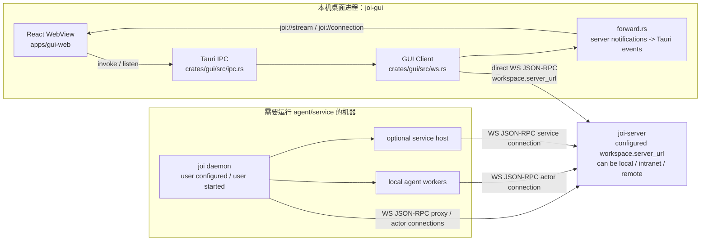

# Joi Desktop GUI 设计文档

> 为 human actor 提供的本地桌面 GUI 客户端，替代/并行于 `joi chat` TUI。
> 交互与视觉语言参考 Discord；协议语义严格遵循 v0（[open-multi-actor-collaboration-protocol-v0.md](protocol/open-multi-actor-collaboration-protocol-v0.md)）。
> 本文档是 GUI 工作的权威入口，后端 Rust 代码与前端 React 代码都以此为规范。

## 1. 目标与非目标

### 目标

1. 为人类 actor 提供一个持续驻留、桌面原生的工作台（mac / linux），取代 TUI 的长连接窗口。
2. **完全等价**地覆盖 TUI 当前所有交互：channel/thread 浏览、发送、流式接收、@handoff、`/slash`、reply target、cancel turn、action.request 审批、announcement 面板、channel 邀请/撤销、跨 scope 的 action.request inbox。
3. 视觉与交互向 Discord 的「服务器栏 · 频道栏 · 主内容 · 成员栏」四栏范式看齐，便于新用户零学习成本。
4. 不引入任何新的 WS 方法。GUI 仍是协议客户端，不托管 `joi-server`，
   也不启动 `joi daemon`；machine/daemon 由用户在目标机器上自行配置和启动。

### 非目标

- 不做帐号/身份认证（v0 仍免认证；actor_id 由本地配置决定）。
- 不做多服务器并行连接（首版只连 `config.server_url` 指定的一个 joi-server）。
- 不做消息/文件的跨设备同步——服务器本身就是 single source of truth。
- **不**字面拷贝 Discord 的 CSS / 位图资源（版权与法律风险）。我们复刻的是**设计语言**：三/四栏骨架、深色配色比例、消息组、reactions、@mention picker、slash palette、bell inbox、context menu。

## 2. 技术栈与工程结构

### 2.0 运行拓扑



这条边界必须保持稳定：GUI 可以为了 `cargo run -p joi-gui` 的开发体验补起 Vite dev
server；但 `joi-server` 和 `joi daemon` 都是用户显式管理的外部进程。GUI 启动不
依赖它们已经在线，也不负责拉起它们；用户在 GUI 里选择 workspace 后，才按
`server_url` 尝试连接对应服务端。

### 2.1 栈

- **外壳**：Tauri 2.x（Rust 后端 + WebView 前端；产物比 Electron 小一个数量级）。
- **后端 Rust**：复用 workspace 里已有的 `proto`、`crates/cli/src/client.rs`、`crates/cli/src/config.rs`。Tauri 把它们包成 IPC command 面向前端。
- **前端**：React 18 + TypeScript + Vite + Tailwind CSS。状态管理用 Zustand（小、无样板、适合这类派发式 store）。Markdown 用 `react-markdown` + `remark-gfm` + Shiki 代码高亮。
- **包管理**：pnpm（锁文件稳定、速度快）。
- **测试**：Rust 侧跑 `cargo test --workspace`；前端跑 Vitest + React Testing Library。E2E 暂缓——手动在 mac 上跑通。

### 2.2 目录

```
crates/
  gui/                          # 新增：Tauri 后端 crate，名 "joi-gui"
    Cargo.toml
    build.rs                    # tauri-build
    tauri.conf.json
    src/
      main.rs                   # Tauri app 入口
      ipc.rs                    # 对前端暴露的 #[tauri::command]
      state.rs                  # ClientHandle + NotifBus
      forward.rs                # WS notification → Tauri event
apps/
  gui-web/                      # 新增：前端 React 工程（非 cargo 成员）
    package.json
    vite.config.ts
    tsconfig.json
    tailwind.config.ts
    index.html
    src/
      main.tsx
      App.tsx
      design/                   # tokens / components / icons
      features/
        sidebar/
        chat/
        announcement/
        inbox/
        prompt/                 # 输入框 + slash/at picker
      store/
        session.ts              # actor/config/connection
        channels.ts             # channel & thread tree
        messages.ts             # 每 scope 的 bubble list + stream buffer
        inbox.ts                # cross-scope pending action.requests
        ui.ts                   # modal / picker / focus
      ipc/
        bridge.ts               # typed wrapper around invoke() + listen()
        types.ts                # 和 crates/proto 同步的 TS 类型
```

- `crates/gui` 注册进 workspace `Cargo.toml`，不加入 `make release` 的 `PKG_FLAGS`——Tauri 有自己的打包命令。
- `apps/gui-web` 独立于 cargo workspace，pnpm 自成一体。

### 2.3 开发命令（新增）

```sh
make gui-dev            # 开发：启动 vite + tauri dev（内部起前端 dev server 并打开桌面壳）
make gui-release        # 出 .app / .dmg / .AppImage
```

底层是 `cd crates/gui && cargo tauri dev|build`；tauri.conf.json 里 `distDir` 指向 `../../apps/gui-web/dist`、`devPath` 指向 `http://localhost:5173`。

## 3. 信息架构

Discord 的四栏结构直接可用：

```
┌──────┬────────────────┬────────────────────────────────────┬──────────┐
│      │                │                                    │          │
│  S   │   Channels     │                                    │ Members  │
│  e   │                │          Main (chat area)          │          │
│  r   │   Threads      │                                    │  Rail    │
│  v   │                │                                    │          │
│  e   │                │ ─────────────────────────────────  │          │
│  r   │                │ Prompt + slash/at palette          │          │
│  s   │                │ Reply-target chip / Streaming bar  │          │
│      │                │                                    │          │
└──────┴────────────────┴────────────────────────────────────┴──────────┘
```

### 3.1 Servers 栏（最左，72px）

| 项 | 语义 |
| --- | --- |
| Workspace icon | 每个已添加的 workspace 一个；hover 显示 name + URL，点击切换/连接，右键弹 Reconnect / Disconnect / Remove |
| 状态圆点 | 绿=活跃且已连，橙=正在连接，红=活跃但出错，灰=未连 |
| `+` | Add workspace（打开 AddWorkspaceModal：name / server URL / actor id / display name） |
| Inbox（铃铛） | 跨 scope 待办 `action.request` 数量徽标；断线时 disabled |
| Settings | 本地配置 |

启动时**不自动连**：如果有历史 workspace 就展示它们在栏里、主区展示 Landing；如果没有就直接渲染空态让用户走 Add。配置在 `~/.config/joi-apps/desktop.toml`（多 profile 的 toml 数组），首次启动会尝试从 TUI 的 `cli.toml` 迁移成 "Local" workspace。

### 3.2 Channels & Threads 栏（240px）

一栏里分区展示，参考 Discord 的「频道列表 + 活跃线程」：

```
JOI WORKSPACE                 ⚙
────────────────────────────
▸ CHANNELS
   # design           🟢      ← 当前频道高亮
     └  thread-1   (3)       ← unread 徽标
     └  thread-2
   # lobby  (Public)
▸ DIRECT                     ← 预留：actor 直连私信（v0 暂不做）
```

- **分组**：CHANNELS 是所有可见 `Channel`，Public 单独标 `Public` 字样；Private 频道显示挂锁图标。
- **展开**：默认展开的 channel 下挂其 threads；公共频道支持「公区入口」伪 thread（对应 `ScopeKind::Channel`，点击让 GUI bind 到 channel 的 common area）。
- **当前 scope**：绿色圆点；sidebar 自动聚焦到当前 thread 所属 channel（参考 `Sidebar::focus_channel_of_current_thread` sidebar.rs:112-138）。
- **右键菜单**：
  - 在 channel 上：Rename / Delete / Invite... / Members / Leave（如果自己是成员）
  - 在 thread 上：Rename / Delete / Copy id
- **增删**：右上角小 `+` 按钮触发 modal；创建 thread 时先在 channel
  公共区写入 root event，再以该 `rootEventId` 调用 `thread/create`。不能从
  thread 内 event 继续创建子 thread。

### 3.3 Main 区（flex）

自上而下：

1. **Header**：`#channel / thread_title`，右侧三个图标：pinned announcement 切换、members rail 切换、thread 菜单（...）。
2. **Announcement pinned banner（可选）**：当 `history.current_announcement` 不为空时显示一条折叠/展开的黄色条带。参考 TUI `chat/announcement.rs`。
3. **Message list**：
   - 按时间升序；相邻同 actor 且间隔 < 5 分钟的 bubble 合并成「消息组」（仅首条显示头像 + 名字 + 时间）。
   - 气泡类型（直接映射 `history::BubbleKind`）：
     - `Stream`：正常 `content.add` 消息；同 actor 同 turn 的连续内容可合并。
     - `Static`：handoff、action.response 之类。
     - `ActionRequest`：黄色左 border + 标题 + 选项按钮；首次到达吹气（pulse）一次。
     - `System`：灰色斜体、居中。
   - 每条气泡 hover 显示工具条：`Reply` · `Copy` · `Copy id` · 对 `ActionRequest` 显示各 choice 按钮。
   - **Reply quote line**：有 `reply_to_event_id` 时头部挂一条 `↩ @target: preview…`（TUI history.rs 已有同款概念）。
   - **Handoff line**：有 `handoff_target` 时用 `handoff -> @target: …` 样式，右侧小 badge 显示目标 agent 状态（从 `actor/list` 过滤 agent）。
4. **Streaming status bar**（position: sticky; bottom）：展示当前 scope 内所有 open turn（`open_turns_in_scope`）。点击 ✕ 触发 `turn/close(status=cancelled)`。
5. **Prompt**（固定底部，参考 Discord 输入框）：
   - 多行可伸缩 textarea，`Enter` 发送，`Shift+Enter` 换行。
   - **Reply chip**：`reply_target` 非空时顶出一行 `Replying to @x: preview…  [✕]`。
   - **Slash palette**：输入以 `/` 开头且还没空格时浮出命令列表（见 §5）。
   - **@Mention palette**：输入以 `@` 开头且还没空格时浮出 agent 列表（遵循 private channel 过滤规则，app.rs:308-357）。
   - **粘贴大段文本**：走 TUI 已有的 auto-artifact 逻辑（events.rs:2362 `save_pasted_content_to_workspace`），GUI 弹「以附件发送 / 以内联发送」二选一。

### 3.4 Members rail（右，240px，可折叠）

- 列出当前 channel 的 members（`sidebar.members_by_channel[current_channel]`）。
- 每行：头像圆点（agent=正方形，human=圆形，service=菱形，对应 `ActorKind`）+ 显示名 + 状态文字。
- 右键：Invite... / Revoke（非自己时）/ Open DM（预留）。
- channel 是 Public 且没有解析过 members 时，显示 "公共频道" 占位。

### 3.5 Inbox（全屏覆盖页）

点击 Servers 栏的铃铛进入。对应 TUI 「cross-scope action.request 横幅 + 跨 scope 状态行」，GUI 升级成独立视图：

```
Inbox                                                       [Mark all read]

  ⚠ #design > thread-1
     "Approve deploy to prod?"    · 5m ago
     [Approve]  [Reject]  [Open thread ↗]

  ⚠ #lobby (common area)
     "请确认变更 #CR-1234"        · 2h ago
     [Approve]  [Reject]  [Open ↗]
```

数据来自：
- 各 scope 的 history 里未响应的 `action.request`（`History::pending_action_requests`）。
- 跨 scope 的 `action.request` 通过 actor-inbox push 进来时写入 `inbox.store`（events.rs:462 `apply_cross_scope_action_request` 的 GUI 等价）。

「Approve / Reject」按钮直接调 `event/append(kind='action.response', payload={optionId, kind}, relations=[RespondsTo(request_event_id)])`，和 TUI `do_action_response` 完全一致（events.rs:2171）。

## 4. 设计 Token

> **重要**：以下 token **借鉴** Discord 的视觉比例（深背景主导、冷色高亮、高对比文字），但**自选**具体色值。不复用 Discord 的任何 CSS / SVG / 字体。字体用 Inter（免费）+ JetBrains Mono（免费）。

### 4.1 颜色（深色主题，默认）

| token | hex | 语义 |
| --- | --- | --- |
| `--bg-servers` | `#1a1b1e` | Servers 栏底 |
| `--bg-sidebar` | `#23252a` | Channels 栏底 |
| `--bg-main` | `#2b2d31` | 主内容背景 |
| `--bg-elevated` | `#1e1f22` | 弹层 / modal 底 |
| `--bg-hover` | `#34363c` | hover 态 |
| `--bg-active` | `#404249` | 当前选中行底 |
| `--bg-mention` | `rgba(255, 196, 0, 0.08)` | 提到我的消息底色 |
| `--border` | `#1f2023` | 分栏分隔线 |
| `--text-primary` | `#f2f3f5` | 正文 |
| `--text-secondary` | `#b5bac1` | 次级 / 时间 / 徽标数字 |
| `--text-muted` | `#80848e` | placeholder / 系统消息 |
| `--accent` | `#5865f2` | 链接、highlight、button primary |
| `--accent-hover` | `#4752c4` | |
| `--accent-contrast` | `#ffffff` | accent 上文字 |
| `--success` | `#3ba55d` | 在线状态圆点 / Delivered ✓ |
| `--warning` | `#f2b14a` | action.request border / announcement |
| `--danger` | `#ed4245` | error、断线徽标 |
| `--role-human` | `#b794f4` | human 消息头名字默认色 |
| `--role-agent` | `#22d3ee` | agent 消息头名字默认色 |
| `--role-service` | `#a1a1aa` | service 消息头名字默认色 |
| `--role-self` | `--text-primary` | 自己的消息 |

浅色主题留给 v2。

### 4.2 字号 / 行距 / 间距

- 基准字号 14px / 行距 1.5；时间戳 12px；徽标 11px。
- 栏间 1px `--border` 分隔；栏内通用内边距 8px 16px。
- 气泡组内部消息间距 2px；组间 16px。
- 气泡最大宽度：`min(760px, 90% main)`；图片/代码块允许超过。

### 4.3 圆角与阴影

- 方框小圆角 4px（sidebar 行、hover state）。
- Modal 8px + 一级 shadow `0 8px 24px rgba(0,0,0,.45)`。
- 头像 6px 圆角（agent 方、human 圆，通过 border-radius `50%` vs `25%` 区分）。

### 4.4 字体栈

```css
--font-ui: "Inter", -apple-system, BlinkMacSystemFont, "Segoe UI", sans-serif;
--font-mono: "JetBrains Mono", "SF Mono", Menlo, Consolas, monospace;
```

## 5. 槽位一览：组件清单

| 组件 | 作用 | 对应 TUI |
| --- | --- | --- |
| `ServerRail` | 左侧 72px 服务器栏 + Inbox/Settings | 无（GUI 新增） |
| `ChannelList` | channel 分组 + create 按钮 | `sidebar.rs::Channels` 栏 |
| `ThreadList` | 选中 channel 的 threads + common-area 入口 | `sidebar.rs::Threads` 栏 |
| `MembersRail` | 当前 channel 成员 | `sidebar.rs::Members` |
| `ChatHeader` | scope 标题 + 快捷 toggle | TUI header |
| `AnnouncementBanner` | 顶部 pin 面板（折叠） | `chat/announcement.rs` |
| `MessageList` | 虚拟滚动的 bubble 列 | `chat/history.rs` + `chat/ui.rs` |
| `Bubble.Stream` / `Static` / `ActionRequest` / `System` | 四种 bubble 渲染器 | `BubbleKind` |
| `InFlightStatusBar` | 当前 scope open turns + cancel | `ui.rs` in-flight 区 |
| `Prompt` | textarea + chip + placeholder | `chat/prompt.rs` |
| `SlashPalette` | `/` 触发的浮层菜单 | `app::slash_menu` |
| `MentionPalette` | `@` 触发的浮层菜单 | `app::at_menu` |
| `ReplyChip` | prompt 上方 reply target 条 | `app::reply_target` |
| `InboxPage` | 跨 scope pending action.requests | events.rs:462 逻辑 |
| `Modal.CreateChannel` / `Rename` / `Delete` / `Invite` | channel CRUD | `prompt.rs::PromptModal` |
| `ContextMenu` | 右键通用 | 无 |
| `Toast` | 状态/错误提示（3s） | TUI status bar |
| `DisconnectedOverlay` | 断线半透明盖层 + 重连按钮 | `app.disconnected` |

## 6. 状态模型

前端 store 直接映射 TUI `App`：

### 6.1 `session` store

```ts
{
  config: { serverUrl, actorId, displayName }
  connection: 'idle' | 'connecting' | 'open' | 'closed' | 'error'
  serverInfo?: { name, title, version, protocolVersion }
}
```

对应 `client.initialize` / `connection/open`。

### 6.2 `channels` store

```ts
{
  channels: Channel[]                          // by title asc
  threadsByChannel: Record<channelId, Thread[]>
  membersByChannel: Record<channelId, MemberRow[]>
  currentScope: { kind: 'thread'|'channel', id: string } | null
  selected: { channelId?, threadId? }          // sidebar cursor
}
```

驱动事件：`channel/list` 冷启、`thread/list` 按需、`channel/members` 按需；增量来自 `stream/update{kind: channel.invited|channel.revoked|thread.created}`。

### 6.3 `messages` store（每 scope 一棵）

```ts
type Bubble = {
  id: string                // trailing_event_id | synthetic
  actorId: string
  turnId?: string
  kind: 'stream' | 'static' | 'actionRequest' | 'system'
  text: string
  ts: ISOString
  replyToEventId?: string
  delivery: 'na' | 'pending' | 'delivered'
  handoffTarget?: string
  // action.request 专用：
  requestType?: string
  choices?: { id: string; label: string }[]
  acknowledged?: boolean
}

{
  byScope: Record<scopeKey, {
    bubbles: Bubble[]
    announcement?: { text, actorId, ts }
    pendingActionIds: Set<string>       // 本 scope 内未 ack 的 action.request id
    openTurns: Record<turnId, { actorId, openedAt }>
    autoFollow: boolean
    scrollToBottom: number               // 触发器
  }>
}
```

所有写入逻辑严格对齐 `history::push_event` switch：
- `content.add` 且 `HandsOffTo` 且无 `RepliesTo` → 推 handoff bubble。
- `content.add` 其它 → append stream（同 actor 同 turn 合并）。
- `action.request` → `ActionRequest` bubble + `pendingActionIds += id`。
- `action.response` → 从 relations[RespondsTo] 取 request id，`pendingActionIds.delete(id)`，可选 push static。
- `announcement.set` / `.clear` → 改 `announcement`。
- `turn.close` 且 `status=cancelled` → push system 行。

### 6.4 `inbox` store

```ts
{
  items: Array<{
    requestEventId: string
    scope: ScopeRef
    title: string
    description: string
    choices: Choice[]
    arrivedAt: ISOString
    seen: boolean
  }>
}
```

来源：
- 跨 scope push（`event.created` kind=action.request + HandsOffTo me && scope ≠ currentScope）→ 追加。
- 本 scope 解决时若 item 来自 inbox 需移除。

### 6.5 `ui` store

```ts
{
  sidebarVisible: boolean
  membersVisible: boolean
  modal: null | { type: 'createChannel'|'renameThread'|... , props }
  toast?: { level, message, id }
  draft: Record<scopeKey, string>          // 对应 TUI DraftInput 的持久化
  replyTarget: Record<scopeKey, { eventId, preview } | null>
  theme: 'dark' | 'light'
}
```

`draft` 和 `replyTarget` 按 scope 存，切换不丢（TUI 用 `chat/draft.rs` 实现持久化，GUI 用 `localStorage`）。

## 7. 后端（Tauri）桥接

前端永远不直接开 WebSocket。Tauri Rust 侧持有唯一的 `Arc<Client>`，前端通过 IPC 说话。好处：

- **重连策略**在 Rust 里写一次，前端不关心。
- **类型**：Rust 拿 `proto` 的 canonical 类型；给前端用 `ts-rs` 或手写 TS mirror。
- **性能**：notification 流量大时 Rust 聚合后发 1 帧；JS worker 不会被滚。

### 7.1 前端 → 后端（`#[tauri::command]`）

| command | 参数 | 行为 |
| --- | --- | --- |
| `connect` | `{ url, actorId, displayName }` | `Client::connect` + `initialize` + `connection/open` |
| `disconnect` | — | 关闭 WS |
| `channel_list` | — | `channel/list` |
| `channel_create` | `{ title, visibility }` | `channel/create`（private 时带 actorId） |
| `channel_update` / `channel_delete` / `channel_invite` / `channel_revoke` | | 对应 RPC |
| `channel_members` | `{ channelId }` | |
| `thread_list` / `thread_create` / `thread_update` / `thread_delete` | | |
| `scope_subscribe` / `scope_unsubscribe` / `scope_read` | `{ scope, limit?, beforeEventId? }` | |
| `event_append` | `{ event: EventAppendInput }` | 通用：message send、handoff、action.response 都走这个 |
| `turn_close` | `{ turnId, status }` | cancel |
| `actor_list` / `agent_list` | | 启动时引导 + @mention palette |
| `artifact_publish` | `{ ingress, createdBy, scope }` | 粘贴附件 |

### 7.2 后端 → 前端（`tauri::Manager::emit`）

Rust 侧跑一个 `forward` task 把 WS `Notification` 映射成 Tauri event：

| event name | payload |
| --- | --- |
| `joi://stream` | `{ kind: string, scope, data }`（原 `stream/update` 镜像） |
| `joi://trace` | `TurnTraceUpdate`（agent 行）—— GUI 首版不展示，但埋好 |
| `joi://connection` | `{ state: 'open'|'closed'|'error', detail? }` |

前端在 `ipc/bridge.ts` 注册 listener，分发到对应 store。

### 7.3 重连

- 断线 → 指数退避（1s, 2s, 5s, 10s, 30s 封顶）自动重连。
- 重连成功后重放：`initialize` → `connection/open` → 所有 `subscribedScopes` 重订阅 → 对当前 scope 做 `scope/read` 增量回补（`beforeEventId` 取本地最老那条）。
- UI：`DisconnectedOverlay` 半透明覆盖 main 区，大字 "Reconnecting…" + 重试按钮。

## 8. 事件 ↔ UI 更新映射表

| 协议入口 | 处理 | UI 可视结果 |
| --- | --- | --- |
| `stream/update{event.created, content.add}` | messages.append / mergeStream | 气泡出现或拼接 |
| `stream/update{event.created, action.request}` 本 scope | messages.append ActionRequest + inbox-in-scope | 黄框气泡、铃铛响、桌面通知 |
| `stream/update{event.created, action.request}` 跨 scope | inbox.add + toast | Servers 铃铛徽标 +1、顶部 toast |
| `stream/update{event.created, action.response}` | messages.resolveAction | 原 ActionRequest 气泡上打勾、按钮禁用 |
| `stream/update{event.created, announcement.set/clear}` | messages.setAnnouncement | AnnouncementBanner 出现/消失 |
| `stream/update{turn.opened}` | openTurns[id] = ... | 状态条显示 "agent X typing…" |
| `stream/update{turn.closed}` | openTurns delete; 流式 bubble 结束 | 光标消失、状态条移除 |
| `stream/update{channel.invited}` | channels.addOrPatch + toast "you were added to #x" | Sidebar 出现新 channel |
| `stream/update{channel.revoked}` | channels.remove + 当前 scope 若在其中则回 Home | Sidebar 该 channel 消失 |
| `stream/update{thread.created}` | threadsByChannel[ch].append | Sidebar 展开 channel 时可见 |
| `stream/update{delivery.updated}` | messages.markDelivered | outgoing bubble 从 ⏳ → ✓ |

## 9. 键盘快捷键

尽量对齐 Discord + macOS 原生约定；括号内是 TUI 等价。

| 组合 | 行为 |
| --- | --- |
| `⌘K` / `Ctrl+K` | 全局 quick switcher：channel、thread、actor 模糊查找 |
| `⌘B` / `Ctrl+B` | 切换 Channels/Threads 栏（对齐 TUI Ctrl+B） |
| `⌘U` / `Ctrl+U` | 切换 Members rail |
| `⌘⇧I` / `Ctrl+Shift+I` | 打开 Inbox |
| `/` | 在 prompt 空时聚焦并打开 slash palette |
| `@` | 在 prompt 空时聚焦并打开 @mention palette |
| `↑` 在 prompt 空时 | 编辑自己上一条（v2） |
| `Esc` | 关闭 palette / modal / reply chip / cancel edit |
| `⌘↵` / `Ctrl+Enter` | 强制发送（即使 palette 打开） |
| `Shift+Enter` | 换行 |
| `Enter` | 发送 |
| `⌘F` / `Ctrl+F` | 在当前 scope 内搜索（v2） |
| `⌘,` / `Ctrl+,` | Settings |
| 右键气泡 | Reply · Copy · Copy id · React（v2） |

## 10. Slash 命令映射

来源 `app.rs:617-633`：

| `/cmd` | GUI 行为 |
| --- | --- |
| `/handoff [@agent] [msg]` | 带 message → 直接发 `content.add` + HandsOffTo；不带 → 打开 Handoff picker |
| `/reply` | 打开 Reply picker（历史中可回复的气泡） |
| `/action` | 打开本 scope 的 pending action picker |
| `/agents` | 在 main 区弹出 agents 列表（`actor/list` 过滤 agent） |
| `/cancel [@agent]` | 取消本 scope 的 open turn（多选时弹 picker） |
| `/invite` | 打开 Invite actor modal |
| `/members` | 打开 MembersRail（若已开则滚到顶） |
| `/announce <text>` / `/announce clear` | `event/append` announcement.set / .clear |
| `/quit` | 关闭窗口（= ⌘Q） |

除了 `/quit` 其它**和 TUI 字面一致**——允许用户把 TUI 肌肉记忆直接搬到 GUI。

## 11. 里程碑拆分

### M0 · 设计文档（本文）

### M1 · 脚手架（下一步落地）

交付物：
- `crates/gui` Tauri backend crate：能启动空白窗口、完成 `connect` 命令、前端能收到 `joi://connection` event。
- `apps/gui-web` React 骨架：Discord-like 四栏空壳、读 mock 数据；验证设计 token。
- `make gui-dev` / `make gui-release` 可跑通。

### M2 · 核心聊天闭环（本轮目标收口）

- Sidebar：列 channels、点击切 scope、基本 thread 列表。
- Main：`scope/read` 冷启 + open turn 状态 + 发送。
- Bell：本 scope action.request 弹黄框 + cross-scope 写 inbox。
- Prompt：textarea + slash/at palette 基础项（`/handoff`、`@agent`）。

### M3 · 完整覆盖 TUI

**已落：**
- ✅ channel CRUD（create / rename / delete / invite / thread create/rename/delete）走通用 Modal + 右键 ContextMenu。
- ✅ members pane（自动按 channel 拉 `channel/members`）。
- ✅ announcement banner + `/announce <text>` / `/announce clear` 写入路径。
- ✅ cancel turn（`/cancel` 或状态条 ✕，自动选唯一 / 多条时弹 picker）。
- ✅ `/reply` · `/action` · `/invite` · `/members` · `/agents` · `/quit` 真实动作。
- ✅ 断线 overlay（`DisconnectedOverlay`）+ 手动 Retry。
- ✅ `⌘K` quick switcher 骨架（`ModalHost` 的 quickSwitch 模式已实现，尚未绑全局快捷键）。
- ✅ 通用右键菜单（channel / thread / workspace）。
- ✅ **Workspace 多 profile**：ServerRail 顶部渲染 workspace icons，启动不自动连，`+` 打开 AddWorkspaceModal，右键 workspace 可 reconnect / disconnect / remove。首次启动自动从 TUI 的 `cli.toml` migrate 一份 "Local" workspace。

**未落（M4 再做）：**
- `⌘K` 全局快捷键绑定（需要 `@tauri-apps/plugin-global-shortcut` 或 DOM 级 keydown bridge）。
- 指数退避自动重连（现在只有手动 Retry 按钮）。
- agent status 徽标（需要基于 `actor/list` / connection 状态或服务器端 push）。

### M4 · GUI 独有能力

- Inbox 独立页（跨 scope 待办汇总）。
- 粘贴大块文本自动 artifact 选择器。
- 拖放文件上传 artifact（`artifact/publish` InlineText → binary 时需先扩协议，暂缓）。
- 浅色主题。
- agent trace 可视化（`turn/trace.update`）。

## 12. 与 TUI 的共存策略

- TUI 和 GUI 走同一个 joi-server、可同时连，服务器 actor-inbox 会把 directed event（handoff、invite 等）给**所有** bound connection。但 action.response 只能有一条——先响应的先生效。
- 配置文件共享 `~/.config/joi-apps/cli.toml`。GUI 修改 actor_id 会写回这里，TUI 下次启动读到新值。
- 文档里保留 `joi chat` 作为「轻量 / ssh 远程 / 服务器旁运维」入口；GUI 作为日常工作台入口。

## 13. 合规与版权说明

- Discord 的代码、CSS、图标、位图、字体资源**不使用**。本设计语言来自 Discord 交互范式（三栏布局、消息组、@mention、slash）——这些是 IM 产品通行模式，不是 Discord 独占。
- 颜色、字体、图标集：
  - 颜色全部自选（§4.1）。
  - 字体用 Inter（OFL）+ JetBrains Mono（OFL）。
  - 图标用 [Lucide](https://lucide.dev)（ISC License）。
- 产品名：`Joi Desktop`（与 TUI 的 `joi` 区分）。
