# Loom 破坏性重构目标规格

本文档记录从当前 `joi` 工程重构到 `loom` 的目标规格。实现以本文档的目标形态为准；若需要改变设计，必须先更新本文档再实现。

## 0. 底线约束

- 不考虑旧 `joi` 名称、命令、配置、数据目录、协议方法的兼容。
- 可以直接做破坏性修改，目标是把模型重构彻底，而不是在旧模型上继续补丁。
- 新架构要以消息为中心，`thread`、`task`、投递、agent 执行都围绕消息展开。
- 目标注意力模型采用 Slock 风格的确定性投递：mention / DM / owned task / followed thread。`loom-server` 不引入小模型。
- agent 主动性不能简单等价为“所有 agent 看所有消息”。若需要语义主动性，也应作为外部 attention service，而不是塞进 `loom-server` 主进程。
- 文档中的 `loom` 是新名称。旧文档、旧代码中的 `joi` 都视为待替换对象。

## 1. 当前架构简述

当前工程大体分为几块：

- `crates/proto`: 协议类型和 JSON-RPC 方法定义。
- `crates/server`: WebSocket JSON-RPC 消息枢纽，负责 channel / thread / turn / event / task / delivery / artifact 的持久化与 fanout。
- `crates/cli`: CLI、daemon、agent worker、service worker。
- `crates/agent-runtime`: agent adapter 抽象，连接 Codex/Claude/ACP/command transport 等外部运行时。
- `crates/gui` + `apps/gui-web`: Tauri 桌面端和 React GUI。

当前核心问题：

- `Event`、`Handoff`、`Task`、`Delivery` 的语义分散，用户实际感知的是“消息”，但协议中心不是 message。
- `@mention` 的 GUI 触发和发送语义不一致。输入中可以在任意位置选择 mention，但发送时只有前缀 `@xxx ...` 被转成 handoff。
- agent 当前依赖 mention/handoff。目标模型应收敛为 Slock 风格确定性投递，语义主动性不进入 server 核心。
- task 是独立对象，但实际更像顶层消息上的任务状态维度。
- CLI 命令拆成 `say` / `handoff` / `message`，心智模型不统一。
- GUI 通知体系、人员分组、agent 配置版本管理、Docker 部署还不完整。

## 2. Slock 参考结论

从 Slock 频道设计中抽象出的关键点：

- `thread` 不需要单独 create。顶层消息有 `msg id`，回复目标写成 `#channel:msgId` 即可按需创建或复用 thread。
- `thread` 是新的子会话上下文，不是新的 agent 实例。
- `task` 不是脱离消息的新对象，而是挂在某条顶层消息上的任务状态维度。
- `@mention` 是强信号，但不是“看到名字就必须回复”。是否回复还要结合语义、投递规则、thread/task 归属、最近发言人和协作礼仪。
- agent 回复时应复用收到消息的 target：channel 消息回 channel，thread 消息回同一个 thread，DM 消息回 DM。
- 多 agent 场景中，避免重复劳动的关键是 task claim / ownership，而不是让每个 agent 都抢答。

这些结论应该成为 Loom 新消息模型和 agent 投递模型的基础。

## 3. 目标拓扑

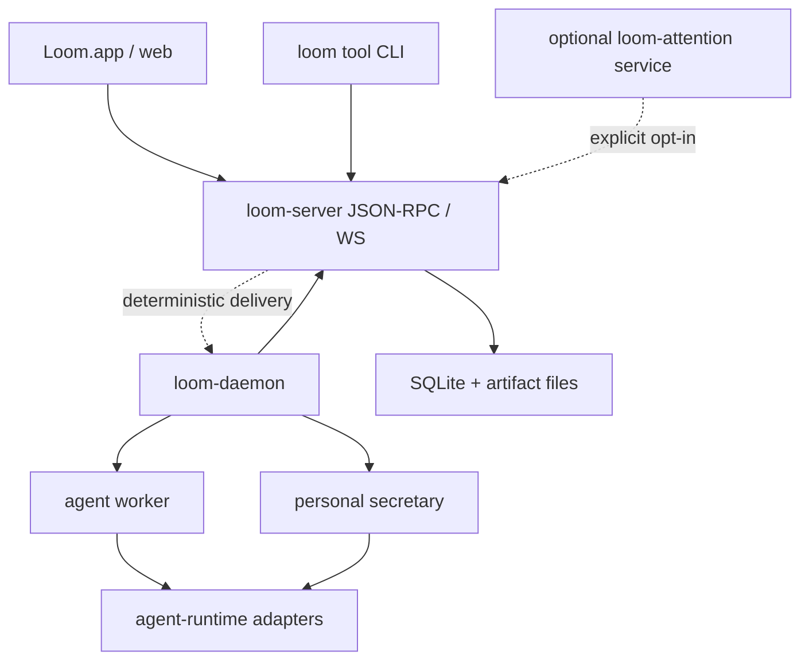

设计边界：

- `loom-server` 仍然是协作状态和实时消息中心。
- `loom-daemon` 仍然是本机 agent runtime supervisor，不把 adapter 生命周期塞进 server。
- 不把小模型或意图识别放进 `loom-server`。
- 普通 member agent 不订阅全量频道消息，只接收与自己相关的确定性投递。
- 如果需要语义主动性，使用独立 `loom-attention` 服务。它通过普通 RPC 读授权范围内的轻量上下文，再显式发 message 或 task，不改变 server 的纯粹边界。

## 4. 命名硬切

所有公开和内部命名都从 `joi` 改为 `loom`：

- agent/tool CLI: `loom`
- runtime binaries: `loom-server`, `loom-daemon`，需要单独成二进制时使用
- macOS app: `Loom.app`
- crate/package/app id: `loom-*`
- env: `LOOM_*`
- config dir: `~/.loom`
- data dir: `loom` server data
- protocol service name: `loom`
- Docker image: `loom-server`
- GUI 文案、README、脚本、测试、示例、文档全部替换

不保留 `joi` alias，不做旧配置自动读取，不做旧命令转发。

## 5. 新领域模型

### 5.1 核心对象

| 对象 | 说明 |
| --- | --- |
| `Actor` | 人、agent、machine、system、service 的统一身份 |
| `ActorPresence` | 某个 actor 在某个 channel 中的存在、静音、关注、工作区和注意力策略 |
| `ActorGroup` | 成员分组，支持 `@all`、`@agents`、`@humans` 和自定义组 |
| `Channel` | 长期协作空间和权限边界 |
| `Message` | 核心通信单元，取代用户层面的 `Event` |
| `Thread` | 某条顶层 message 下的子会话上下文 |
| `Task` | 挂在顶层 message 上的任务状态维度，替代当前分散的 task 概念 |
| `CoordinationSession` | 多 actor 行动计划与 commitment，挂在 task 或 thread 上 |
| `CoordinationStep` | 协作执行的一步，带 `base_revision` 和提交者 |
| `Run` | agent 的一次执行回合，重构当前 `Turn` 的 agent 语义 |
| `Delivery` | actor attention queue 的持久项，表示某条 message 是否需要某个 actor 注意或行动 |
| `Artifact` | 消息或 task 关联的产物 |
| `AgentConfigVersion` | agent 配置的不可变版本 |

用户层 `Event` 删除。若实现需要审计或投影重放，只保留内部 `JournalRecord`，不暴露 public API。

### 5.2 Message 字段

```text
Message {
  id
  scope
  target
  author_actor_id
  created_at
  kind
  body
  mentions[]
  audience
  intent
  delivery_policy
  parent_message_id
  thread_root_message_id
  task_id
  attachments[]
  metadata
}
```

关键字段：

- `target`: `#channel`、`#channel:msgId`、`dm:@actor`、`group:@group`。
- `kind`: `human`、`agent`、`system`、`attention`、`task_update`、`artifact`。
- `intent`: `chat`、`ask`、`request_action`、`assign_task`、`status_update`、`review`、`notify`。
- `audience`: actor/group/all 的结构化目标，不从正文临时推导。
- `delivery_policy`: `notify_only`、`wake_agent`、`route_by_intent`、`silent`。

### 5.3 Thread 关系

顶层消息：

```text
#channel
  message: msg_123
```

thread target：

```text
#channel:msg_123
```

规则：

- 发到 `#channel:msg_123` 时，server 自动创建或复用 thread。
- thread 的权限继承 channel，但可以有 follow/unfollow/read state。
- agent 收到 thread 消息后必须回同一个 target。
- thread 不是新 agent 实例，也不是新的 workspace。

### 5.4 Task 关系

`Task` 挂在顶层 message 上：

```text
Channel
  root Message
    Task
      canonical Thread
      Run[]
      Artifact[]
      Assignment/Owner
      Status
```

状态：

- `open`
- `claimed`
- `in_progress`
- `waiting_review`
- `done`
- `blocked`
- `canceled`
- `failed`

`Task` 不再承担消息职责。讨论、进度、交付物都进入 canonical thread。

## 6. 通信与命令收拢

### 6.1 RPC 方向

新 RPC 以 message 为用户可见中心，同时把任务和协作状态机拆成独立入口：

- `message.send`
- `message.list`
- `message.read`
- `message.search`
- `thread.follow`
- `thread.unfollow`
- `inbox.list`
- `delivery.ack`
- `task.create`
- `task.claim`
- `task.assign`
- `task.update`
- `task.complete`
- `task.reopen`
- `task.cancel`
- `run.open`
- `run.append`
- `run.close`
- `coordination.propose`
- `coordination.commit`
- `coordination.respond`
- `coordination.step`
- `coordination.skip`
- `coordination.reassign`
- `agent_config.publish`
- `agent_config.activate`

删除面向用户的独立 `handoff` 命令。简单点名交办由 message 的 audience / intent / delivery policy 表达；多人有序交接由 `CoordinationStep(type=handoff)` 表达。

### 6.2 CLI 方向

统一到 `loom message`：

```text
loom message send --target "#channel" "hello"
loom message send --target "#channel:msg_123" "thread reply"
loom message send --to "@reviewer" --intent request_action "帮我看一下"
loom message read --target "#channel"
loom message read --target "#channel:msg_123"
loom inbox list
loom message search "keyword"
loom task create --root msg_123 --title "修复登录页 500"
loom task claim --id task_123 --base-owner-revision 0
loom task update --id task_123 --status in_progress --message "开始处理"
```

`say`、`handoff` 不保留。可以保留 slash/helper 层，但消息类操作最终落到 `message.send`，任务状态操作最终落到 `task.*`。

### 6.3 运行程序与模型工具 CLI 分离

整体原则：给 agent 的能力全部通过受限的 `loom` 工具 CLI 暴露；运行程序不和模型工具 CLI 混在一起。

需要拆成两类命令面：

| 命令面 | 名称 | 使用者 | 能力范围 |
| --- | --- | --- | --- |
| Tool CLI | `loom` | agent runtime / 模型工具 / 人类日常消息操作 | 发消息、读 inbox/thread、claim/update task、coordination step、artifact 操作、approval/action request |
| Runtime binaries | `loom-server`, `loom-daemon` | 人类运维、桌面端、启动脚本 | 启停 server/daemon、配置机器、部署、迁移、调试服务 |
| GUI | `Loom.app` | 人类用户 | 正常 macOS app 交互 |

边界：

- agent prompt 中只出现 `loom`。
- `loom` 不包含 `server start`、`daemon stop`、配置服务、删除数据、迁移数据等运行管理能力。
- `loom` 通过当前 actor 身份和 server 权限校验收敛能力。
- `loom` 的输出面向模型，稳定、短、结构化。
- `loom-server` / `loom-daemon` 的输出面向人类和脚本，可以包含调试和运维细节。
- `Loom.app` 是正常的 macOS app，不作为 agent 工具面。

公开二进制：

```text
loom          # agent/tool CLI
loom-server   # server runtime
loom-daemon   # daemon runtime
Loom.app      # macOS GUI app
```

agent 运行环境只把 `loom` 放进工具清单，不把 `loom-server`、`loom-daemon` 或 macOS app 管理能力放进去。

### 6.4 Agent 工具面

给模型的所有 Loom 能力都收敛到 `loom`。agent 不直接调用 server RPC，不直接读写 server 数据目录，也不拿 runtime 管理命令。

`loom` 最小能力面：

```text
loom message send
loom message read
loom inbox list
loom delivery ack
loom task create
loom task claim
loom task assign
loom task update
loom task complete
loom task reopen
loom task cancel
loom coordination propose
loom coordination commit
loom coordination respond
loom coordination step
loom artifact put
loom artifact get
loom approval request
loom action request
```

prompt 约束：

- 与 Loom 通信只能使用 `loom`。
- 不允许尝试启动、停止、重启、配置 `loom-server` 或 `loom-daemon`。
- 不允许修改 `~/.loom`、server data dir、runtime config，除非通过明确的 `loom` 工具能力完成。
- 没有 delivery、baton、slot 或用户显式要求时，不主动执行 channel 中的普通消息。
- coordination 工作必须通过 `coordination.*` 工具提交 proposal、commit 和 step，不把自然语言回复当成可验证 step。

这样 agent 的操作面和服务运行面隔离，避免模型误操作影响系统本身。

## 7. Mention 与 `@all`

### 7.1 Mention 是投递语法，不是语义判断

消息正文对 `loom-server` 保持语义透明。server 可以理解 mention 这种投递语法，但不能根据正文含义推断任务类型或协作模式。

边界：

- GUI/CLI 在发送时提交 `mentions[]` / `audience` envelope。
- server 校验 mention span、actor/group 是否存在、caller 是否有权限。
- server 提供兜底的纯语法 mention resolver，用于 CLI/plain text 场景。
- server 不解析“依次”“轮流”“分别给方案”等自然语言含义。

修复目标：

- 消息体任意位置出现 `@actor` 都能解析。
- 支持中文、英文名、display name、actor id、短 id。
- 支持 `@all`、`@agents`、`@humans`、自定义 group。
- server 生成结构化 `mentions[]` 和 `audience`。
- GUI 发送时不再通过正则把前缀 `@xxx` 特判成 handoff。

### 7.2 `@all` 语义

`@all` 是通知全体成员，不是唤醒所有 agent。

规则：

- human 成员收到通知。
- 内部 `JournalRecord` 记录 `@all` 审计事件。
- member agent 默认不因为 `@all` 被唤醒，除非 channel policy 明确允许。
- `@all` 不携带协作模式。即使正文写了“依次”“分别”，server 也不从正文推断 `sequential` 或 `parallel_reduce`。
- 如果需要所有 agent 行动，必须通过显式协作入口或授权 coordinator actor 创建 `CoordinationSession`。

## 8. Agent 主动性

### 8.1 Slock 风格基线

目标模型不把语义主动性放进 server，不引入 server-side 小模型。基础规则采用 Slock 风格的确定性投递：

- channel 是权限和公共历史边界。
- thread 是收敛上下文的目标地址，形如 `#channel:msgId`。
- task 是挂在顶层 message 上的任务状态维度。
- agent 不订阅全量 channel 消息。
- agent 只接收 mention、DM、owned task、followed thread、action request 等确定性投递。
- agent 回复时复用原 target，thread 消息必须回同一个 thread。

这里要区分“可见”和“投递”：

- 有频道权限的成员可以在 GUI 中看到频道历史。
- 但 agent runtime 不会因为自己是频道成员就收到所有消息上下文。
- 只有进入 delivery/inbox 的消息才会唤醒 agent。
- thread 在 GUI 上收敛展示，避免主频道刷屏，同时给 task 留出稳定上下文。

### 8.2 不采用全量消息广播

不能让所有 member agent 看到所有频道消息。问题：

- 上下文成本不可控。
- agent 会互相抢答。
- 隐私和权限边界变差。
- channel 越活跃，daemon 和模型调用越浪费。

### 8.3 确定性投递模型

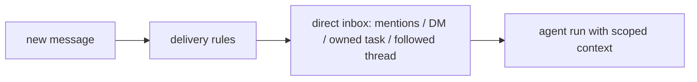

直接投递给 actor 的消息：

- DM
- 明确 mention
- 负责的 task
- 关注的 thread
- action request / approval result

被唤醒 agent 只拿 scoped context：

- 触发消息
- 原 target
- 相关 thread 摘要
- task 状态
- 最近少量相关消息
- 必要 artifact 引用
- 简洁回复约束

不把全频道历史塞给 agent。

### 8.4 Prompt 约束

agent prompt 需要明确：

- 只在被明确请求、负责 task/thread、收到 DM、或 action request 时回复。
- 不抢答别的 agent 负责的任务。
- thread 消息必须回同一个 thread target。
- task 需要先 claim，claim 成功后再执行。
- 回复默认简洁，复杂工作先给短计划，过程更新不要刷屏。

### 8.5 可选外部 attention service

如果需要“没 @ 也能理解用户在找谁”的能力，使用独立 `loom-attention` 服务：

- 它不是 `loom-server` 的一部分。
- 它以 system/service actor 身份连接 server。
- 它只读取启用频道的轻量上下文。
- 它的输出仍然是普通 message、task 或 directed delivery。
- member agent 仍然不会看到全量频道消息。

## 9. 小秘书 Agent

新增 per-user global agent，命名为 `assistant:<user>`。

定位：

- 个人 inbox triage。
- 提醒、日程、未读、待办整理。
- 帮用户把频道消息转成 task。
- 帮用户选择合适 agent。

边界：

- 不默认读取所有频道全量消息。
- 只看该用户可见且被授权进入的 inbox/thread/task。
- 可以作为用户显式 target，或 `loom-attention` 的候选目标，但不是全局管理员。

## 10. 持久化存储

破坏性重构后默认 server 存储切到 SQLite。

表：

- `actors`
- `actor_groups`
- `actor_group_members`
- `channels`
- `channel_members`
- `messages`
- `message_mentions`
- `threads`
- `tasks`
- `coordination_sessions`
- `coordination_steps`
- `agent_runs`
- `deliveries`
- `read_states`
- `artifacts`
- `agent_config_versions`
- `agent_config_activations`

关键字段和约束：

```text
messages(
  id primary key,
  target,
  channel_id,
  thread_root_message_id null,
  author_actor_id,
  kind,
  intent,
  body,
  created_at,
  idempotency_scope,
  idempotency_key,
  unique(author_actor_id, idempotency_scope, idempotency_key)
)

message_mentions(
  message_id,
  actor_or_group_id,
  kind,
  byte_start,
  byte_end,
  unique(message_id, actor_or_group_id, byte_start, byte_end)
)

threads(
  root_message_id primary key,
  channel_id,
  created_at
)

tasks(
  id primary key,
  root_message_id unique,
  canonical_thread_root_message_id,
  status,
  owner_actor_id null,
  owner_revision,
  status_revision,
  created_at,
  updated_at
)

deliveries(
  id primary key,
  actor_id,
  source_message_id null,
  source_task_id null,
  source_coordination_session_id null,
  status,
  priority,
  reasons_json,
  dedupe_key,
  lease_owner null,
  lease_expires_at null,
  created_at,
  unique(actor_id, dedupe_key)
)

coordination_sessions(
  id primary key,
  task_id null,
  thread_root_message_id null,
  owner_actor_id,
  mode,
  decision_rule,
  status,
  revision,
  baton_holder_actor_id null,
  plan_json
)

coordination_steps(
  id primary key,
  session_id,
  actor_id,
  step_type,
  slot_key null,
  base_revision,
  status,
  output_message_id null,
  unique(session_id, actor_id, step_type, base_revision),
  unique(session_id, slot_key) where status = 'accepted' and slot_key is not null
)
```

事务边界：

- `message.send`: insert message、mentions、thread、read states、deliveries，单事务完成。
- `task.create`: insert task、ensure canonical thread、append `task_update` message、deliveries，单事务完成。
- `task.claim`: `owner_revision` CAS、append `task_update` message、deliveries，单事务完成。
- `task.update`: validate status transition、`status_revision` CAS、append `task_update` message、deliveries，单事务完成。
- `coordination.step`: validate holder/slot and `base_revision`、insert step、advance session、append message/delivery，单事务完成。

coordination 约束：

- `sequential` 用 `session.revision` 和 `baton_holder_actor_id` 验证当前提交者，DB 事务内推进 revision。
- `parallel_reduce` 每个 participant slot 使用稳定 `slot_key=session_id:actor_id`，accepted slot 只能写入一次。
- rejected step 可以入库用于审计，但不得推进 session revision。

搜索：

- 使用 SQLite FTS5 建 `messages_fts`。

artifact：

- 元数据在 SQLite。
- 文件仍在 `<data-dir>/artifacts`。
- artifact 文件存储可替换为对象存储，但不影响核心消息模型。

不做旧 JSONL journal 的兼容读取。若需要保留历史，只做一次性离线转换工具，不进入主路径。

## 11. GUI 重构点

### 11.1 消息通知

增加通知中心：

- mention
- `@all`
- thread reply
- task status update
- agent action request
- approval result
- failed run

通知状态持久化到 server 的 delivery/read state，不只存在前端内存。

### 11.2 人员分组

成员页按组展示：

- Humans
- Agents
- Machines
- Services
- Custom Groups

mention palette 支持：

- actor
- group
- `@all`
- `@agents`
- `@humans`

### 11.3 Task UI

顶层消息可以：

- 转为 task
- claim
- assign owner
- 打开 canonical thread
- 查看 status / owner / artifacts / runs

任务视图本质是 task projection，不是独立聊天空间。

## 12. Agent 配置版本化

agent 配置改成不可变版本：

```text
AgentConfigVersion {
  id
  actor_id
  version
  prompt
  model
  adapter
  tools
  capability_tags
  attention_policy
  context_policy
  reply_policy
  created_by
  created_at
}
```

规则：

- 每次 agent run 记录使用的 config version。
- 修改配置创建新版本，不原地覆盖。
- channel 可选择启用哪个版本。
- 支持 diff、rollback、activate。
- daemon 拉取 active version，再启动对应 adapter。

## 13. Docker 一键拉起

目标：

```text
docker compose up
```

组成：

- `loom-server`
- `/data` volume
- WebSocket/API port
- `/healthz`
- bootstrap admin/user/channel

Docker 目标聚焦 server 可一键启动。daemon 和 GUI 可以容器化，也可以本机连接。

## 14. 实施顺序

### 步骤 1: 命名硬切

- crate/package 改为 `loom-*`。
- agent/tool CLI 命名为 `loom`。
- 运行二进制拆为 `loom-server`、`loom-daemon`。
- GUI 打包为正常 macOS `Loom.app`。
- 删除旧 `joi` 命令兼容。
- 更新 env/config/data path。
- 更新 GUI 文案、脚本、测试、文档。

### 步骤 2: Message 模型落地

- 引入 `Message` public API。
- 删除用户层 `Event`，内部审计使用 `JournalRecord`。
- 统一 `message.send/list/read/search`。
- 删除用户层 `handoff`。

### 步骤 3: Thread / Task 重构

- 实现 `#channel:msgId` target。
- Task 挂到 root message。
- canonical thread 自动创建/复用。
- CLI/GUI 统一展示。

### 步骤 4: Mention / Audience / Group

- server-side mention parser。
- `@all` / group mention。
- GUI mention palette 和通知中心。

### 步骤 5: Agent Attention Baseline

- 确定性 delivery / inbox。
- scoped context builder。
- agent inbox 和 task ownership policy。
- prompt 简洁回复约束。

### 步骤 6: Attention Service

- 独立 `loom-attention` 服务，不进入 `loom-server`。
- 如启用语义主动性，使用独立小模型或规则引擎。
- 通过普通 message/task/delivery 输出决策。

### 步骤 7: Agent Config Versioning

- 配置版本存储。
- run 记录 config version。
- GUI 管理、diff、activate。

### 步骤 8: SQLite / Docker

- SQLite schema。
- FTS search。
- Dockerfile / compose / healthcheck。
- e2e 验证。

## 15. 已收敛决策

- 用户层 `Event` 删除。实现上保留内部 `JournalRecord` 只用于审计和投影重放，不作为 public API。
- 存储层直接切 SQLite，不在旧 Store 上继续堆 message API。旧 JSONL 只允许离线转换工具读取。
- `loom-attention` 不进入默认核心部署。需要语义主动性时作为独立 service actor 连接 server。
- `@all` 默认不唤醒 agent。允许 channel policy 显式打开 group wake，但必须由管理员开启，且仍不传递全频道上下文。
- personal secretary 只读取该用户授权的 inbox/thread/task，不默认拥有跨频道全量读权限。
- agent config version 由 server 管理。daemon 只缓存 active version，并在 run 记录中写入实际使用的 version id。
- `Task` 是任务状态唯一模型；`message.send` 不携带 task action，`task.*` 可以事务性追加 `task_update` message。

## 16. 整体技术设计复盘与一致性校验

本节按“领域模型 -> 通信协议 -> 模块划分 -> 数据流转 -> 时序图 -> 分支图 -> 状态机 -> 交叉验证”的顺序复盘。目标是检查边界是否清晰、状态是否唯一、消息分支是否会互相打架。

### 16.1 领域模型

#### 16.1.1 模型分层

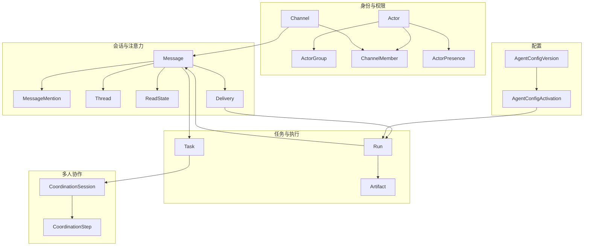

职责切分：

| 模型 | 负责什么 | 不负责什么 |
| --- | --- | --- |
| `Actor` | 统一身份，人、agent、machine、service 都是 actor | 不表达频道内注意力策略 |
| `ActorGroup` | `@all`、`@agents`、`@humans`、自定义组 | 不直接代表权限，权限仍由 channel/member 决定 |
| `ChannelMember` | 可见性、读写权限、成员关系 | 不代表 agent runtime 订阅全量消息 |
| `ActorPresence` | channel 内 mute/focus/follow/attention policy | 不改变底层权限 |
| `Message` | 所有通信事实的中心记录 | 不承担任务状态机，也不隐式推进协作状态 |
| `Thread` | root message 下的上下文收敛空间 | 不是新 agent 实例，不是新 workspace |
| `ReadState` | 人类 GUI 的已读/未读 | 不唤醒 agent |
| `Delivery` | 需要某个 actor 注意或行动的持久投递 | 不代表消息可见性 |
| `Task` | 任务状态、owner、验收、canonical thread | 不负责多人执行顺序 |
| `CoordinationSession` | 多 actor 行动计划、commitment、baton/revision | 不替代 task 的业务状态 |
| `Run` | agent 一次执行回合 | 不作为对话事实，输出必须落成 message/task/coordination/artifact |
| `AgentConfigVersion` | 不可变 agent 配置版本 | 不由 daemon 原地改写 |

#### 16.1.2 核心关系

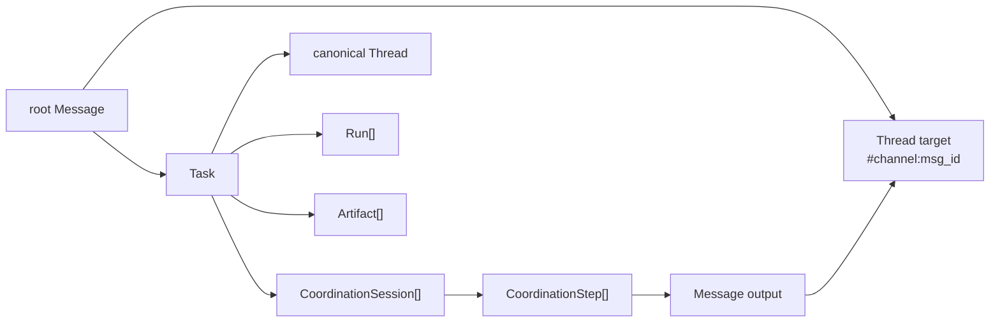

必须保持的领域不变量：

- `Message` 是事实追加，普通消息不直接改变 `Task.status` 或 `CoordinationSession.revision`。
- `Task` 只描述“这件事做到哪了”，`CoordinationSession` 只描述“多人怎么有序做”。
- `Thread` 是上下文边界，不能被实现成新的 agent 实例。
- `Delivery` 是注意力队列，不能和 `ReadState` 合并成同一个领域概念。
- `Event` 不作为 public API。若存储实现需要 journal，只使用内部 `JournalRecord`，不要重新暴露给用户层。

### 16.2 通信协议

#### 16.2.1 协议边界

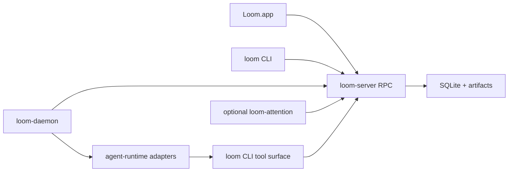

协议原则：

- 对外协议以 JSON-RPC over WebSocket 为主，CLI、GUI、daemon 都走同一组 server API。
- `loom-server` 只处理结构化 envelope、权限、状态机和持久化，不做自然语言意图识别。
- `loom` CLI 是给 agent 和人类日常操作的安全工具面，不包含 server/daemon 启停、迁移、删库等运行管理能力。
- `loom-server`、`loom-daemon` 是运行程序，不能进入 agent prompt 的工具清单。
- subscription 只推送状态变化和投递结果，不代表 agent 订阅全频道正文。

#### 16.2.2 Message 协议核心

`message.send` 的 envelope 必须表达清楚“发到哪里、给谁、是什么意图”，server 不从正文猜，也不修改 task 状态：

```text
MessageSend {
  target
  body
  mentions[]
  audience[]
  intent
  delivery_policy
  parent_message_id?
  thread_root_message_id?
  attachments[]
  idempotency_key
  metadata
}
```

字段约束：

- `target` 是地址：`#channel`、`#channel:msg_id`、`dm:@actor`、`group:@group`。
- `mentions[]` 是投递语法解析结果，可以由 GUI/CLI 提交，也可以由 server 做纯语法兜底解析。
- `audience[]` 是结构化目标，不从自然语言里推断。
- `intent` 只能使用显式提交的值，例如 `chat`、`request_action`、`assign_task`、`review`、`notify`。
- `delivery_policy` 只能基于 envelope 和 channel policy 执行，不允许调用模型推断。
- `message.send` 只产生 `Message`、mention、read state、delivery、thread 创建/复用，不创建或更新 `Task`。
- `Task` 状态变化只走 `task.*`。`task.*` 可以在同一事务里追加 `kind=task_update` 的可见 message。
- `CoordinationSession` 不通过 `message.send` 隐式创建或推进，只能通过 `coordination.*` RPC/CLI。

目标语法：

```text
target = "#"<channel_slug>
       | "#"<channel_slug>":"<root_message_id>
       | "dm:@"<actor_slug_or_id>
       | "group:@"<group_slug_or_id>
```

mention 结构：

```text
MessageMention {
  actor_or_group_id
  kind: actor | group | all | agents | humans
  source: gui | cli | server_parser
  byte_start
  byte_end
  display
}
```

`idempotency_key` 由 client/CLI/daemon 生成。对于 `message.send`，server 按
`actor_id + resolved channel/thread scope + idempotency_key` 去重，使同一 thread 的
root-message target 与 thread-id target 归一，同时避免不同 thread 之间误去重；其他
支持幂等键的 RPC 可使用 method-specific scope。重复提交返回第一次成功的结果，不再
生成 message 或 delivery。

#### 16.2.3 RPC 分类

| 分类 | RPC | 说明 |
| --- | --- | --- |
| Message | `message.send/list/read/search` | 所有用户可见通信都走 message |
| Thread | `thread.follow/unfollow` | thread 按 target 自动创建，follow 只影响注意力 |
| Inbox | `inbox.list`, `delivery.ack` | agent 和 human notification 的持久队列 |
| Task | `task.create/claim/assign/update/complete/reopen/cancel` | root message 上的任务状态；状态变化可附带生成 `task_update` message |
| Run | `run.open/append/close` | agent 执行生命周期 |
| Coordination | `coordination.propose/commit/respond/step/skip/reassign` | 多 actor 有序协作 |
| Artifact | `artifact.put/get` | 元数据入库，文件进 artifact store |
| Config | `agent_config.publish/activate` | 不可变版本和激活关系 |
| Directory | `actor.list`, `group.list`, `channel.member.*` | mention palette、成员分组和权限 |

#### 16.2.4 错误模型

关键错误必须结构化，agent 才能正确恢复：

| code | 触发场景 | 期望处理 |
| --- | --- | --- |
| `invalid_target` | target 不存在或格式错误 | CLI/GUI 提示修正 |
| `permission_denied` | 无读写或创建权限 | 不重试 |
| `unknown_actor` | mention/group 无法解析 | 让发送方选择 |
| `delivery_not_found` | ack/lease 的 delivery 不存在 | 刷新 inbox |
| `task_claim_conflict` | owner CAS 失败 | 读取当前 owner |
| `not_baton_holder` | 非当前 holder 提交 sequential step | 不执行，读取 session |
| `stale_revision` | `base_revision` 过旧 | 读取最新 session |
| `duplicate_slot` | parallel slot 已提交 | 不重试 |
| `config_version_inactive` | run 使用版本已不可用 | daemon 拉取 active version |

权限失败行为：

- 写权限失败返回 `permission_denied`，不生成 message、task、delivery 或 run。
- mention 到无权限可见的 actor/group 返回 `unknown_actor` 或 `permission_denied`，不做部分发送。
- group expansion 必须在 server 端按发送者权限过滤；不可见成员不会被泄露给 caller。
- idempotent replay 返回原始成功响应；如果原始请求失败，不缓存失败结果。

#### 16.2.5 Delivery 规则矩阵

| 输入 | Human 默认行为 | Agent 默认行为 | 可配置项 |
| --- | --- | --- | --- |
| 普通 channel message | unread/read state | 不投递 | 无 |
| muted channel message | silent unread | 不投递 | per-actor mute |
| DM | high priority delivery | high priority delivery | 无 |
| `@actor` | mentioned actor delivery | mentioned agent delivery | 无 |
| `@all` | channel human/member notification | 不投递 | admin-only group wake |
| `@agents` | visible notification | 不投递 | admin-only group wake |
| custom group mention | group members notification | 默认不唤醒 agent | group wake policy |
| followed thread reply | follower delivery | follower delivery | per-thread follow/mute |
| owned task update | owner/follower delivery | owner/follower delivery | task follow/mute |
| action request | actionable delivery | actionable delivery | 无 |
| coordination baton/slot | actionable delivery | actionable delivery | session plan |

Delivery 去重以 `actor_id + dedupe_key` 为准。普通消息的 `dedupe_key=message:<id>`；task 状态变更可用 `task:<id>:<revision>:<reason>`；coordination baton/slot 可用 `coord:<id>:<revision>:<actor_id>`。

#### 16.2.6 Agent Scoped Context Contract

agent 每次 run 只接收固定结构，不读取全频道历史：

```text
ScopedContext {
  delivery
  trigger_message
  target
  actor_identity
  channel_summary
  thread_summary
  recent_thread_messages(limit)
  task_summary?
  coordination_summary?
  artifact_refs[]
  tool_contract
  reply_policy
  config_version_id
}
```

限制：

- `recent_thread_messages` 默认来自当前 target/thread，不从整个 channel 扫历史。
- `channel_summary` 只能是摘要和权限信息，不包含全量消息正文。
- `coordination_summary` 必须包含 `session_id`、`mode`、`revision`、`baton_holder` 或 slot 信息。
- prompt 中必须要求 agent 回复简洁，除非任务明确需要详细输出。

#### 16.2.7 `loom` CLI 输出规格

给模型使用的 `loom` 命令默认输出稳定 JSON，不输出面向人的长日志：

```text
loom <domain> <action> --json ...
```

成功：

```json
{
  "ok": true,
  "data": {},
  "warnings": []
}
```

失败：

```json
{
  "ok": false,
  "error": {
    "code": "stale_revision",
    "message": "base_revision is stale",
    "retryable": false,
    "current": {}
  }
}
```

agent-facing 命令面：

```text
loom message send/read/search
loom inbox list
loom delivery ack
loom task create/claim/assign/update/complete/reopen/cancel
loom coordination propose/commit/respond/step/skip/reassign
loom artifact put/get
loom approval request
loom action request
```

`loom` 不提供 `server start`、`daemon stop`、数据迁移、删库、编辑 runtime config 等命令。

### 16.3 模块划分

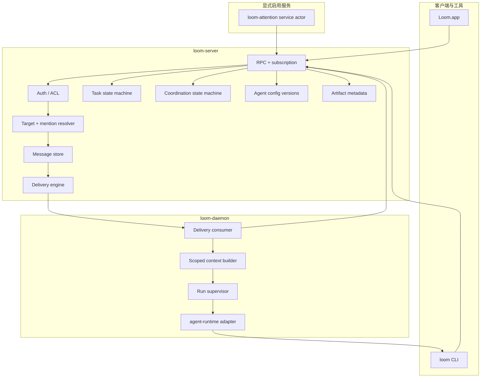

模块边界：

| 模块 | 应该拥有的状态 | 不应该拥有的状态 |
| --- | --- | --- |
| `loom-server` | canonical message/task/thread/delivery/coordination/config/artifact metadata | 模型上下文、adapter 进程、自然语言判断 |
| `loom-daemon` | 本机 run 进程、lease 中的 delivery、临时上下文 | canonical task/coordination 状态 |
| `loom` CLI | 当前 actor 的一次工具调用上下文 | 长期 daemon 进程、server 管理状态 |
| `Loom.app` | GUI cache、草稿、视图状态 | 权威 read/delivery/task 状态 |
| `agent-runtime` | adapter 抽象和模型交互 | Loom 协议业务状态 |
| `loom-attention` | 被授权读取的轻量上下文和决策输出 | server 内部状态机，不直接唤醒 member agent |

### 16.4 数据流转

#### 16.4.1 写入路径

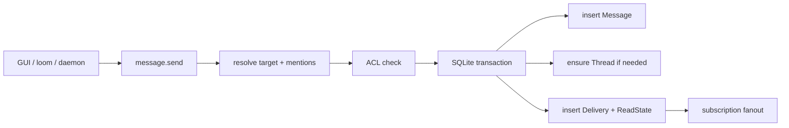

写入的关键点：

- `message.send` 只写消息事实、thread 创建/复用、mention/read state/delivery。
- thread target 自动创建或复用 thread，不需要单独 create。
- task 变更只走 `task.*`，由 `TaskEngine` 在同一事务里完成 CAS 和 `task_update` message 追加。
- coordination 由 `coordination.*` 命令进入独立状态机；如果需要可见记录，该命令在同一事务里追加关联 message。
- delivery/read state 从同一批事实派生，但领域上保持分离。

#### 16.4.2 Task 写入路径

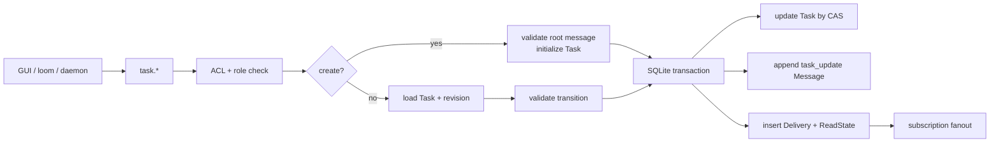

Task 命令是任务状态唯一写入口。任何“创建任务并发一条说明”“更新状态并发进度”都应该由 `task.*` 在事务里完成，而不是由 `message.send` 携带 task 动作。

`task.create` 的 CAS 对象是 `root_message_id unique`，用于防止同一 root message 重复创建任务；`task.claim/assign/update/complete/reopen/cancel` 使用 `owner_revision` 或 `status_revision` 做 CAS。

#### 16.4.3 Agent 执行路径

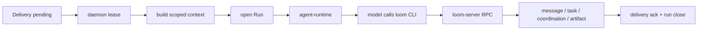

agent 只拿 scoped context：

- 触发 delivery 和触发 message。
- 原 target。
- 相关 thread 摘要。
- task 状态。
- coordination session 状态和当前 baton/slot。
- 必要 artifact 引用。
- agent config version。

agent 不拿全频道历史，也不因为自己是 channel member 被动消费所有消息。

#### 16.4.4 读取路径

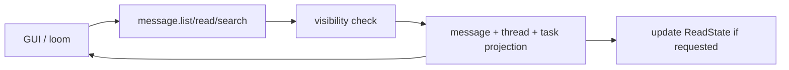

读取路径只改变 `ReadState`，不改变 `Delivery` 的 actionable 状态。agent 的 `delivery.ack` 是独立动作。

### 16.5 所有核心逻辑的时序图

#### 16.5.1 普通频道消息

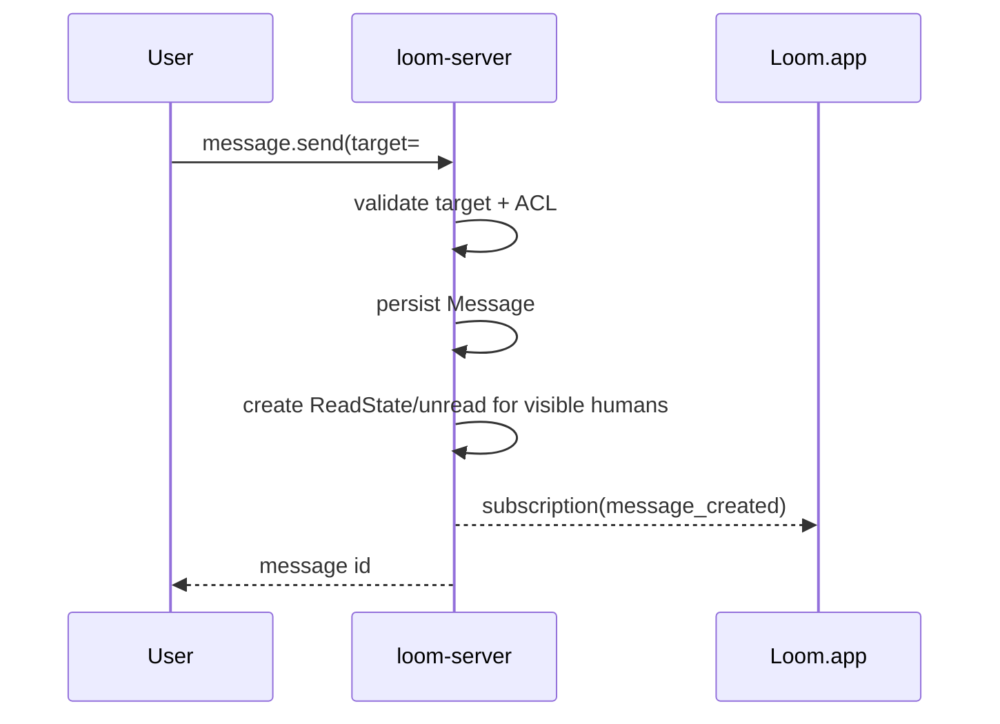

结果：不创建 `Delivery` 给 agent，不启动 run。

#### 16.5.2 消息体中间 `@agent`

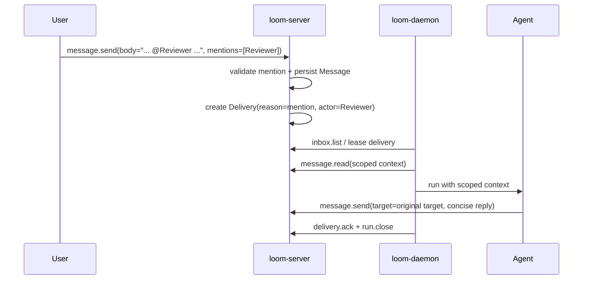

结果：修复“只有前缀 @ 才触发”的旧 bug，mention 不再和 handoff 绑定。

#### 16.5.3 `@all`

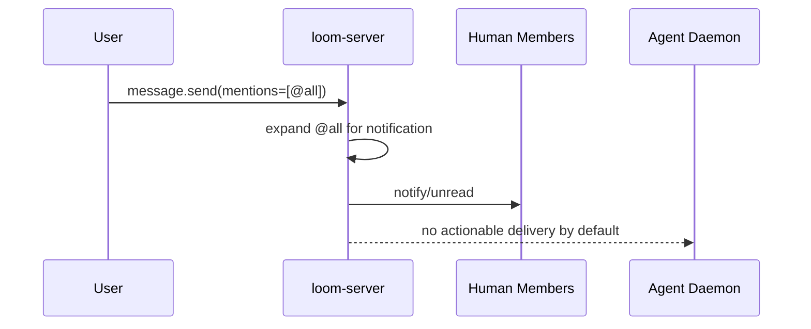

结果：`@all` 是通知全体成员，不是唤醒所有 agent。

#### 16.5.4 Thread 回复

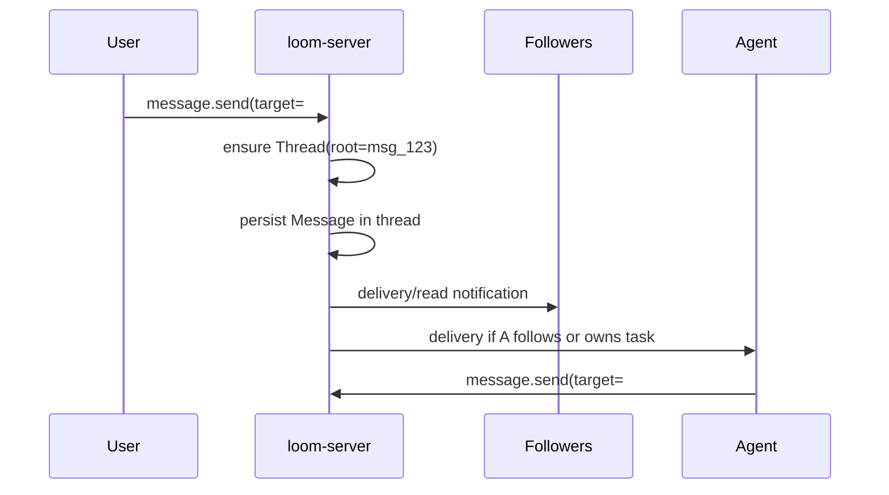

结果：thread 收敛上下文，agent 回复位置由 target 决定。

#### 16.5.5 Task 创建、认领、更新

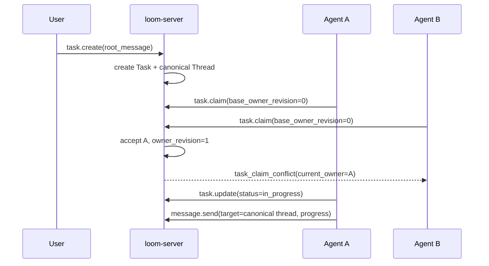

结果：归属由 CAS 保证，不靠 prompt 礼貌。

#### 16.5.6 Sequential 协作

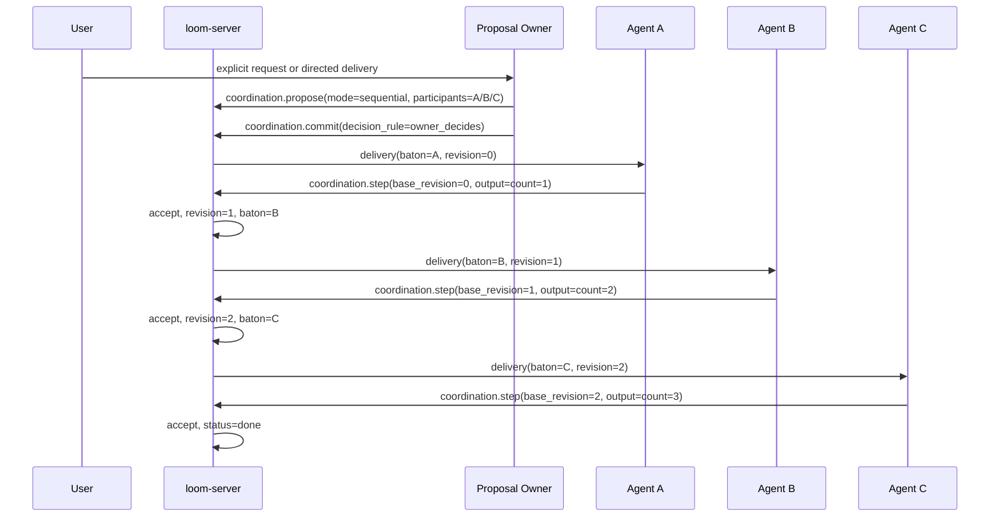

结果：只有当前 holder 能推进，顺序协作不依赖所有 agent 同时读同一段上下文。

#### 16.5.7 Stale step 拒绝

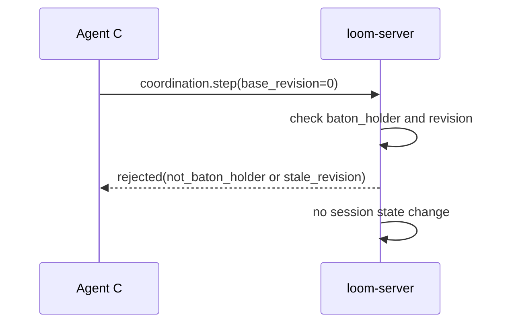

结果：错误 step 可以被记录和通知，但不能改变 commitment。

#### 16.5.8 Parallel reduce

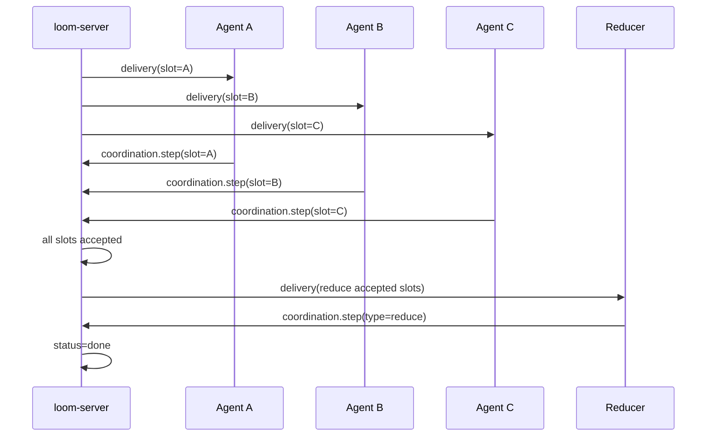

结果：并行和顺序是不同 mode，不复用 handoff 语义。

#### 16.5.9 Agent 配置版本运行

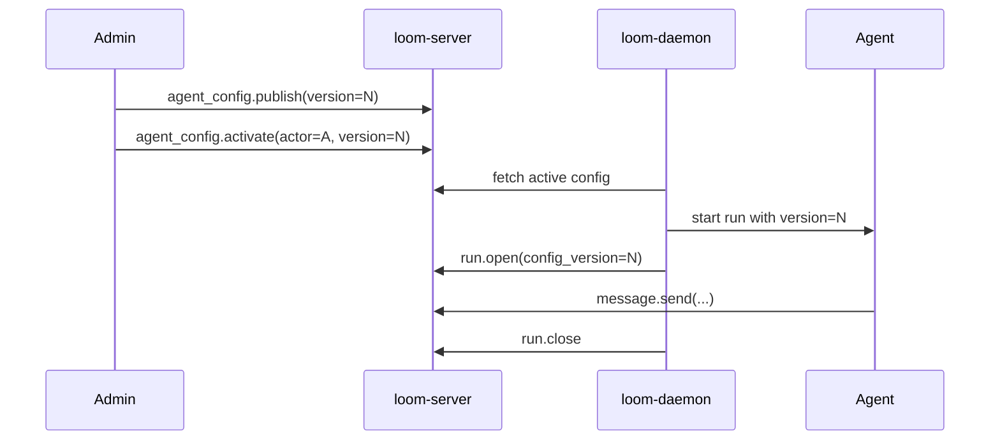

结果：每次 run 可追溯到不可变配置版本。

#### 16.5.10 Artifact 写入

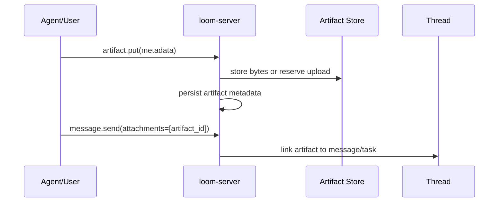

结果：artifact 是产物引用，不把大文件塞进 message body。

#### 16.5.11 可选 Attention Service

```mermaid
sequenceDiagram
    participant S as loom-server
    participant T as loom-attention
    participant A as Target Agent

    S->>T: delivery(policy enabled channel summary)
    T->>S: message.read(scoped lightweight context)
    T->>S: message.send(intent=request_action) / task.create
    S->>A: deterministic delivery if T created explicit target
```

结果：语义主动性发生在独立 service actor，输出仍然回到普通 message/task/delivery，不污染 `loom-server`。

### 16.6 所有核心逻辑的分支图

#### 16.6.1 Message 写入分支

```mermaid
flowchart TD
    In["message.send"] --> Target{"target type"}
    Target -- channel --> Root["root channel message"]
    Target -- thread --> Thread["ensure/reuse thread"]
    Target -- dm --> DM["direct message"]
    Target -- group --> Group["expand authorized group target"]

    Root --> Ordinary["ordinary message"]
    Thread --> Ordinary
    DM --> Ordinary
    Group --> Ordinary
    Ordinary --> Delivery
```

不可走的分支：

- `body` 里出现“依次/轮流/分别”不能进入 `CoordinationSession`。
- `@all` 不能直接进入 agent fanout。
- `message.send` 不能创建或更新 `Task`。
- 普通 message 不能直接推进 `CoordinationSession.revision`。

#### 16.6.2 Delivery 分支

```mermaid
flowchart TD
    Msg["accepted message/state change"] --> Reason{"delivery reason"}
    Reason -- DM --> Direct["target actor delivery"]
    Reason -- mention actor --> Mention["mentioned actor delivery"]
    Reason -- group mention --> GroupPolicy{"group policy"}
    Reason -- @all --> All["human notification"]
    Reason -- followed thread --> Follow["followers delivery"]
    Reason -- owned task --> Owner["owner/follower delivery"]
    Reason -- coordination baton --> Baton["holder actionable delivery"]
    Reason -- action request --> Action["requested actor delivery"]

    GroupPolicy -- notify only --> Notify["notification/read state"]
    GroupPolicy -- wake allowed --> Direct

    Direct --> Dedup["dedupe actor+message"]
    Mention --> Dedup
    Follow --> Dedup
    Owner --> Dedup
    Baton --> Dedup
    Action --> Dedup
    All --> Notify
    Dedup --> Queue["Delivery pending"]
```

#### 16.6.3 Coordination 分支

```mermaid
flowchart TD
    Coord["coordination request"] --> Kind{"kind"}
    Kind -- propose --> Owner{"proposal owner known?"}
    Owner -- yes --> Plan["create plan"]
    Owner -- no --> Ask["ask human to choose owner"]
    Plan --> Rule{"decision_rule"}
    Rule -- owner_decides --> Commit["commit"]
    Rule -- human_approval --> Approval["wait approval"]
    Rule -- all_ack --> Ack["collect participant ack"]
    Rule -- majority --> Majority["collect majority"]
    Approval --> Commit
    Ack --> Commit
    Majority --> Commit

    Kind -- step --> Validate{"holder/slot + revision valid?"}
    Validate -- yes --> Accept["accept step + advance"]
    Validate -- no --> Reject["reject, no state change"]
```

显式产品入口：

- GUI 在消息或 task 上提供“创建协作计划”，用户必须选择 `sequential`、`parallel_reduce`、`broadcast` 或 `race_claim`。
- CLI 使用 `loom coordination propose --mode ... --participants ... --target ...`。
- channel coordinator actor 可以在收到 directed delivery 后发起 `coordination.propose`，但必须具备 `coordination:create` 权限。
- 多 agent mention、`@all`、自然语言“依次/轮流/分别”都不自动创建 session。
- proposal owner 默认规则：显式 owner > channel coordinator > 第一个被 @ 的 agent > 请求人类选择。
- `owner_decides` 是默认 decision rule；高风险动作使用 `human_approval`。

#### 16.6.4 Agent Run 分支

```mermaid
flowchart TD
    Delivery["pending delivery"] --> Lease{"lease success?"}
    Lease -- no --> Idle["stay idle"]
    Lease -- yes --> Context["build scoped context"]
    Context --> Start{"adapter starts?"}
    Start -- no --> Retry["mark failed/retry"]
    Start -- yes --> Execute["model executes"]
    Execute --> Tool{"tool call?"}
    Tool -- loom message/task/coordination/artifact --> RPC["RPC through loom"]
    Tool -- runtime management attempt --> Deny["not available in tool surface"]
    RPC --> Execute
    Execute --> Done{"complete?"}
    Done -- success --> Ack["ack delivery + close run"]
    Done -- fail --> Fail["run failed + retry policy"]
    Done -- canceled --> Cancel["release/cancel delivery"]
```

#### 16.6.5 Task 分支

```mermaid
flowchart TD
    TaskCmd["task.*"] --> Kind{"command"}
    Kind -- create --> Create["create Task from root message"]
    Kind -- claim --> Claim["owner_revision CAS"]
    Kind -- assign --> Assign["permission + owner_revision CAS"]
    Kind -- update --> Update["status transition + status_revision CAS"]
    Kind -- complete --> Complete["validate review/owner policy"]
    Kind -- reopen --> Reopen["terminal state audit"]
    Kind -- cancel --> Cancel["terminal state audit"]

    Create --> Msg["append task_update Message"]
    Claim --> Msg
    Assign --> Msg
    Update --> Msg
    Complete --> Msg
    Reopen --> Msg
    Cancel --> Msg
    Msg --> Delivery["delivery rules"]
```

Task 分支只处理任务状态；讨论和产物说明通过 canonical thread 中的 message 呈现。

### 16.7 所有状态机的状态轮转

#### 16.7.1 Message

`Message` 在 server 领域里是不可变事实，不设计业务状态机：

```text
client draft/pending -> server accepted -> visible in target
```

撤回、修正、补充都应写成新 message 或受审计的 redaction mutation，不让普通编辑破坏协作引用。

#### 16.7.2 Task

```mermaid
stateDiagram-v2
    [*] --> open
    open --> claimed: claim/assign(owner_revision CAS)
    claimed --> claimed: reassign(owner_revision CAS)
    in_progress --> in_progress: reassign(owner_revision CAS)
    waiting_review --> waiting_review: reassign(owner_revision CAS)
    blocked --> blocked: reassign(owner_revision CAS)
    claimed --> in_progress: start
    in_progress --> waiting_review: request_review
    waiting_review --> done: accept
    waiting_review --> in_progress: request_changes
    in_progress --> blocked: blocked
    blocked --> in_progress: unblock
    in_progress --> failed: fail
    failed --> in_progress: retry/reopen
    open --> canceled: cancel
    claimed --> canceled: cancel
    in_progress --> canceled: cancel
    waiting_review --> canceled: cancel
    blocked --> canceled: cancel
    failed --> canceled: cancel
    done --> in_progress: reopen
    canceled --> [*]
    done --> [*]
```

状态约束：

- owner 变更必须 CAS，并追加 `task_update` message。
- status 变更必须 CAS，并记录操作者和 message/thread 依据。
- `done` 后重新打开必须产生审计记录。

#### 16.7.3 Delivery

```mermaid
stateDiagram-v2
    [*] --> pending
    pending --> leased: daemon lease
    leased --> acked: delivery.ack
    leased --> pending: lease timeout
    leased --> failed: retry exhausted
    pending --> dismissed: human dismiss
    pending --> canceled: source canceled
    pending --> expired: ttl reached
    acked --> [*]
    dismissed --> [*]
    canceled --> [*]
    expired --> [*]
    failed --> [*]
```

状态约束：

- agent 只能消费 `pending -> leased` 的 delivery。
- human read 不等于 `delivery.ack`。
- 同一 `actor_id + dedupe_key` 只有一个 delivery，原因合并。

#### 16.7.4 Run

```mermaid
stateDiagram-v2
    [*] --> queued
    queued --> preparing_context
    preparing_context --> running
    running --> waiting_tool: tool call
    waiting_tool --> running: tool result
    running --> completed
    running --> failed
    running --> canceled
    completed --> [*]
    failed --> [*]
    canceled --> [*]
```

状态约束：

- `Run` 必须引用 `delivery_id` 或 explicit local start reason。
- `Run` 必须引用 `agent_config_version_id`。
- `Run` 输出必须进入 message/task/coordination/artifact，不把 daemon 私有日志当协作事实。

#### 16.7.5 CoordinationSession

```mermaid
stateDiagram-v2
    [*] --> planning
    planning --> collecting_responses: decision_rule requires ack/approval
    collecting_responses --> committed: approval/ack satisfied
    planning --> committed: owner_decides
    committed --> executing: first baton/slots delivered
    executing --> executing: accepted step advances revision
    executing --> done: completion condition met
    planning --> canceled: cancel
    collecting_responses --> canceled: cancel/reject
    committed --> canceled: cancel
    executing --> canceled: cancel
    done --> [*]
    canceled --> [*]
```

状态约束：

- `mode`、`participants`、`decision_rule`、`plan` 在 commit 后不可随意改写；需要变更时创建新的 session。
- `sequential` 同一 revision 只能接受当前 `baton_holder` 的 step。
- `parallel_reduce` 每个 participant slot 只能 accepted 一次。
- rejected step 不改变 `revision`。

#### 16.7.6 CoordinationStep

```mermaid
stateDiagram-v2
    [*] --> submitted
    submitted --> accepted: valid holder/slot + base_revision
    submitted --> rejected: invalid/stale/duplicate
    accepted --> [*]
    rejected --> [*]
```

`CoordinationStep` 是一次提交记录，不做反复编辑。纠错需要新 step。

#### 16.7.7 Thread Follow 与 ReadState

```mermaid
stateDiagram-v2
    [*] --> not_following
    not_following --> following: follow
    following --> muted: mute
    muted --> following: unmute
    following --> not_following: unfollow
    muted --> not_following: unfollow
```

```mermaid
stateDiagram-v2
    [*] --> unread
    unread --> read: read up to message
    read --> unread: newer visible message
```

`ThreadFollow` 影响 delivery，`ReadState` 影响 GUI unread，不互相替代。

#### 16.7.8 AgentConfigVersion

```mermaid
stateDiagram-v2
    [*] --> published
    published --> active: activate for scope
    active --> retired: activate newer version
    published --> retired: retire
    retired --> active: rollback/reactivate
```

版本内容不可变；`active/retired` 是 activation 关系，不改版本本体。

#### 16.7.9 Artifact

```mermaid
stateDiagram-v2
    [*] --> reserved
    reserved --> available: bytes stored
    available --> linked: attached to message/task
    linked --> deleted: delete/tombstone
    available --> deleted: delete/tombstone
    deleted --> [*]
```

artifact 删除保留 tombstone，避免历史 message 引用变成悬空不可解释。

### 16.8 交叉验证

#### 16.8.1 冲突检查矩阵

| 可能冲突点 | 校验结论 | 设计约束 |
| --- | --- | --- |
| server 纯粹性 vs mention 解析 | 不冲突 | mention 是投递语法，server 只做语法/权限解析，不做 NLP |
| server 纯粹性 vs coordination | 不冲突 | coordination 来自 `coordination.*` 工具调用，server 只验证 commitment |
| `@all` vs agent 主动性 | 不冲突 | `@all` 默认通知 human，不唤醒全部 agent |
| 多 agent mention vs 顺序协作 | 不冲突 | 多 mention 只生成 delivery；顺序必须显式 `coordination.propose/commit` |
| Thread vs Task | 不冗余 | thread 管对话上下文，task 管状态和验收 |
| Task vs CoordinationSession | 不冗余 | task 管“做什么/做到哪”，coordination 管“谁按什么顺序做” |
| Delivery vs ReadState | 不冗余 | delivery 是行动/注意力队列，read state 是 GUI 阅读位置 |
| Run vs Message | 不冗余 | run 是执行过程，message 是协作事实 |
| `loom` CLI vs `loom-daemon` | 不冲突 | `loom` 是安全工具面，daemon 是运行进程 |
| AgentConfigVersion vs daemon config | 不冲突 | server 存版本，daemon 只缓存和执行 active version |
| Handoff 删除 vs 交接能力 | 不丢能力 | handoff 作为 `CoordinationStep(type=handoff)` 保留，不做顶层命令 |

#### 16.8.2 冗余收敛结论

应该删除或降级的旧概念：

- 用户层 `Event`：改为 `Message`；如果需要 journal，使用内部 `JournalRecord`。
- 顶层 `Handoff` 命令：简单交办用 `message.send(intent=request_action/assign_task)`；有序交接用 `coordination.step(type=handoff)`。
- 旧的独立聊天式 task：收敛为 root message 上的 `Task` 状态，不再是聊天空间。
- server 内小模型：不进入 `loom-server`，如需要放到 `loom-attention` service actor。
- agent 全频道订阅：改为 delivery/inbox + scoped context。

#### 16.8.3 需要在实现中硬编码的防线

- `message.send` 不得因为正文关键词创建 coordination。
- `message.send` 不得创建或更新 `Task`。
- `@all` 默认不得产生 agent actionable delivery。
- `CoordinationSession` 的 `step` 必须验证 `base_revision`。
- `sequential` 必须验证 `baton_holder`。
- `parallel_reduce` 必须验证 participant slot。
- `task.claim` 必须 CAS。
- daemon 不得绕过 `Delivery` 从 channel subscription 启动 agent run。
- agent prompt 和 tool registry 不暴露 `loom-server` / `loom-daemon` 管理命令。

#### 16.8.4 复盘结论

当前目标架构的主线是顺的：

1. `Message` 是唯一通信中心。
2. `Thread` 收敛上下文。
3. `Task` 表达任务状态。
4. `Delivery` 表达注意力和行动入口。
5. `Run` 表达 agent 执行过程。
6. `CoordinationSession` 只在显式多人协作时出现，用 commitment/revision/baton 解决有序协作。
7. `loom-server` 保持纯协议和状态机服务，不承担自然语言理解。

最关键的设计风险不是 coordination 状态机复杂，而是把它错误地下沉到所有消息上。正确边界是：普通消息永远走简单路径；只有 `coordination.*` 或授权 coordinator 创建的 session 才进入 baton/revision/CAS。

#### 16.8.5 一次性重构执行条件

以下条件全部满足时，可以按破坏性重构一次性执行：

- 公开命名只保留 `loom`、`loom-server`、`loom-daemon`、`Loom.app`。
- public API 只暴露 `Message`，不暴露用户层 `Event`。
- `message.send` 只写消息，不写 task 或 coordination 状态。
- `Task` 状态只由 `task.*` 写入，并在同一事务里追加 `task_update` message。
- `CoordinationSession` 只由 `coordination.*` 或授权 coordinator 创建/推进。
- agent run 只由 `Delivery` 或用户本机显式启动触发。
- agent 工具清单只包含 `loom`，不包含 runtime 管理命令。
- 默认存储为 SQLite，旧 JSONL 不进入主读写路径。
- `@all` 默认不唤醒 agent，group wake 必须由管理员显式开启。

## 17. 场景推演附录

本节用于检查设计是否存在交叉、重复唤醒或状态冲突。

### 17.1 全景模型

```mermaid
flowchart TD
    Actor["Actor<br/>identity / kind / capabilities"]
    Presence["ActorPresence<br/>channel policy / mute / focus / workspace"]
    Group["ActorGroup"]
    Channel["Channel"]
    Member["ChannelMember"]
    GroupMember["ActorGroupMember"]

    Message["Message<br/>body / target / intent / audience"]
    Mention["MessageMention"]
    Thread["Thread<br/>root message"]
    Task["Task<br/>status / owner / canonical thread"]
    Coord["CoordinationSession<br/>plan / commitment / revision / baton"]
    Step["CoordinationStep<br/>base_revision / output"]

    Delivery["Delivery<br/>actor inbox / attention item"]
    Read["ReadState"]
    Run["Run<br/>agent execution"]
    Artifact["Artifact"]
    Config["AgentConfigVersion"]

    Actor --> Presence
    Actor --> Member
    Actor --> GroupMember
    Group --> GroupMember
    Channel --> Member
    Channel --> Message
    Presence --> Channel

    Message --> Mention
    Message --> Thread
    Message --> Task
    Message --> Delivery
    Message --> Read
    Message --> Artifact

    Thread --> Task
    Task --> Coord
    Coord --> Step
    Step --> Message
    Step --> Delivery

    Delivery --> Run
    Config --> Run
    Run --> Message
    Run --> Artifact
```

关键区分：

- `ChannelMember` 决定可见性，不等于 agent runtime 会收到所有消息。
- `ActorPresence` 决定这个 actor 在 channel 中的注意力策略。
- `Delivery` 是 agent/human 的 attention queue 项，只有进入 delivery 的消息才会唤醒 agent。
- `Thread` 负责上下文收敛。
- `Task` 负责任务状态。
- `CoordinationSession` 负责多人或多 agent 的行动计划、commitment 和有序推进。

### 17.2 消息进入系统后的分支

```mermaid
flowchart TD
    In["message.send"] --> Target["resolve target<br/>channel / thread / DM / group"]
    Target --> Auth["check visibility + write permission"]
    Auth --> Persist["persist Message"]

    Persist --> Parse["parse mentions + explicit audience"]
    Persist --> Threading{"target is thread?"}

    Threading -- yes --> EnsureThread["create/reuse Thread"]
    Threading -- no --> PublicMsg["root message"]

    Parse --> DeliveryRules["compute deterministic deliveries"]
    EnsureThread --> DeliveryRules
    PublicMsg --> DeliveryRules

    DeliveryRules --> Dedup["dedupe by actor<br/>merge reasons + max priority"]
    Dedup --> HumanNotify["human notification/read state"]
    Dedup --> AgentInbox["agent delivery/inbox"]
    AgentInbox --> Scoped["build scoped context"]
    Scoped --> Run["agent Run"]
```

这里有两个硬规则：

- **普通 message 只追加事实，不推进协作状态。**
- **`@all`、多 agent mention、自然语言里的“依次/分别/轮流”都不能让 server 自动创建 coordination session。**

coordination session 只允许来自 `coordination.*` RPC/CLI，或已有 session 的 step。

### 17.3 协作模式由谁决定

server 不从正文推断 `mode=sequential`。协作模式只能来自三个入口：

| 入口 | 谁决定 mode | server 做什么 |
| --- | --- | --- |
| 显式用户操作 | 用户在 GUI/CLI 选择 `sequential` / `parallel_reduce` / `broadcast` / `race_claim` | 校验权限和 participants，创建 plan/commitment |
| 授权 coordinator actor | coordinator 读取自己收到的消息，发起结构化 coordination 请求 | 校验该 actor 是否有创建权限，创建 plan/commitment |
| 已有 session step | session 当前状态已经包含 mode、participants、baton、revision | 校验 holder 和 revision，接受或拒绝 step |

禁止的入口：

- `loom-server` 根据正文自然语言创建 session。
- 多个普通 agent 各自解析同一条 `@all` 并同时创建 session。
- `@all` 自动 fanout 为所有 agent 的 actionable run。

因此，如果用户只是发：

```text
@all 依次报数
```

server 的正确行为是：

- 解析 `@all` 为通知/投递语法。
- 不知道、也不尝试知道这是 `sequential`。
- 不创建 `CoordinationSession`。

如果 channel 配置了 coordinator，则 coordinator 可以收到这条消息，并创建一个结构化请求：

```text
coordination.propose {
  mode = sequential
  proposal_owner = A
  participants = [A, B, C]
  decision_rule = owner_decides
  initial_state = { count: 0 }
}
```

没有 coordinator 或显式用户操作时，这条消息就是普通 `@all` 通知。

### 17.4 Proposal owner 与 commitment

多 agent 协作默认不需要民主协商。系统需要的是一个明确的 proposal owner 制定行动计划，并把计划固化成 server 可验证的 commitment。

proposal owner 的选择规则：

1. 用户显式指定 coordinator 或 owner。
2. channel 配置了 coordinator actor。
3. 多个 agent 被 @ 时，选择第一个被 @ 的 agent 作为 proposal owner。
4. 仍无法确定时，要求人类选择。

`CoordinationSession` 的核心字段：

```text
CoordinationSession {
  id
  owner_actor_id
  mode
  participants[]
  plan
  decision_rule
  status: planning | collecting_responses | committed | executing | done | canceled
  revision
  baton_holder
}
```

`decision_rule` 决定 plan 是否需要参与者确认：

| decision_rule | 行为 |
| --- | --- |
| `owner_decides` | proposal owner 直接 commit，参与者收到 baton/slot 后执行 |
| `human_approval` | 人类确认后 commit |
| `all_ack` | 所有参与者确认后 commit |
| `majority` | 多数同意后 commit |

默认策略：

- 普通 agent-agent 协作使用 `owner_decides`。
- 高风险、跨权限、影响外部系统的协作使用 `human_approval`。
- 真正需要共识的协作才使用 `all_ack` 或 `majority`。

这保留了协商机制，但不把所有多 agent 工作都变成投票。核心是先把多 agent 行动计划结构化，再让 server 按 commitment 有序投递和验证。

### 17.5 Delivery 生成规则

| 分支 | Human | Agent |
| --- | --- | --- |
| 普通 channel message | unread/read state | 默认不投递 |
| muted channel message | 静默 unread | 不投递 |
| DM | 高优先级通知 | 高优先级 delivery |
| `@actor` | 被 @ 人通知 | 被 @ agent delivery |
| `@all` | 全体 human 通知 | 默认不唤醒 agent |
| `@agents` / agent group | 取决于 channel policy | 默认不 fanout，可配置 |
| followed thread reply | follower 通知 | follower delivery |
| owned task update | owner/follower 通知 | owner/follower delivery |
| action request | 指定 actor actionable delivery | 指定 actor actionable delivery |
| coordination next baton | 当前 holder actionable delivery | 当前 holder actionable delivery |
| coordination stale step | 提交者收到 rejected notice | 提交者收到 rejected notice |

去重规则：

- 同一条 message 对同一 actor 最多生成一个 `Delivery`。
- `Delivery.reasons[]` 可以包含多个原因，例如 `mention + owned_task + followed_thread`。
- `Delivery.priority` 取所有原因中的最高优先级。
- agent daemon 只消费 `Delivery`，不直接订阅 channel 全量消息。

### 17.6 推演一：普通频道消息

输入：

```text
target = #backend
body = "今天 CI 有点慢"
mentions = []
```

结果：

- server 写入 `Message`。
- 所有有权限成员在 GUI 中可见，read state 更新。
- muted 成员只积累静默 unread。
- agent 不收到 delivery。
- 不创建 thread，不创建 task，不启动 run。

检查结论：可见性和投递分离，没有上下文浪费。

### 17.7 推演二：消息体中间 @agent

输入：

```text
target = #backend
body = "这个失败看起来像缓存问题，@Reviewer 你确认一下"
```

结果：

- server-side mention parser 解析出 `@Reviewer`。
- 生成给 `Reviewer` 的 delivery，reason=`mention`。
- daemon 拉取 delivery 后构建 scoped context：触发消息、原 target、最近少量相关消息。
- `Reviewer` 回复时 target 仍是 `#backend`，除非它显式转为 task/thread。

检查结论：不依赖前缀正则，修复当前 mention bug。

### 17.8 推演三：`@all`

输入：

```text
target = #backend
body = "@all 今天 17:00 冻结发布"
```

结果：

- server 解析 `@all` 为 human/member notification。
- human 成员收到通知。
- member agent 默认不收到 actionable delivery。
- 如 channel policy 允许 `@all wakes agents`，才生成 agent delivery。

检查结论：`@all` 不等于“所有 agent 都拿上下文”。

### 17.9 推演四：thread 回复

输入：

```text
target = #backend:msg_123
body = "我把日志贴在这里"
```

结果：

- server 自动创建或复用 root message `msg_123` 的 thread。
- 消息只进入该 thread。
- delivery 发给 thread followers，以及关联 task 的 owner/followers。
- channel 成员能通过 thread 入口查看，但不会被主频道刷屏。
- agent 如果被唤醒，回复必须使用同一个 target `#backend:msg_123`。

检查结论：thread 收敛上下文，不制造新 agent 实例。

### 17.10 推演五：task claim

输入：

```text
root message = "修复登录页 500"
actor A claim task
actor B 同时 claim task
```

结果：

- server 对 `Task.owner_revision` 做 CAS。
- 先到者 claim 成功，task owner 变成 A。
- 后到者 claim 失败，收到 rejected delivery 或普通错误。
- canonical thread 创建或复用。
- 后续进展进入 canonical thread。

检查结论：任务归属不是靠 prompt 礼貌，而是靠 server 原子状态。

### 17.11 推演六：报数协作

用户输入：

```text
让 #test 里的 A、B、C 依次报数，每个在上一个基础上 +1
```

系统应建模为：

```text
Task: count-demo
CoordinationSession:
  mode = sequential
  participants = [A, B, C]
  shared_state = { count: 0 }
  revision = 0
  baton_holder = A
```

流程：

```mermaid
sequenceDiagram
    participant S as loom-server
    participant A as Agent A
    participant B as Agent B
    participant C as Agent C

    S->>A: delivery(session, revision=0, count=0, baton=A)
    A->>S: step(base_revision=0, count=1)
    S->>S: accept, revision=1, baton=B
    S->>B: delivery(session, revision=1, count=1, baton=B)
    B->>S: step(base_revision=1, count=2)
    S->>S: accept, revision=2, baton=C
    S->>C: delivery(session, revision=2, count=2, baton=C)
    C->>S: step(base_revision=2, count=3)
    S->>S: accept, revision=3, done
```

如果 C 提前提交：

```text
C -> step(base_revision=0, count=1)
```

server 结果：

```text
rejected: baton_holder != C 或 base_revision stale
```

检查结论：报数这种协作不能靠所有 agent 同时看消息；必须由 coordination session 的 baton 和 revision 保证顺序。

### 17.12 推演七：并行后汇总

适用于“每个 agent 各自给一个方案，最后由 Reviewer 汇总”。

```text
CoordinationSession:
  mode = parallel_reduce
  participants = [A, B, C]
  reducer = Reviewer
  slots = {
    A: pending,
    B: pending,
    C: pending
  }
```

规则：

- A/B/C 各自收到一个 slot delivery。
- 每个 actor 只能提交自己的 slot。
- server 收齐所有 slot 后，给 reducer 生成 actionable delivery。
- reducer 基于 accepted slots 汇总。

检查结论：并行和顺序是不同 mode，不能混用同一套 handoff 语义。

### 17.13 推演八：handoff 是 step，不是独立命令

旧模式：

```text
message -> hands_off_to B
```

新模式：

```text
CoordinationStep:
  type = handoff
  from = A
  to = B
  base_revision = 3
  summary = "分析完成，交给 B 实现"
```

server 接受后：

```text
revision = 4
baton_holder = B
delivery -> B
```

检查结论：handoff 作为 step 类型保留能力，但不作为独立顶层命令和独立模型分支存在。

### 17.14 当前不变量

这些不变量如果在实现里被破坏，就说明模型出现交叉或矛盾：

- `ChannelMember` 只表示可见性，不表示 agent runtime 全量订阅。
- agent run 只能从 `Delivery` 或用户本机显式启动产生。
- `Message` 是事实追加；普通 message 不直接改变 coordination revision。
- `@all` / 多 agent mention 不能隐式创建 `CoordinationSession`。
- `CoordinationSession` 只能由显式用户操作、授权 coordinator actor 或已有 session step 推进。
- `Task` 归属变更必须 CAS。
- `CoordinationStep` 必须带 `base_revision`。
- `CoordinationSession` 同一 revision 只能接受一个顺序 step。
- `parallel_reduce` 的每个 participant slot 只能接受一次。
- `Delivery` 对同一 `actor_id + dedupe_key` 去重，原因合并。
- thread target 决定回复位置，agent 不自行猜测回哪里。
- `@all` 默认不唤醒所有 agent。

### 17.15 推演暴露出的设计风险

1. `Delivery` 和 `ReadState` 不能混成一个概念。
   - 人类需要 unread/read state。
   - agent 需要 actionable delivery。
   - 两者使用独立领域状态；即使物理存储复用表，也不能复用同一状态字段。

2. `@agents` / `@all` 如果允许唤醒 agent，必须有 channel policy。
   - 默认 fanout 会造成上下文爆炸。
   - 若用户真的需要“所有 agent 都行动”，应创建 `CoordinationSession(mode=broadcast/parallel_reduce)`。

3. coordination step 不能只是自然语言消息。
   - 必须有结构化 `session_id`、`base_revision`、`step_type`。
   - 否则无法拒绝 stale step。

4. task 和 coordination session 不要互相替代。
   - `Task` 管状态和验收。
   - `CoordinationSession` 管多人如何推进。

5. thread 收敛后必须有入口和通知。
   - GUI 需要 thread unread badge。
   - Task 视图需要 canonical thread 入口。
   - Notification center 需要展示 thread/task 的 unread/actionable 项。
