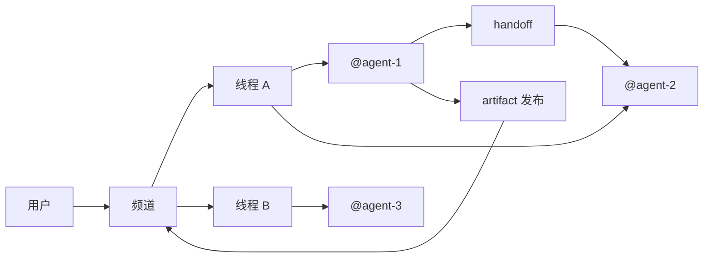
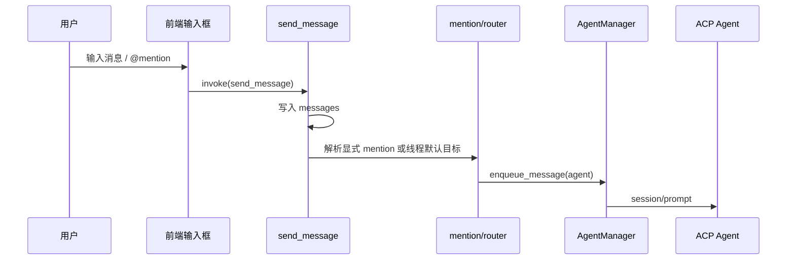
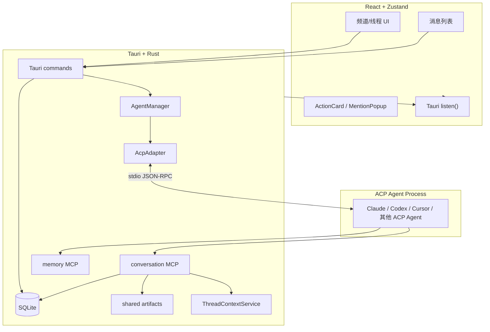
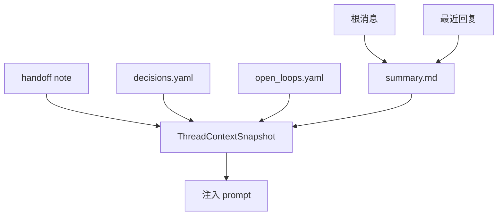
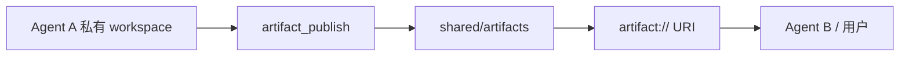
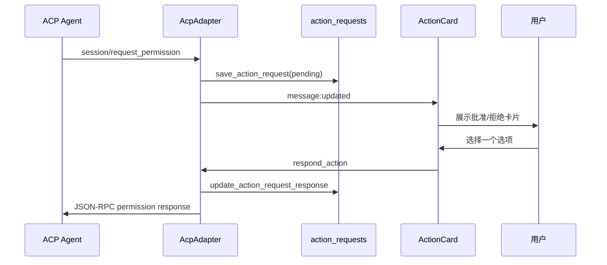

> 注意：这篇文章保留的是 `joi` 原型阶段的产品背景与交互直觉，其中 `@mention` 仍被描述为机器路由手段。
> `joi-apps` 当前权威协议语义以
> [open-multi-actor-collaboration-protocol-v0.md](/Users/bojun.cbj/Workspace/gitlab.alibaba-inc.com/bojun.cbj/joi-apps/docs/protocol/open-multi-actor-collaboration-protocol-v0.md)
> 和
> [open-multi-actor-collaboration-schema-v0.md](/Users/bojun.cbj/Workspace/gitlab.alibaba-inc.com/bojun.cbj/joi-apps/docs/protocol/open-multi-actor-collaboration-schema-v0.md)
> 为准：`@handle` 属于 binding 层语法，显式执行交接使用 `handoff`，持续上下文归属使用 `Membership`。

多 Agent 协作这个方向，其实已经在脑子里转了很久。Joi 也不是第一次尝试，之前还做过一个更早期的实验：[cocowork](https://github.com/0xd219b/cocowork)。后来停下来，不是因为这个方向没意思，而是越来越清楚一件事：如果交互边界、上下文边界和接力方式都不稳，多 Agent 很容易停在概念层，看起来热闹，实际很难落地。

这篇文章不想定义多 Agent 平台应该是什么，只想回答一个更具体的问题：多个 Agent 真正在一个本地桌面环境里一起工作时，最小可用的交互闭环到底长什么样。当下的 Joi，就是围绕这个问题做的一次工程化回答。

真正难的其实不是“能不能一次拉起三个模型一起跑”，也不是“能不能做一个总控 agent 去调度一切”。更硬的问题往往只有几件：

1. 谁在什么时候该收到什么信息。
2. 一个 Agent 做到一半，怎样把任务、上下文和产物交给另一个 Agent。
3. 共享信息和私有草稿怎么分开，避免相互污染。
4. 整个过程怎样被人看见、打断、批准和修正。

如果这几件事没处理好，多 Agent 往往会变成一种表演：屏幕上同时跑了几个模型，看起来很热闹，但上下文边界不稳，交接也不清楚，最后人类只能盯着终端猜系统到底在干什么。那不叫协作，最多叫并发输出。

Joi 从一开始就不是“万能 Agent 编排平台”，而是一个**多 Agent 交互协作的 MVP 探索**。范围刻意收得很窄：本地优先、桌面应用、频道和线程式对话、显式 mention、显式 handoff、显式 artifact 分享，再加上可视化的工具轨迹和权限请求。这样做不是保守，而是为了先把最小闭环做实。

OpenAI 那篇关于内部用 Codex 做工程实践的复盘里，有个判断和这里很对得上：真正限制系统上限的，往往不是模型会不会继续写代码，而是环境是否清楚、意图是否明确、反馈回路是否闭合。Joi 先从频道、线程、handoff、artifact 和可观察性下手，本质上也是沿着这个方向在补地基。


## 一、为什么没有从“编排”开始，而是从“对话空间”开始

很多人一聊多 Agent，会很自然地想到 workflow engine：一个 planner 拆任务，一个 researcher 查资料，一个 coder 写代码，一个 reviewer 收尾。这套叙事当然很好理解，但它过早假设了一个稳定的控制中心。现实没这么整齐。

在实际使用里，Agent 之间的关系经常是松散的、临时的、局部的：

- 用户先 @ 一个 Agent 进来处理问题。
- Agent 在过程中发现自己不适合继续，转而 @ 另一个 Agent。
- 某个线程里有一个局部讨论，需要补充上下文，不该把整个频道都塞给下一个 Agent。
- 有些内容要共享，比如 patch、报告、截图；有些内容只是当前 Agent 的草稿，不该让别人误读成“已经确认的事实”。

所以更愿意把多 Agent 看成一个**协作空间问题**，而不是一个**任务 DAG 问题**。先给它们一个像样的交互空间，再谈更复杂的调度策略。

Joi 最早的直觉其实很简单：如果人类团队能在 Discord 这种模型里协作，为什么 Agent 不行？频道承载公开语境，线程承载局部收敛，@mention 决定谁被卷进来，消息本身形成天然的时间线。这个模型的好处也很直接：它天然支持不完整信息和临时介入。一个 Agent 不需要先进入某个巨大的 workflow 图，才能开始工作；它只需要被拉进某个上下文。

也越来越认同一个产品判断：Agent 最好住进平台原生的对象和动作里，而不是悬浮成一个额外的控制台。Joi 里 Agent 和人类一样待在频道、线程、消息、附件这些对象里，差别只是能力边界和执行方式不同。这样做的好处很现实，用户不用先学一套全新的交互语法，就能理解它在系统里究竟算什么。




这个仓库里，消息、线程、Agent 会话、handoff、action request 都落在本地 SQLite 里；Agent 配置则不在数据库里，而是落成文件系统上的 `spec.yaml + identity.md + soul.md + tools.yaml`。这也是一个有意识的选择：**运行态数据用数据库，Agent 自身规格用文件系统**。前者适合事件流和查询，后者适合编辑、版本化和迁移。

## 二、对多 Agent 交互的一个基本判断：先解决“信息泳道”

如果把一个多 Agent 系统拆开来看，真正决定体验的是信息流，而不是模型能力本身。Joi 里花最多力气的部分，不是“怎么给 prompt 多堆一点上下文”，而是两条泳道：

- 消息怎么被接收。
- 消息怎么被发送和展示。

先说接收。

在 Joi 里，一个 Agent 收到消息主要有三种方式。第一种很直接，用户或另一个 Agent 在文本里显式 `@mention` 它。第二种是线程自动续接：如果一个线程的根消息来自某个 Agent，那么用户在这个线程里继续回复时，即使不再写 `@agent-name`，系统也会默认把它路由回这个 Agent。这件事看起来普通，其实很关键。因为线程本来就是“围绕某个回复继续往下收敛”的地方，强迫用户每次都重新 mention 一遍，交互负担太高。第三种则不是聊天输入，而是本地 scheduler 生成的系统消息。它的作用是先在桌面端补上一层“订阅消息”能力，比如定时拉取 MR 状态、流水线结果或外部 feed，再把更新写回频道；如果消息模板里带了 `@agent-name`，后续也会像普通消息一样继续路由给对应 Agent。

这套路由逻辑在实现上也没绕弯。用户主动发送时，前端把消息发给 `send_message`，Rust 侧先落库，再通过 `resolve_agent_recipients()` 解析显式 mention；如果没有 mention，就看当前线程根消息是不是某个 Agent。定时任务那条链路则由 `SchedulerService` 在本地轮询 HTTP 或命令源，把结果写成频道消息；消息正文里如果带了 mention，同样会走 `resolve_agent_recipients()`，然后统一丢给 `AgentManager.enqueue_message()`。




再说发送。

Joi 不是等 Agent 全部生成完之后再吐一大段文本，而是把 ACP 输出拆成统一事件流：文本块、工具调用、权限请求、状态变化、执行完成、错误。`AcpAdapter` 负责和 ACP runtime 用 stdio 跑 JSON-RPC，`spawn_stdout_reader()` 把每一行输出解析成 `AgentEvent`，再丢进 `spawn_event_forwarder()`。

真正把系统串起来的是这个 event forwarder。它做了三件很关键的事：

1. 把流式文本持续写回同一条消息，而不是一块块生成碎消息。
2. 把工具调用和权限请求挂进同一个 turn 的 metadata。
3. 在 `Finished` 时做 mention 检测、线程摘要刷新，以及下一条队列消息的派发。

在 Joi 里，一次 Agent 执行不是一条纯文本，而是一个带执行时间线的 turn。这个 turn 里，文本只是最终可见的一部分，旁边还会挂着工具轨迹和 action 卡片。这不是锦上添花，而是多 Agent 系统能不能真正拿来讨论和协作的底线。因为 Agent 多了以后，问题不再是“它输出了什么”，而是“它是怎么走到这一步的”。

这件事其实也有一个很现实的背景。只要智能体吞吐量一上来，人类最先撞上的往往不是“代码写不出来”，而是根本看不过来、验不过来。所以越来越不相信那种只给最终答案、不暴露过程的 Agent 产品形态。Joi 现在虽然规模小很多，但还是坚持把工具轨迹、权限请求和消息更新放在一条时间线上，背后就是这个判断：执行过程如果不可见，协作很快就会变脆。

## 三、Joi 的核心结构：前端像聊天，后端像运行时

从工程上看，Joi 其实是一个很明确的两层架构：

- 前端用 React + Zustand，负责频道、线程、消息、通知和 Agent 配置界面。
- 后端用 Rust + Tauri，负责 Agent 生命周期、ACP 通信、数据库、scheduler、MCP 服务、artifact 管理和线程上下文。

这个拆法不花哨，但很适合本地优先的产品形态。Rust 侧拿到原生进程、文件系统和 SQLite，前端只关心事件和状态，不去碰那些脏活。




这里有四个实现细节，很值得单独说。

### 1. Agent 是“规格文件”，不是数据库记录

`AgentRegistry` 扫描 `~/.agentx/agents/<agent-id>/` 目录，每个 Agent 是一个独立目录，里面有：

- `spec.yaml`：协议、命令、工作目录、上下文窗口、handoff 模式、memory 配置。
- `identity.md`：这个 Agent 是谁，职责是什么。
- `soul.md`：它说话和做事的风格。
- `tools.yaml`：平台 MCP 和可用工具白名单。

这意味着 Joi 不是在“保存一个模型实例”，而是在保存一个**可声明的运行时人格和能力边界**。这种组织方式的好处很直接，因为它把“Agent 是什么”和“Agent 跑在哪儿”解耦了。

### 2. AgentManager 的并发模型很克制

`AgentManager` 的 key 是 `agent_name + channel_id`。换句话说，同一个 Agent 在不同频道可以并行跑，不同 Agent 在同一频道也可以并行跑；但同一个 Agent 在同一频道里只会**串行**处理消息。

这个约束非常保守，但它是对的。因为一个长运行 Agent 进程背后其实有很强的会话连续性，如果让它在同一个频道里并发吃多条消息，很容易把上下文搅成一锅粥。Joi 的做法是：并发交给多个 Agent，串行交给单个 Agent 的消息队列。

### 3. ACP 之上再包一层 Joi 自己的协作语义

ACP 解决的是“Joi 怎么跟 Agent 进程说话”。但多 Agent 协作真正需要的语义，还得 Joi 自己补：

- conversation MCP：让 Agent 能读频道消息、查线程、发 handoff、读写共享 artifact。
- memory MCP：让 Agent 能查自己的持久记忆。
- action request：把 runtime 里的权限请求变成 UI 里的卡片。
- artifact URI：把共享文件变成稳定的 `artifact://` 引用，而不是某个私有路径。

说白了，就是在 ACP 下面又补了一层平台语义。这里没有把它设计得特别抽象，因为现在还不需要。还有一个后来越来越明确的转向：**协作能力的主通路应该是 CLI，而不是 MCP**。MCP 当然有价值，能把体验接得更顺；但 handoff、artifact 这类关键协作动作，如果只能在 MCP 可见时成立，那系统其实还不稳。CLI 才是那条最低公共分母的通路，MCP 是在这之上做增强。

### 4. scheduler 先把“订阅消息”补在本地

除了人和 Agent 主动发消息，Joi 现在还有一条主动产生消息的入口：scheduler。它通过 `--agentx-schedule-create` 这一组 CLI，把一个 HTTP、command 或 shell 轮询任务声明进数据库，再由桌面端本地的 `SchedulerService` 常驻 reconcile 和 polling。拉到的新事件会被写成频道消息，原始 payload 会作为 `scheduler-event.json` 附件挂在消息上；如果模板里带了 `@agent-id` 或 `@agent-handle`，这条订阅消息还会继续自动路由给对应 Agent。

这个能力的价值，不是想把桌面端硬做成一个消息中台，而是先在本地优先的前提下，把“订阅”这件事补齐。很多协作信息不是谁临时问一句才出现的，而是天然带时间属性，比如 MR 状态变化、流水线完成、外部 API 更新、待办列表刷新。如果系统只能处理“有人说了一句什么”，却接不住“外部世界刚刚发生了什么”，频道就会天然缺一条信息泳道。

当然，这也是一个很明确的阶段性折中。现在用本地 scheduler，是因为它能让这套消息模型马上跑起来，让订阅消息也进入频道、线程、mention 和 Agent 队列这条主通路里；但长期看，订阅关系、Webhook 接入、去重、可靠投递这些事，显然更适合服务端来做。换句话说，scheduler 在今天更像是 Joi 为本地协作补上的一个过渡层，而不是最终的订阅基础设施。

## 四、怎么理解“多 Agent 的上下文”

很多系统一谈上下文，就会默认等于“多塞历史消息”，然后再上各种压缩策略。但在 Joi 里并不这么看。一个 Agent 真正需要的上下文，至少分四层：

1. 它是谁，它应该以什么方式行动。
2. 当前频道里还有哪些协作者。
3. 这次对话所在的局部语境是什么。
4. 它过去积累过哪些和当前问题相关的记忆。

所以 `build_prompt_text()` 不是简单地把最近消息拼起来，而是按层次组装：

- `identity_markdown`
- `soul_markdown`
- Bootstrap memory
- Turn memory
- 线程上下文
- PromptEnvelope

其中 `PromptEnvelope` 又区分频道主时间线和线程时间线。在线程里，除了最近回复，还会补少量主频道消息；这样一个 Agent 不至于只看到线程内部的局部细节，完全丢掉大盘。

线程上下文这块，是故意做得很“土”的，但它确实有效。`ThreadContextService` 会在 `~/.agentx/channels/<channel-id>/threads/<thread-id>/context/` 下维护四类文件：

- `summary.md`
- `decisions.yaml`
- `open_loops.yaml`
- `handoff.md`

其中 `summary.md` 会根据根消息和最近回复自动刷新，`handoff.md` 则在 Agent 交接时写入。关键不在格式有多高级，而在于它把线程从“消息列表”提升成了“带结构化记忆的局部工作单元”。当第二个 Agent 接手时，它不是从头翻聊天记录，而是直接读到一个压缩过的局部现场。

后来越来越相信一个判断：对智能体来说，运行时拿不到的知识，几乎等于不存在。那些停留在聊天记录、口头约定和人脑里的背景信息，如果没有被写成它能访问的工件，协作就不稳定。Joi 里的 `summary.md`、`handoff.md` 和 artifact manifest，本质上都在处理这件事。




背后的思路很明确：**上下文不是越多越好，而是越可接力越好**。如果一个上下文不能支持后续 Agent 迅速接手，那它只是堆信息，不是协作资产。

## 五、真正的协作不是“互相看文件”，而是显式 handoff 和显式 artifact

这里有一个特别想讲清楚的点。

Joi 早期有一个设计，默认把 `channels/<channel-id>/workspace/` 当成频道里所有 Agent 的工作目录。看起来这很方便，所有人都在一个地方干活，权限也对称。但很快就暴露出一个根本问题：**草稿污染**。

一个 Agent 写到一半的文件，对另一个 Agent 来说很容易被误判成共享事实。它可能只是临时草稿、失败的 patch、半截日志，但另一个 Agent 看到路径还在，就可能据此继续推理。多 Agent 一旦出现这种隐式共享，协作质量会迅速失控。

所以当前仓库已经改成了更稳的模型：频道是共享命名空间，但默认工作目录是每个 Agent 的私有 workspace。

目录大致长这样：

```text
~/.agentx/channels/<channel-id>/
  shared/
    artifacts/
  agents/
    <agent-id>/
      workspace/
      cache/
      logs/
```

一句话概括，就是**默认私有，发布共享**。

这个决定直接带出了 Joi 里另外两个关键能力：handoff 和 artifact。

### handoff：交任务，不交幻觉

Joi 里 Agent 间交接有两条路：

- 文本里 mention 另一个 Agent。
- 调用本地 CLI，或者在可用时走 `agent_handoff` MCP 工具。

两者的差别在于，mention 更像“建议下一位谁来接”，而 handoff 是平台层面的显式记录。handoff 会进入 `agent_handoffs` 表，状态从 `pending` 到 `dispatching`、`queued` 或 `failed`，如果发生在线程里，还会同步写入 `handoff.md`。

这里要的不是“一个更高级的委派 API”，而是**把交接从自然语言暗示变成平台对象**。这样系统才能做后续处理，比如：

- 让目标 Agent 真正入队。
- 让线程上下文保留交接说明。
- 让人类知道这次接力有没有发生、卡在哪一步。

### artifact：共享的是发布结果，不是工作现场

如果 handoff 解决的是“谁接下一个动作”，artifact 解决的就是“接力的人能拿到什么材料”。

在 Joi 里，Agent 可以通过 `artifact_publish` 把文件、目录或者内联文本发布到频道共享区。发布之后，系统会把内容复制到 `shared/artifacts/<artifact-id>/payload/`，写入 manifest，并生成稳定的 `artifact://<channel-id>/<artifact-id>` URI。前端消息里的 markdown 链接如果是 `artifact://`，桌面端会自动解析并打开对应文件。

这个设计看起来很朴素，甚至有点笨，因为它选择了“复制”而不是“直接共享路径”。这里就是故意这么做的。原因很简单：**路径不是协作协议，URI 才是**。路径意味着“你知道我的本地目录结构”；URI 意味着“这是一个已经发布的、可被消费的对象”。

这也对应另一条越来越明确的经验：草稿和正式共享物最好别混在一起。只要一个 Agent 的半成品能被另一个 Agent 误读成“已经确认的事实”，后面的推理就会开始漂。把私有 workspace 和共享 artifact 拆开，不只是目录设计问题，它直接决定协作是不是稳定。



> 贴图占位 6：建议放共享 artifact 的截图，最好能看到消息里的 `artifact://` 链接，或者文件被打开后的效果。

这里还有一个过程中非常关键的转变。Joi 一开始更接近“MCP 优先，CLI 兜底”的思路，后来基本把它反过来了，变成**CLI 优先，MCP 增强**。原因很简单：不是所有 ACP runtime 对 MCP 注入都稳定，有些 runtime 对 workspace 级 MCP 配置支持得也不一致；但 handoff、artifact 这种协作动作，偏偏又不能时有时无。

所以现在这个仓库更接近下面这个判断：

- 关键协作动作先保证能通过本地 CLI 成立。
- MCP 可用时，再把体验接得更顺、更自然。

这个转向影响很大。它不再让 MCP 看起来像协作层的唯一基础设施，而更像一种很好的接入方式。真正要保证的是：即便 MCP 不稳定，协作本身也不能塌。

后来越来越认同一个很工程化的判断：`CLI` 的自描述性，决定了它在协作层往往比 `MCP` 更稳。命令、参数、退出码、stdout/stderr、环境变量，这些东西天然就是可检查、可复现、可调试的契约；而 `skills` 又刚好把“什么时候调、怎么调、失败后怎么退”这层经验补了上来。两者配在一起，效率其实很高。`MCP` 当然能把体验接得更顺，但如果要选一条更适合做基线能力的通路，`CLI + skills` 会是更偏向的答案。

## 六、把人放在 on the loop，而不是 in the loop

多 Agent 一旦真的开始并行执行，用户最容易遇到的问题不是“它不会做”，而是“我看不见它在做什么”。屏幕上有回复在滚，但你不知道它有没有调用 shell、有没有卡在权限申请、有没有等另一个 Agent 的结果。

所以这里更适合把人放在 on the loop，而不是 in the loop。系统大部分时候应该自己跑，人默认是观察者，只在必要的节点介入。如果每一步都等人点头，协作会被切得很碎；但如果过程完全藏起来，系统又会迅速变黑箱。

这要求界面先把几件基本事情做对。第一，Agent 必须和人类一眼区分开。谁是用户，谁是 Agent，谁在执行，谁在等待输入，这些边界不能糊。第二，只要 Agent 被唤起，它就应该立刻给出克制但明确的反馈，而不是让用户对着静止界面猜它到底有没有收到请求。Joi 里 `agent:status`、流式消息更新、`ActionCard` 和消息时间线，做的都是这种状态沟通。

当 ACP runtime 发来 `session/request_permission` 时，`AcpAdapter` 会把它转成 `ActionRequest` 事件，后端落到 `action_requests` 表，再把状态同步到当前消息的 metadata 里。前端 `ActionCard` 直接从消息元数据渲染卡片，用户点批准或拒绝后，调用 `respond_action` 把结果再写回 runtime。

权限请求不是一个弹窗，也不是一个脱离上下文的系统提示，而是**这条消息执行时间线的一部分**。它的意义不在于把人强行拉回环内，而在于告诉观察者：系统现在卡在什么地方，你如果要介入，应该介入哪一步。




但也不想把这件事写成一个很夸张的“前端可观察性章节”，好像只有我们才在意轨迹。正常的 Agent 产品都会折叠噪音，把不必要的信息收起来。Joi 真正在意的，不是轨迹有没有，而是轨迹能不能同时满足两件事：默认克制，不打断阅读；需要的时候，又能被完整查到。

这块界面前后其实做过几轮迭代，目的不是把轨迹做得更花，而是把“默认折叠”和“随时可查”同时成立。工具调用默认折叠，不代表它不重要；恰恰相反，正因为它重要，才不能让它变成频道里的持续噪音。真正需要时，人可以展开 execution timeline 去看，Agent 也可以通过消息历史、thread context、handoff、artifact 去查别的 Agent 留下的信息。多 Agent 协作里，人和 Agent 对彼此行动的知情权应该尽量对称。

> 贴图占位 8：建议放一张带 execution timeline 的消息截图，突出“默认折叠，但内容可查”的状态。

## 七、这轮实现里刻意坚持的边界

这部分不是想论证 Joi 这个 MVP 有多好，而是想把这轮实现里刻意坚持的几条边界说清楚。很多时候，系统最后长成什么样，不是因为想加什么，而是因为先决定不做什么。

### 1. 没有先去做一个全自动 planner

这个仓库没有上来就做自动 planner、统一任务图、智能调度评分。先做的是谁收到消息、谁在忙、任务怎样排队、交接怎样落库、产物怎样共享、观察者怎样介入。不是这些事更“高级”，而是这些事决定了系统有没有最基本的协作骨架。

### 2. 默认值刻意偏保守

同一 Agent 在同一频道串行执行，默认 `handoffMode = manual`，工作区默认私有，共享必须显式 publish。这些默认值看起来不激进，但现在反而更相信这种做法。多 Agent 早期最怕的不是能力不够，而是系统偷偷替你做了太多假设。

### 3. runtime 生态本来就不统一

ACP 很重要，但现实里不同 agent runtime 的支持程度并不一样。Joi 现在保留 MCP 注入，也保留本地 CLI，不是因为这样优雅，而是因为今天的现实就是如此。更准确地说，CLI 是协作层的基线能力，MCP 是在这条基线之上的增强。协作层如果只押一条通路，系统很快就会死在兼容性上。

### 4. 共享状态尽量做成显式对象

一直不太信那种“所有 Agent 共用一个工作目录，然后自然形成协作”的说法。那往往不是协作，而是污染。Joi 现在这套做法里，草稿是私有的，发布才共享，handoff 是显式的，线程上下文是压缩过的。至少看起来，这比“大家都能看到同一堆文件”更接近真实团队里的边界。

### 5. 希望把一些边界慢慢写成系统规则

还有一点越来越确定：很多原本只存在于工程师经验里的“品味”和“边界”，一旦被写成可执行规则，价值会突然放大。对人来说，这些约束有时显得啰嗦；对智能体来说，它们反而是放大器。Joi 现在还没把这件事做满，但 `ToolPolicy`、`handoffMode`、权限响应链路、串行队列这些机制，已经是在把一些原本靠人脑维持的边界，慢慢变成系统本身的一部分。

## 八、如果继续往下走，最关心的不是“更强”，而是“更稳”

现在最想继续讨论的，不是怎么让更多 Agent 一起跑，而是下面这些问题：

### 1. handoff 的粒度是不是还不够

现在的 handoff 本质上还是一条消息加状态机。它已经够用，但还比较轻。后续可能需要更强的字段，比如优先级、期望产物类型、是否阻塞当前线程、接手前置条件等。

### 2. thread context 还太被动

目前 `summary.md` 是自动刷新的，`decisions.yaml` 和 `open_loops.yaml` 主要还是结构位。接下来可以考虑让 Agent 在合适的时候建议更新这些文件，但会非常谨慎，不想把线程上下文变成另一个会失控的自动摘要系统。

### 3. memory 目前更像可读缓存，还不像真正的长期学习

现在的记忆能力已经能用，但 extraction 和 compaction 都还是 disabled。现在先把“查得到”做好了，还没有把“自动沉淀得靠谱”做好。这是一个明显的后续工作点。

### 4. 共享 artifact 还缺更强的预览和比较能力

现在桌面端已经能解析 `artifact://` 并打开文件，但如果以后 artifact 里经常包含 patch、报告、截图和目录树，前端应该有更强的内嵌预览，而不是只负责跳转。

### 5. 订阅能力现在还是偏本地

现在这套 scheduler 已经够支撑“桌面端自己轮询，然后把结果写回频道”的订阅场景了，做 MVP 没问题，但它终究还是本地方案。只要场景开始要求稳定在线、跨设备、低延迟回调，或者要接更多外部系统的 Webhook，本地轮询就会显得笨重。更合理的方向，还是由服务端持有订阅关系、负责事件分发，桌面端只消费结果并继续协作。

### 6. 真正的安全边界还没到位

当前模型解决的是**意外互相干扰**，不是**强隔离**。如果某个 runtime 拥有更大的本地文件访问能力，它理论上仍然能走出私有 workspace。要彻底解决这个问题，需要更硬的 sandbox，而这已经超出当前 MVP 范围。

## 九、现在对多 Agent 的态度

做到这里，对多 Agent 的看法反而变得更朴素了。

现在不再把它理解成“让几个模型围着一个任务各司其职”这么简单。更愿意把它理解成：**给一组有能力但彼此并不天然共享心智的参与者，设计一套低摩擦、可接力、可回看、可打断的协作机制。**

这也是为什么 Joi 长得像聊天工具，却在底层塞了 Agent 生命周期、MCP、handoff、artifact、thread context、action request 这些东西。因为多 Agent 协作的核心不在“表面上有几个机器人头像”，而在：

- 消息有没有明确路由。
- 执行有没有可见轨迹。
- 共享有没有发布边界。
- 交接有没有平台语义。
- 观察者能不能持续看见并在必要时接管。

如果这些点都不成立，再复杂的编排也只是把不稳定放大。

所以今天回头看这个仓库，更愿意把它定义成一句很朴素的话：**Joi 不是在证明多 Agent 已经成熟，而是在证明多 Agent 至少可以先用一种不自欺的方式工作起来。**

这也是愿意把它拿出来做开放式分享和讨论的原因。它不是答案，但它已经把问题缩小到了可以认真讨论的尺度。接下来不管是做更强的 handoff、把现在这层本地 scheduler 继续推向更靠谱的订阅基础设施、增强 artifact 预览，还是往更硬的隔离和更稳的 memory 演进，前提都一样：先承认协作是个交互问题，再去做智能问题。

如果这篇文章只能留下一句判断，那就是这句：**多 Agent 的第一性问题不是“怎么分工”，而是“怎么把上下文、控制权和共享事实放在正确的位置上”。Joi 现在做的，就是这件事的一个 MVP。**
