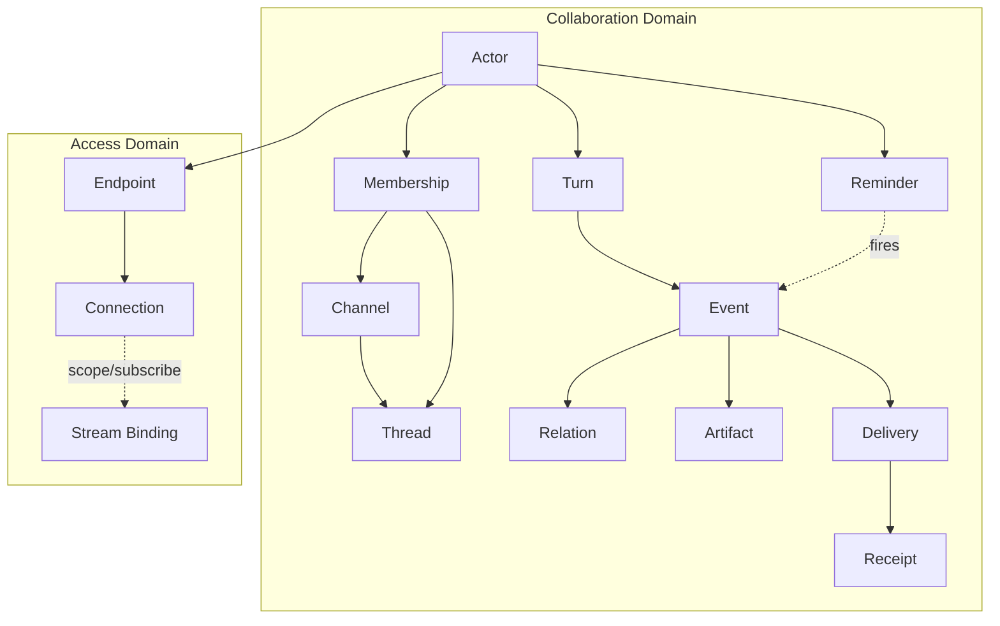
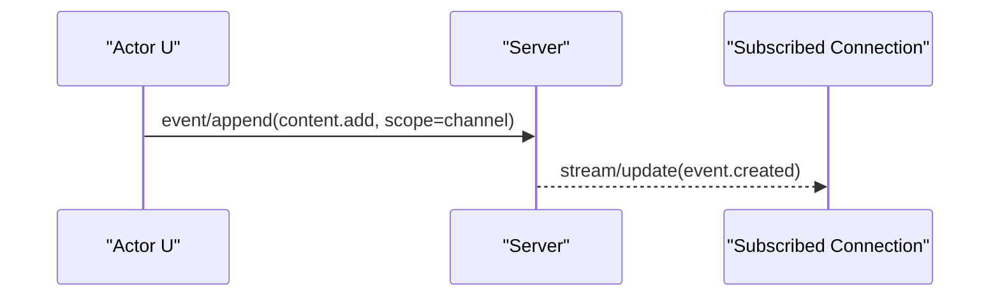
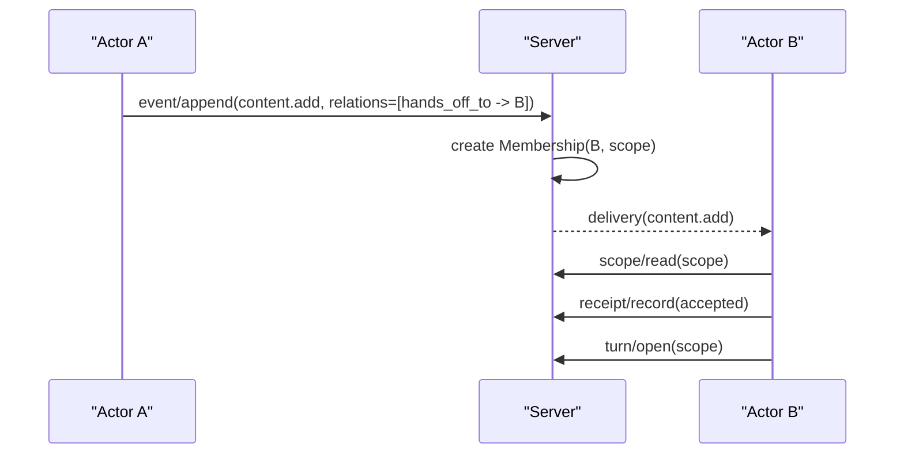
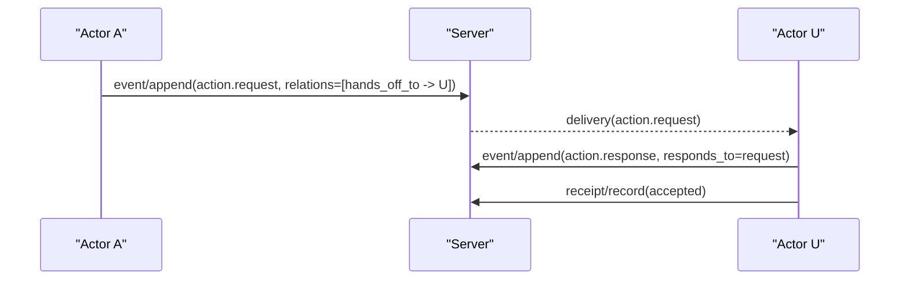
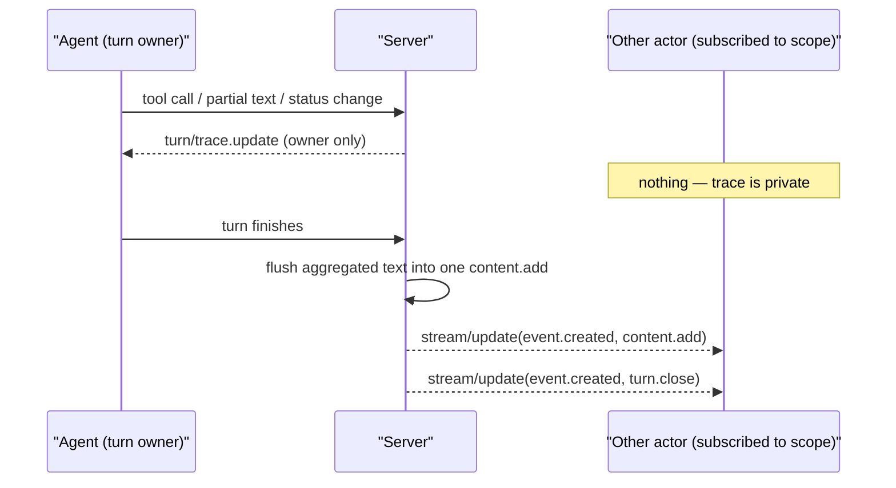

# 开放多参与者协作协议草案 v0

## 1. 目标

这份草案定义一套面向人类与 Agent 平等协作的通用协议模型。

它满足四个目标：

- 简洁：核心对象少，定义互斥，边界清楚。
- 原子：每个对象只承担一种职责。
- 开放：不绑定某个 UI 形态，也不绑定某个 Agent runtime。
- 可覆盖：能够表达共享空间、局部讨论、显式 handoff、流式执行、审批请求和共享产物。

这里有一个明确取舍：

- `@handle` 之类的输入语法属于 UI / binding 层。
- 协议不把 `@` 文本本身当成调度语义。
- actor 之间真正的可执行接力，通过显式 `handoff` 表达。

## 2. 非目标

v0 明确不处理以下问题：

- 联邦发现与跨域信任。
- 权限系统和组织结构的完整建模。
- 工作流编排、任务 DAG、全局调度策略。
- 特定传输实现的细节绑定。
- 特定产品的命名兼容。
- 文本里的 `@handle` 语法标准化。

## 3. 设计原则

### 3.1 协作域与接入域分离

协作域负责表达“发生了什么”。接入域负责表达“谁通过什么连接进来”。

### 3.2 Actor 平等

协议不区分“人类消息”和“Agent 消息”的领域地位。所有参与者统一建模为 `Actor`。

### 3.3 Scope 优先

事件必须发生在某个稳定作用域里。作用域是历史、查询和上下文归属的主边界。

### 3.4 Event 不可变

协议以不可变事件为最小事实单元。UI 或客户端可以聚合事件，但不应把“就地修改旧事件”当作主语义。

### 3.5 关系显式，调度更显式

- `reply`、handoff、artifact 关联都必须显式表达，不依赖客户端本地推断。
- 协议把 `hands_off_to` 当成可机器处理的 actor-directed 关系。
- 纯文本中的 `@handle` 是否存在、如何高亮、是否弹候选框，属于 binding 层，不属于核心协作语义。

### 3.6 Turn 可回看

一次处理过程通常包含多条事件。协议需要 `Turn` 来把这些事件组织成可回看的执行单元。

### 3.7 Membership 独立于 Delivery

协议明确区分两件事：

- 某个 Actor 是否属于某个 scope 的持续上下文。
- 某条 Event 是否被显式投递给某个 Actor。

前者由 `Membership` 表达，后者由 `Delivery` 表达。

## 4. 领域模型

### 4.1 对象定义

| 对象 | 定义 | 是否属于协作域 |
| --- | --- | --- |
| `Actor` | 稳定参与者，可以是人、Agent 或服务 | 是 |
| `Endpoint` | `Actor` 的一个接入端实现 | 否 |
| `Connection` | `Endpoint` 和服务器之间的一次在线连接 | 否 |
| `Channel` | 顶层共享作用域 | 是 |
| `Thread` | `Channel` 下的子作用域 | 是 |
| `Turn` | 一个 Actor 在一个作用域中的一次处理回合 | 是 |
| `Event` | 不可变事实 | 是 |
| `Relation` | 从一个事件指向某个目标的显式边 | 是 |
| `Artifact` | 独立发布的共享产物 | 是 |
| `Membership` | Actor 对某个作用域的持续上下文归属 | 是 |
| `Delivery` | 某个事件对某个 Actor 的投递状态 | 是 |
| `Receipt` | Actor 对某个事件的确认状态 | 是 |
| `Reminder` | 某个 Actor 拥有的定时唤醒请求 | 是 |

### 4.2 结构图



## 5. 核心不变量

### 5.1 Scope 不变量

- `Thread` 必须隶属于且仅隶属于一个 `Channel`。
- `Thread` 必须锚定该 `Channel` 公共区中的一个 `rootEventId`。
- `Thread` 不能再嵌套 `Thread`。
- 一个 `Event` 必须且只能属于一个 `ScopeRef`。
- `ScopeRef` 只能取两种值：`channel` 或 `thread`。

### 5.2 Turn 不变量

- 一个 `Turn` 必须且只能属于一个 `ScopeRef`。
- 一个 `Turn` 必须且只能属于一个 `Actor`。
- 一个 `Event` 最多属于一个 `Turn`。
- 同一个 `Turn` 内的事件必须按 `seq` 严格递增。

### 5.3 Relation 不变量

- `Relation` 的源只能是一个 `Event`。
- `Relation` 的目标必须是一个明确的 `Ref`，不能是裸文本。
- `Relation.kind` 必须显式声明，不能依赖客户端猜测。
- 协议不要求文本里的 `@handle` 映射为任何特定 `Relation`。

### 5.4 Membership 不变量

- `Membership` 表示某个 Actor 从某个时间点起属于该 scope 的持续上下文。
- `Membership` 不等于实时推送，也不等于自动执行。
- `Membership` 的存在意味着该 Actor 在后续被唤醒时，可以通过 `scope/read` 补看历史。

### 5.5 Delivery 不变量

- `Delivery` 是 event 级事实，不是 scope 级成员关系。
- `Delivery` 只应由显式的 actor-directed 语义产生，例如 `hands_off_to`。
- 服务端不得从纯文本 `@handle` 自动推导出 `Delivery`。

### 5.6 Access 不变量

- `Connection` 不得作为协作上下文的主键。
- `scope/subscribe` 绑定的是连接上的实时流，不创建 `Membership`。
- 断线重连不得改变既有 `Event`、`Turn`、`Thread` 的身份。

## 6. 标准引用类型

### 6.1 `Ref`

```json
{
  "kind": "actor | channel | thread | turn | event | artifact",
  "id": "string"
}
```

### 6.2 `ScopeRef`

```json
{
  "kind": "channel | thread",
  "id": "string"
}
```

## 7. 标准资源形状

### 7.1 Actor

```json
{
  "id": "actor_123",
  "kind": "human | agent | service",
  "displayName": "string",
  "capabilities": {},
  "_meta": {}
}
```

### 7.2 Channel

```json
{
  "id": "chan_123",
  "title": "string",
  "_meta": {}
}
```

### 7.3 Thread

```json
{
  "id": "thread_123",
  "channelId": "chan_123",
  "title": "string",
  "rootEventId": "evt_001",
  "_meta": {}
}
```

### 7.4 Turn

```json
{
  "id": "turn_123",
  "actorId": "actor_123",
  "scope": {
    "kind": "thread",
    "id": "thread_123"
  },
  "triggerEventId": "evt_001",
  "status": "open | closed | failed | cancelled",
  "openedAt": "2026-04-18T12:00:00Z",
  "closedAt": null,
  "_meta": {}
}
```

### 7.5 Event

```json
{
  "id": "evt_123",
  "type": "content.add",
  "actorId": "actor_123",
  "scope": {
    "kind": "thread",
    "id": "thread_123"
  },
  "turnId": "turn_123",
  "seq": 1,
  "occurredAt": "2026-04-18T12:00:01Z",
  "payload": {},
  "relations": [],
  "_meta": {}
}
```

### 7.6 Relation

```json
{
  "kind": "replies_to | hands_off_to | responds_to | attaches_artifact",
  "target": {
    "kind": "actor",
    "id": "actor_456"
  },
  "_meta": {}
}
```

### 7.7 Artifact

```json
{
  "id": "art_123",
  "uri": "artifact://authority/art_123",
  "name": "string",
  "mediaType": "text/markdown",
  "size": 1024,
  "checksum": "sha256:...",
  "_meta": {}
}
```

### 7.8 Membership

```json
{
  "actorId": "actor_456",
  "scope": {
    "kind": "thread",
    "id": "thread_123"
  },
  "joinedAt": "2026-04-18T12:00:00Z",
  "updatedAt": "2026-04-18T12:00:10Z",
  "lastReadEventId": "evt_120",
  "_meta": {}
}
```

### 7.9 Delivery

```json
{
  "eventId": "evt_123",
  "actorId": "actor_456",
  "state": "pending | delivered | failed",
  "updatedAt": "2026-04-18T12:00:02Z",
  "_meta": {}
}
```

### 7.10 Receipt

```json
{
  "eventId": "evt_123",
  "actorId": "actor_456",
  "kind": "seen | read | accepted | declined | completed",
  "recordedAt": "2026-04-18T12:00:03Z",
  "_meta": {}
}
```

## 8. 核心事件类型

v0 定义一组最小可互操作事件类型。实现可以扩展，但不得改写这些核心类型的语义。

| 事件类型 | 用途 | 最低要求 |
| --- | --- | --- |
| `content.add` | 追加可展示内容，如文本、Markdown、结构化片段 | 必需 |
| `action.request` | 请求审批、输入或选择 | 必需 |
| `action.response` | 对某个 `action.request` 的响应 | 必需 |
| `artifact.publish` | 发布共享产物并产生稳定引用 | 必需 |
| `turn.close` | 标记一次 Turn 的结束状态 | 必需 |

判别规则：

- 一个事实是否值得变成 `Event`，取决于它有没有跨 actor 的语义关系（`hands_off_to` / `responds_to` / `attaches_artifact`）。有就写成 `Event`；没有的内部活动属于该 Turn 的私有 trace。
- 异步性不影响这个判别 —— "需要别人未来回应" 的请求即便不阻塞，也仍然是 inter-actor 事件。

说明：

- 普通用户消息可以表示为一个只包含单条 `content.add` 的隐式 Turn。
- Agent 的流式输出在 server 侧聚合：同一 `Turn` 内的增量 chunk 仅作为 trace 帧实时回推给 turn owner，turn 关闭时一次性写入一条最终 `content.add` 事件。其它 actor 不会看到中间的 partial chunk。
- `reply`、handoff、artifact 等语义通过 `relations` 表达，不依赖文本解析。
- 事件与共享产物的关联通过 `attaches_artifact` 关系表达。
- Agent 的工具调用、内部状态变化、运行时错误属于 Turn 私有 trace，由 `turn/trace.update` 通道承载，不写入 `Event` 流，不进入任何 actor 的 `scope/read` 历史。trace 不可被 `replies_to` / `responds_to` 寻址；如果其它 actor 需要细节，由该 actor 用 `content.add` 自行解释。
- v0 阶段不提供 journal 兼容迁移：升级实现后，旧 journal 中遗留的 `tool.report` / `status.report` 事件可被允许直接清空 journal 重建。

## 9. 核心关系类型

| 关系类型 | 源 | 目标 | 语义 |
| --- | --- | --- | --- |
| `replies_to` | Event | Event | 当前事件与某个上游事件形成 `reply` 关系 |
| `hands_off_to` | Event | Actor | 当前事件把后续处理责任转交给某个参与者 |
| `responds_to` | Event | Event | 当前事件是对某个请求事件的响应 |
| `attaches_artifact` | Event | Artifact | 当前事件附带某个共享产物 |

额外说明：

- `hands_off_to` 适合表达“后续动作交给你接”。
- 如果某个 UI 允许用户输入 `@handle`，那只是输入层能力；除非 UI 显式构造 `hands_off_to` relation，否则协议层不为其赋予机器语义。

## 10. 协议操作

协议操作只定义语义，不绑定具体传输。它可以通过 WebSocket、SSE + HTTP、stdio、QUIC 或其他双向流承载。

完整的 interface contract、notification 结构和 binding 约束，见 [open-multi-actor-collaboration-schema-v0.md](/Users/bojun.cbj/Workspace/gitlab.alibaba-inc.com/bojun.cbj/joi-apps/docs/protocol/open-multi-actor-collaboration-schema-v0.md)。

### 10.1 `connection/open`

用途：

- 建立客户端与服务器之间的接入会话。
- 协商身份、能力和订阅方式。

### 10.2 `scope/subscribe`

用途：

- 把当前 `Connection` 绑定到某个 `Channel` 或 `Thread` 的实时更新流。

约束：

- `scope/subscribe` 只影响当前连接上的流式更新。
- `scope/subscribe` 不创建、不删除、不暗示任何 `Membership`。

### 10.3 `scope/read`

用途：

- 按作用域读取历史事件，可支持 cursor、窗口和过滤条件。

### 10.4 `thread/create`

用途：

- 基于某个 `Channel` 公共区中的 `rootEventId` 创建新的 `Thread`。
- `rootEventId` 指向的 `Event.scope.kind` 必须是 `channel`，且 `Event.scope.id`
  必须等于请求里的 `channelId`；不能用 thread 内事件继续创建子 thread。

### 10.5 `turn/open`

用途：

- 显式开启一个 Turn。
- 对于简单消息，客户端也可以省略这一步，由服务端创建隐式 Turn。

### 10.6 `event/append`

用途：

- 向某个 Turn 或隐式 Turn 追加一条不可变事件。

请求示例：

```json
{
  "method": "event/append",
  "params": {
    "event": {
      "type": "content.add",
      "actorId": "actor_user_1",
      "scope": {
        "kind": "thread",
        "id": "thread_123"
      },
      "payload": {
        "contentType": "text/markdown",
        "text": "这里是最新进展。"
      },
      "relations": [
        {
          "kind": "replies_to",
          "target": {
            "kind": "event",
            "id": "evt_001"
          }
        }
      ]
    }
  }
}
```

### 10.7 `turn/close`

用途：

- 显式结束一个 Turn，并报告最终状态。

### 10.8 `artifact/publish`

用途：

- 发布共享产物，返回稳定 `artifact URI`。

### 10.9 `receipt/record`

用途：

- 为某个事件记录确认状态。

### 10.9.1 `delivery/list`

用途：

- 拉取某个 actor 的 durable directed inbox。
- 调用方必须绑定到同一个 `actorId`；server 必须拒绝跨 actor 读取 inbox。
- agent-facing CLI 的 `message check` 以该方法为基础读取 pending delivery，并用
  `receipt/record` 标记处理进度。

### 10.10 `message/search`

用途：

- 搜索调用方可见的消息文本。
- 这是 agent-facing CLI 的读能力补充；发送和读取消息仍分别映射到
  `event/append` 与 `scope/read`。
- 若传入 `scope`，server 必须先按调用方 actor 校验该 scope 的访问权；未传入
  `scope` 时，server 只能返回调用方可见 channel / thread 中的事件。

请求示例：

```json
{
  "method": "message/search",
  "params": {
    "query": "keyword",
    "scope": {
      "kind": "thread",
      "id": "thread_123"
    },
    "limit": 20
  }
}
```

响应示例：

```json
{
  "events": [
    {
      "id": "evt_123",
      "type": "content.add",
      "actorId": "actor_user_1",
      "scope": {
        "kind": "thread",
        "id": "thread_123"
      },
      "payload": {
        "contentType": "text/markdown",
        "text": "keyword in message"
      },
      "relations": []
    }
  ]
}
```

### 10.11 `reminder/*`

用途：

- `reminder/schedule` 创建一个由 `actorId` 拥有的定时提醒。
- `reminder/list` 列出该 actor 的提醒。
- `reminder/cancel`、`reminder/snooze`、`reminder/update` 修改提醒生命周期。

提醒到期时，如果 reminder 绑定了 `scope`，server 追加一条 `reminder.fire`
事件；该事件带 `hands_off_to -> actor:<actorId>`，从而走同一套 directed delivery
机制唤醒目标 actor。若 reminder 绑定了 `msgId`，到期事件还应带
`responds_to -> event:<msgId>`。

## 11. 标准交互模式

### 11.1 普通 room / thread 更新



说明：

- 普通更新进入时间线。
- 是否有连接在线、谁订阅了实时流，是 access 层问题。
- 普通更新不会因为文本里出现 `@handle` 就自动变成 directed delivery。

### 11.2 显式 handoff



说明：

- `handoff` 表示当前 scope 内的责任转移 / 唤醒。
- `handoff` 不表示私聊。私聊是 binding 层目标解析：`dm:<actor_id>` 创建或复用
  两人私有 channel，然后写入 `content.add`，并带 `hands_off_to` 指向收件 actor。
- Canonical DM target 只有 `dm:<actor_id>`；`dm:@actor` 这类写法不是协议或 CLI
  兼容目标。
- Canonical thread target 是 `#<channel_id>:<root_event_id>`，对应一个
  channel 消息下的 thread；`thread:<thread_id>` 不作为 binding target。

### 11.3 审批请求



### 11.4 Agent 内部 trace



说明：

- trace 帧只对当前 Turn 的 owner（即 `Turn.actorId`）可见。
- trace 不写入 `events_by_scope`，不出现在 `scope/read` 结果里。
- owner 在重连后可通过 `turn/trace.read` 拉取该 turn 的历史 trace。

## 12. 实现约束

### 12.1 服务端约束

- 服务端必须为所有 `Event` 分配稳定 ID。
- 服务端必须保持同一 `Turn` 内事件的顺序。
- 服务端必须支持按 `ScopeRef` 查询历史。
- 服务端必须支持将 `Relation` 原样返回给订阅者。
- 服务端不得从纯文本 `@handle` 自动推导 `Delivery` 或 `handoff`。
- 服务端不得把 agent 的工具调用、partial 文本 chunk、内部状态变化作为可订阅 `Event` 广播；这类信号属于 Turn 私有 trace，仅通过 `turn/trace.update` 通道回推给当前 Turn 的 owner。
- 服务端必须在 Turn 关闭时把同一 Turn 内累积的 partial 文本 chunk 聚合成至多一条最终 `content.add` 事件再广播。

### 12.2 Membership 约束

- 服务端应在 actor 首次在某个 scope 发言或被显式 `hands_off_to` 时，创建或刷新对应 `Membership`。
- `Membership` 的存在应足以支撑稍后通过 `scope/read` 补看历史。
- `Membership` 本身不要求服务端主动推送该 scope 的所有新消息。

### 12.3 客户端约束

- 客户端不得把本地连接状态当作 `Turn` 或 `Thread` 的身份来源。
- 客户端不得依赖裸文本解析来重建 handoff 或 directed delivery。
- 客户端和 CLI binding 对同一语义应保留一个 canonical 名称；不得为了兼容旧拼法
  继续暴露同义 alias。
- 客户端可以聚合同一 `Turn` 的事件，但不得篡改原始事件顺序。

### 12.4 扩展约束

- 实现可以增加新的 `Event.type` 与 `Relation.kind`。
- 扩展不得改变 v0 核心类型的既有语义。
- Wire-level 扩展不应重新解释核心字段；binding 层不要求保留旧命名或同义 alias。

## 13. 最小可互操作能力

一个实现若要宣称兼容本协议 v0，至少应支持：

- `Actor`
- `Channel`
- `Thread`
- `Turn`
- `Event`
- `Relation`
- `Artifact`
- `Membership`
- `Delivery`
- `Receipt`
- `Reminder`
- `connection/open`
- `scope/subscribe`
- `scope/read`
- `thread/create`
- `event/append`
- `message/search`
- `artifact/publish`
- `receipt/record`
- `delivery/list`
- `reminder/schedule`
- `reminder/list`
- `reminder/cancel`
- `reminder/snooze`
- `reminder/update`
- `turn/trace.read`

## 14. 总结

这份 v0 草案坚持下面这组边界：

- `@` 是 binding 语法，不是协议调度原语。
- `handoff` 是唯一明确的责任转移语义。
- `Membership` 负责“以后还能补看上下文”。
- `Delivery` 负责“这条事件现在明确投给谁”。

多参与者协作的最小稳定内核，不是某个模型运行时，也不是某个聊天 UI，而是：

- 平等的 `Actor`
- 稳定的 `Scope`
- 不可变的 `Event`
- 显式的 `Relation`
- 可回看的 `Turn`
- 可补看的 `Membership`
- 可引用的 `Artifact`

只要这几个对象被定义清楚，具体界面、具体运行时、具体部署形态都可以在其上自由演化。
