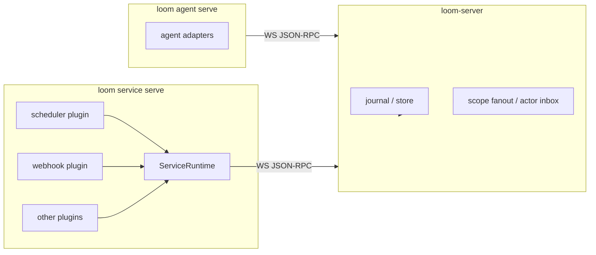

# Service Plugin System Design

> Status: design proposal.

Loom models humans, agents, services, and system actors as `Actor`s. Agent
runtimes are prompt-centric and are managed by the agent host. Services are
different: they listen to the outside world, schedule work, translate events,
deduplicate inputs, and may perform external side effects. They need a
dedicated plugin host that connects to Loom as service actors while keeping
`loom-server` a pure collaboration hub.

## Goals

1. Keep `loom-server` responsible for protocol state, ACL, fanout, actor inbox,
   journal, tasks, turns, deliveries, and artifacts.
2. Run active integrations outside the server as `loom service serve`.
3. Make each service connect as a normal service actor.
4. Share lifecycle, config loading, state directory layout, dedupe, retry,
   logging, and reply waiting across service plugins.
5. Keep agent and service responsibilities separate: services ingest and
   normalize external facts; agents reason over directed work.

## Non-Goals

- No dynamic third-party code loading inside `loom-server`.
- No scheduler embedded in the server process.
- No service plugin subtype of the agent adapter trait.
- No product-specific integration contract in Loom core.

## Topology



`loom service serve` loads service specs, opens one connection per service
actor, and starts the matching plugin. Plugins call `ServiceRuntime`; they do
not hand-roll JSON-RPC requests.

## Service Versus Agent

| Dimension | Agent | Service |
| --- | --- | --- |
| Trigger | Directed delivery or assignment | Time, webhook, queue, external system, Loom event |
| Runtime abstraction | `Adapter::send_prompt` | `ServicePlugin::run` |
| Primary output | Messages, traces, action requests | Messages, artifacts, directed events, external callbacks |
| State | Workspace, profile, provider session | Cursor, dedupe log, external id mapping |
| Typical examples | Claude, Codex, local model CLI | Scheduler, webhook bridge, CI watcher |

## ServiceSpec

Service specs are JSON files loaded by the service host. The default local
path is:

```text
~/.config/loom/services/*.json
```

Minimal shape:

```json
{
  "id": "daily_digest",
  "kind": "scheduler",
  "actor": {
    "id": "svc_daily_digest",
    "kind": "service",
    "displayName": "Daily Digest"
  },
  "config": {}
}
```

Rules:

- `actor.kind` MUST be `service`.
- `id` is the host-local service id and is used for state paths.
- `kind` selects the plugin implementation.
- `config` is plugin-specific and must not be interpreted by `loom-server`.

## ServicePlugin

Conceptual interface:

```rust
#[async_trait]
pub trait ServicePlugin: Send + Sync {
    async fn run(&self, ctx: ServiceContext) -> Result<(), ServiceError>;
    async fn stop(&self) -> Result<(), ServiceError>;
}
```

The first built-in plugins can be compiled into the service host. Marketplace
or subprocess plugins can be added later, but they should keep the same runtime
contract.

## ServiceRuntime

Shared capabilities:

- `actor_upsert(actor)`
- `open_connection(actor_kind = service)`
- `ensure_channel_member(channel_id, actor_id)`
- `create_or_get_thread(key, title)`
- `send_message(scope, text, meta)`
- `send_directed_message(scope, target_actor, text, meta)`
- `await_message_replies(parent_message_id, timeout)`
- `publish_artifact(name, bytes, metadata)`
- `state_dir(service_id)`
- `dedupe_once(key)`
- `cursor_load(name)` / `cursor_save(name, value)`
- retry, backoff, and structured logging helpers

`ServiceRuntime` owns protocol correctness. Plugins own external-system
semantics.

## State Layout

```text
~/.local/share/loom/service-host/services/<service_id>/
  cursors/
  dedupe.jsonl
  external-map.json
  logs/
```

This state is private to the connector. Canonical collaboration facts must be
written back as Loom messages, deliveries, task changes, or artifacts.

## Server Protocol Needs

The service host relies on generic protocol capabilities:

- Service actor connections.
- Durable actor inbox.
- Parent/reply relation or equivalent `responds_to` relation.
- Artifact publish/read.
- Optional lease or single-owner guard if multiple service hosts race to manage
  the same service id.

None of these capabilities should mention a specific external product.

## Rollout

1. Define `ServiceSpec` and service host config loading.
2. Add `ServiceRuntime` with connection, message, artifact, dedupe, cursor, and
   reply-waiting helpers.
3. Move built-in scheduler behavior onto `ServicePlugin`.
4. Add a generic webhook or command-source plugin.
5. Evaluate subprocess plugins and marketplace distribution after the internal
   runtime boundary is stable.
