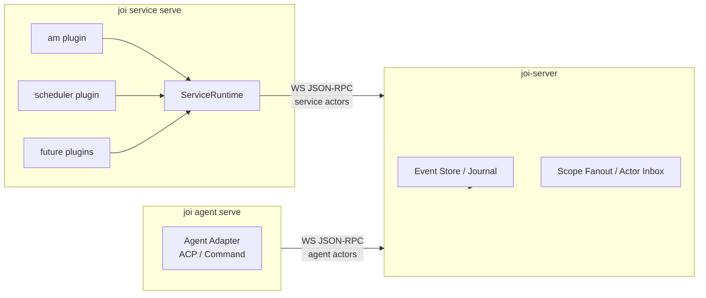

# Service Plugin System Design

> 状态：方案设计草案。目标是把 `am` bridge、scheduler 这类主动接入能力，从一次性脚本沉淀成统一的 service/plugin host。

## 1. 背景

当前 Joi 的核心模型已经把人、agent、service 都统一成 `Actor`。`am` 钉钉接入也是这样跑起来的：外部脚本以 `svc_am_bridge` 这个 service actor 写入 thread，再通过 `hands_off_to` 关系把问题交给目标 agent。

这条链路证明了协议模型是可行的，但实现仍是脚本化的：

- `am` 的状态、thread 映射、重试、回发都在 Python 脚本里。
- scheduler 这类时间驱动入口还没有一等抽象。
- agent runtime 已经有外置化的 `joi agent serve`，service 还没有对应的长期进程模型。
- server 仍不应该感知 `am`、cron、CI watcher 这些具体业务。

因此下一步不是把每个 service 写进 `joi-server`，而是新增一个外置 service/plugin host，让 server 继续保持协议枢纽职责。

## 2. 设计目标

1. `joi-server` 保持纯消息枢纽：持久化、ACL、scope fanout、actor-inbox。
2. `am`、scheduler、CI watcher 等主动入口以 service plugin 形式运行。
3. 所有 service 都以 service actor 身份接入 Joi，写入标准 `Event`。
4. service 之间共享生命周期、配置、状态目录、重试、幂等、日志、`responds_to` 订阅等基础能力。
5. agent 与 service 分层清晰：service 负责外部世界和时间触发，agent 负责被 handoff 后的推理与回复。

## 3. 非目标

- 不把第三方插件动态加载进 `joi-server` 进程。
- 不把 scheduler 做成 server 内部定时器。
- 不把 service plugin 设计成 agent adapter 的子类型。
- 第一阶段不做动态 / 子进程式 plugin。S1-S3 的 plugin 一律以 service-host 进程内 trait impl 形式发布，与 `agent-runtime` 的 ACP / Command 双 adapter 同形态；子进程 plugin 或第三方分发延后到 S4 再评估。
- 不在第一阶段解决远程公网多租户认证。当前 v0 仍是本地信任模型。

## 4. 总体拓扑



`joi service serve` 是一个长期进程。它从配置目录加载 service specs，为每个 service actor 打开连接，启动对应 plugin。plugin 只和 `ServiceRuntime` 交互，不直接拼底层 JSON-RPC。

## 5. Service 与 Agent 的区别

| 维度 | Agent | Service |
| --- | --- | --- |
| 触发来源 | `hands_off_to` 事件 | 外部系统、时间、webhook、轮询、Joi 事件 |
| 输出 | agent 回复、tool trace、action.request | 标准 Joi event、外部回发、handoff |
| 运行抽象 | `Adapter::send_prompt` | `ServicePlugin::run` / ingress loop |
| 状态 | per-agent workspace/profile/session | per-service state/cursor/dedupe/thread-map |
| 典型例子 | Claude、Codex、opencode | am bridge、scheduler、CI watcher |

现有 `Adapter` trait 是 prompt-centric 的，不适合直接复用为 service 抽象。service 的核心是持续监听、事件转换、幂等和外部副作用。

## 6. 核心抽象

### 6.1 ServiceSpec

第一版使用 JSON 文件，路径默认：

```text
~/.config/joi/services/*.json
```

service spec 与 agent spec 的关键差异：

- agent spec 隐式 `actor.kind = "agent"`。
- service spec 必须显式声明 `actor.kind = "service"`，并允许同一 host 进程挂载多个不同 kind 的 service actor。
- 其他公共字段，如 `id`、`displayName`、`autostart`，与 agent spec 对齐，便于复用 `crates/cli/src/cmd/agent_serve.rs` 的 spec 加载与 `--allow-*` 过滤逻辑。

示例：

```json
{
  "id": "am_dingtalk_qa",
  "kind": "am",
  "actor": {
    "id": "svc_am_bridge",
    "kind": "service",
    "displayName": "DingTalk QA Bridge"
  },
  "channelId": "chan_x",
  "targetAgent": "actor_qa",
  "config": {
    "amBin": "am",
    "topic": "/v1.0/im/bot/messages/get",
    "scope": "auto_thread",
    "replyMode": "async_send"
  }
}
```

Scheduler 示例：

```json
{
  "id": "daily_ci_watch",
  "kind": "scheduler",
  "actor": {
    "id": "svc_scheduler",
    "kind": "service",
    "displayName": "Scheduler"
  },
  "channelId": "chan_ops",
  "targetAgent": "actor_planner",
  "config": {
    "jobs": [
      {
        "id": "ci_watch",
        "schedule": "*/10 * * * *",
        "source": {
          "kind": "command",
          "command": "a1",
          "args": ["ci", "run", "list"]
        },
        "scope": {
          "kind": "thread",
          "mode": "fixed",
          "threadId": "thread_ci"
        }
      }
    ]
  }
}
```

### 6.2 ServicePlugin

概念接口：

```rust
#[async_trait]
pub trait ServicePlugin: Send + Sync {
    async fn run(&self, ctx: ServiceContext) -> Result<(), ServiceError>;
    async fn stop(&self) -> Result<(), ServiceError>;
}
```

`run` 内部可以是：

- 内置 `am` plugin 封装的监听 loop；plugin 本体是 service-host 进程内 trait impl，不是动态加载的子进程插件。
- cron/timer loop。
- webhook listener（S4 之后再评估 HTTP listener 与 marketplace 安全模型）。
- message queue consumer。
- Joi scope subscription consumer。

### 6.3 ServiceRuntime

所有 plugin 共享的基础能力：

- `actor_upsert(actor)`
- `open_connection(actor_kind = service)`
- `ensure_channel_member(channel_id, actor_id)`
- `create_or_get_thread(key, title)`
- `append_content(scope, text, relations, meta)`
- `handoff(target_actor, scope, message, meta)`
- `await_responds_to(trigger_event_id, timeout) -> Stream<Event>`
- `reply_external(reply_target, text)`
- `state_dir(service_id)`
- `dedupe_once(key)`
- `cursor_load/save(name)`
- retry/backoff/logging

`await_responds_to` 内部基于 actor-inbox 上 `RespondsTo -> trigger_event_id` 的 push，不要求 plugin 自己轮询 `event/list`。`am` 可以在这个订阅原语上实现 `block_until_first()` helper；scheduler、webhook 等 plugin 可以选择消费或忽略这类响应流。

ServiceRuntime 不提供 polling `event/list` 的便利方法。所有“等回答”都建立在 §9.1 (`responds_to` 不变量) + §9.2 (durable actor inbox) 之上，避免回到当前 `am` 脚本 `joi event list --limit 80` 轮询的反模式。

ServiceRuntime 负责协议正确性，plugin 只负责外部系统语义。

## 7. AM Plugin 设计

`am` plugin 是第一个迁移对象。

### 7.1 输入

来自 `am listen --topic /v1.0/im/bot/messages/get` 的事件。plugin 负责提取：

- message text
- conversation id
- sender staff id
- message id / event id

### 7.2 Scope 映射

支持三种模式：

- `channel`：所有消息写入 channel common area。
- `fixed_thread`：所有消息写入指定 thread。
- `auto_thread`：按 `conversationId` 或 sender 映射到不同 thread。

auto thread 映射从脚本里的 JSON 文件迁到 service state：

```text
~/.local/share/joi/service-host/services/am_dingtalk_qa/thread-map.json
```

### 7.3 Joi 写入

每条外部消息转换成一次 handoff：

```json
{
  "type": "content.add",
  "actorId": "svc_am_bridge",
  "scope": { "kind": "thread", "id": "thread_x" },
  "payload": {
    "contentType": "text/markdown",
    "text": "Source: DingTalk bot message ...\n\nUser message:\n..."
  },
  "relations": [
    { "kind": "hands_off_to", "target": { "kind": "actor", "id": "actor_qa" } }
  ],
  "_meta": {
    "service": "am",
    "external": {
      "conversationId": "...",
      "senderStaffId": "...",
      "messageId": "..."
    }
  }
}
```

### 7.4 回发

回发模式保留三种：

- `callback`：同步从 listener stdout 返回 DingTalk callback response。
- `send`：同步调用 `am group` / `am chat`。
- `async_send`：先 callback 返回“收到，正在处理。”，后台等 agent 回复再调用 `am`。

回发依赖 agent 回复中的：

```json
{
  "kind": "responds_to",
  "target": { "kind": "event", "id": "<handoff event id>" }
}
```

这是协议层必须补硬的点，不能只依赖某条 runtime 路径。

## 8. Scheduler Plugin 设计

Scheduler 是 service plugin，不是 server 内置定时器。

### 8.1 适合放 scheduler 的任务

- 定时拉 HTTP API。
- 定时执行命令。
- 定时检查 CI / CR / bug / task 状态。
- 定时汇总 channel/thread 里的事件。
- 到点向 agent handoff，让 agent 分析或生成报告。

### 8.2 不适合放 scheduler 的任务

- journal compact。
- artifact GC。
- delivery retry。
- 索引重建。

这些是 server 内部维护任务，应该留在 server 或 maintenance worker。

### 8.3 Job 执行模型

每个 job 在 spec 里定义如下字段（参见 §6.1 scheduler 示例）：

| 字段 | 必填 | 说明 |
| --- | --- | --- |
| `id` | 是 | 同一 service 内唯一；进入 dedupe key 与 cursor 文件名 |
| `schedule` | 是 | 5-field cron 表达式，UTC 解释（§13 Q3） |
| `source.kind` | 是 | `command` / `http`（S3 仅这两种） |
| `source.command` / `source.args` | command 时必填 | 子进程执行，捕获 stdout |
| `source.url` / `source.method` / `source.headers` | http 时必填 | GET/POST，捕获响应 body |
| `source.timeoutMs` | 否 | 默认 30000 |
| `scope` | 是 | `{ "kind": "thread"\|"channel", "id": "..." }`；目标必须 svc_scheduler 已加入 |
| `targetAgent` | 否 | 设置后触发 handoff；不设置则纯 logging |
| `dedupeBy` | 否 | `payload_hash`（默认） / `source_event_id` / `none` |
| `cursorBy` | 否 | `none`（默认） / `body_hash` / `jq:<expr>` |

#### 触发流

```mermaid
sequenceDiagram
    participant Cron as cron tick
    participant Plugin as scheduler plugin
    participant Source as cmd / http
    participant Runtime as ServiceRuntime
    participant Server as joi-server
    participant Agent as target agent (opt)

    Cron->>Plugin: fire(job_id, fire_time_utc)
    Plugin->>Source: exec(timeout)
    Source-->>Plugin: stdout / response
    Note over Plugin: cursor diff vs last; dedupe_once first
    alt new event
        Plugin->>Runtime: append_content(scope, body, hands_off_to?)
        Runtime->>Server: event/append
        opt targetAgent set
            Server-->>Agent: actor-inbox push
        end
    else no change or already seen
        Plugin->>Runtime: cursor_save(new_cursor)
    end
```

#### Source kinds

- `command`：以 `Command::new(cmd).args(args)` 起子进程，捕获 stdout 作为 body，stderr 进 log，exit code != 0 视为失败（计入 retry policy，不发 event）。子进程 exec 与失败语义留在 plugin 内部，不进 ServiceRuntime（理由见 §8.7）。
- `http`：单次 GET/POST，非 2xx 视为失败（同上）。响应 body 作为 event payload。

#### Cursor 语义

- `none`：每次 tick 都视为新事件，结合 `dedupe_once` 防 idempotency。适合"按时间汇总"型 job。
- `body_hash`：cursor 是上次成功 body 的 sha256；本次 hash 相同则跳过。适合状态轮询（CI / 任务队列）。
- `jq:<expr>`：从 body 用 jq 提取游标值（如 `jq:.runs[0].id`），与上次比较。适合带天然 id 的 source（GitHub Actions 的 run id、消息列表的 last message_id）。

cursor 持久化到 `~/.local/share/joi/service-host/services/<sid>/cursors/<job_id>.json`，failover 后重启即可恢复（与 §9.2 durable inbox 同语义但局限在 plugin 私有状态，不进 server journal）。

#### 标准 Joi event

Job 触发并通过 dedupe 后生成：

```json
{
  "type": "content.add",
  "actorId": "svc_scheduler",
  "scope": { "kind": "thread", "id": "thread_ci" },
  "payload": {
    "contentType": "text/markdown",
    "text": "CI changed: ...",
    "_meta": {
      "service": "scheduler",
      "jobId": "ci_watch",
      "fireTimeUtc": "2026-04-24T09:00:00Z",
      "sourceCursor": "run_982371"
    }
  },
  "relations": [
    { "kind": "hands_off_to", "target": { "kind": "actor", "id": "actor_planner" } }
  ]
}
```

### 8.4 幂等要求

Scheduler 必须默认防重复。dedupe key 选择优先级：

1. **source 有天然 event id**（如 GitHub workflow_run.id、消息 id）：

   ```text
   service:<service_id>:job:<job_id>:source_event:<source_id>
   ```

2. **source 无天然 id**：

   ```text
   service:<service_id>:job:<job_id>:fire:<fire_time_utc>:hash:<body_hash>
   ```

`dedupe_once(key)` 必须在 `append_content` **之前**调用：写 dedupe 行 → 写 event。倒序会留下窗口，让两次 tick 撞同一个 source state 时双发。

dedupe 存储与 cursor 同目录：`~/.local/share/joi/service-host/services/<sid>/dedupe.jsonl`，append-only。S1 可以做按时间窗口截断（默认保留 14 天）。

### 8.5 Scope 映射与等待 agent

与 §7.2 不同，scheduler 的 scope 是 **per-job 静态的**，不需要 auto-thread 之类按 source 字段动态分配。原因是 cron job 通常代表一个固定关注点（CI watcher 永远进 `#ops/ci` 线程），动态分流会模糊 job 责任边界。

Job 触发后是否等 agent 回复：

- **Fire-and-forget**（默认，几乎所有 watcher 类 job）：append event with handoff，立刻 return，tick 之间不持有 turn-level 状态。agent 的回复通过 §9.5 RespondsTo 反向投递落到 `svc_scheduler` 的 inbox，但 plugin 可以选择仅订阅 cron 调度、忽略 actor-inbox push，让 reply 只在 channel/thread 给人看。
- **Awaited**（少数报告类 job，如"每天 9 点跑总结"）：append event 后调用 `await_responds_to(trigger_event_id, timeout)`，把 agent 文本作为 job 输出（写日志、回写另一个 channel、触发下一步 job）。timeout 必须显式（推荐 ≤ 单次 tick 间隔的 1/2），超时按 retry policy 处理。

下一次 tick 与上一次 await 冲突时：plugin 内部用 `single_in_flight: bool` 默认拒绝叠加（同一 job 不能同时持两个未完成 turn），打 warning 日志并跳过本次 tick。这是 plugin 级语义，不需要 ServiceRuntime 介入。

### 8.6 状态目录布局

```text
~/.local/share/joi/service-host/services/<service_id>/
  state.json           # 服务级元数据（启动时间、版本、上次 graceful shutdown）
  cursors/
    <job_id>.json      # cursor 值 + 上次成功 fire_time
  dedupe.jsonl         # append-only，按 §8.4 key 去重
  pending/             # 仅 awaited 模式使用：未完成 turn 的 (job_id, trigger_event_id, deadline)
  logs/
    scheduler.log
    job-<job_id>.log
```

跟 §10 同语义：这些都是 connector 私有状态，不进 server journal。

### 8.7 ServiceRuntime API 验证（S0.5 结论）

§12 Phase S0.5 要求用第二个 plugin 验证 §6.3 的 API 列表不是 `am` 形状的拓印。scheduler 的设计实测如下：

**scheduler 用到的方法**：`actor_upsert` / `open_connection` / `ensure_channel_member` / `append_content` / `handoff` / `state_dir` / `dedupe_once` / `cursor_load|save` / retry+backoff+logging。

**scheduler 没用到的方法**（am 用到）：

- `create_or_get_thread`：scheduler 用静态 scope，不需要按外部字段动态建 thread。
- `reply_external`：scheduler 是单向 ingress，没有"回发到外部系统"语义。
- `await_responds_to`：fire-and-forget 模式不用；少数 awaited 模式用到，属 plugin-optional 而非必选。

**scheduler 需要但 §6.3 缺失**的方法：**无**。

- 子进程执行 (`exec_command`) 与 HTTP 取数 (`http_fetch`) 应留在 plugin 内部，不进 runtime —— 这两个能力的失败语义（exit code、HTTP status、超时）与 source 类型紧耦合，runtime 抽象会丢精度。S3 之后若多个 plugin 共享同一套 subprocess wrapper，再评估上提。
- cron 解析与调度循环留在 plugin 内部（§13 Q3 选定 5-field UTC 后，runtime 没必要承担调度器角色）。

**结论**：§6.3 通过第二 plugin 测试，S1 可以按既有列表抽 trait，不需要因 scheduler 而 rebase。`cursor_load|save` 这条原本为 am 假想的 API，scheduler 的实际使用反而比 am 更典型，确认不是死代码。`reply_external` 与 `await_responds_to` 在 scheduler 路径不被强制依赖，证明 §6.3 没有把 am 单形态作为下限。

## 9. Server 侧需要补的协议能力

### 9.1 responds_to 是协议不变量，不是 phase 任务（已实现）

所有针对 trigger event 产生的 agent 回复都必须携带 `responds_to -> trigger_event_id`。这是 service plugin 能存在的前提：

- 失去这条关系，service 只能 polling `event/list` 猜回答，即 `am` 现状。
- 拥有这条关系，§6.3 的 `await_responds_to` 才能基于 actor-inbox push 工作。

两条 runtime 路径现在都满足该不变量：

- 外置 `joi agent serve`：`crates/cli/src/cmd/agent_serve.rs::flush_text` 写 `RespondsTo`。
- 嵌入 runtime：`crates/server/src/runtime/wakeup.rs::flush_text_as_event` 从 `Turn.trigger_event_id` 反查并写入；缺 trigger（agent 主动开口）时与外置实现一致地降级为空 relations。

### 9.2 Durable actor inbox

现在 actor-inbox 更偏在线推送。service plugin 需要可恢复：

- 断线后按 cursor 补收 directed events。
- service 重启后不会漏掉要处理的事件。
- 已处理事件要能记录 receipt 或 cursor。

可以先做最小 API：

```text
delivery/list(actorId, state=pending, limit, cursor)
receipt/record(eventId, actorId, completed)
```

### 9.3 Thread API ACL（已实现）

`event/append` 已有 scope ACL；现在 thread create/list/update/delete 四个 handler 也按 caller-actor 校验 channel membership：

- `thread/create`：caller 必须是目标 channel 的 member（公区 channel 短路）。
- `thread/list`：silently filter，只返回 caller 可见 channel 下的 thread；与 `channel/list` 同形态。
- `thread/update` / `thread/delete`：先解析 thread → channel，再校验 caller membership。
- 实现位置：`crates/server/src/handlers/mod.rs::thread_create / thread_list / thread_update / thread_delete`，dispatch 层透传 `connection_id`。
- 单元测试：`thread_create_refuses_non_member_in_private_channel` / `thread_create_allows_member` / `thread_list_filters_to_visible_channels` / `thread_delete_refuses_non_member` / `thread_update_refuses_non_member`。

### 9.4 Service connection lease（已实现）

复用 v1 agent-client 的同一策略（参见 `docs/architecture-v1-agent-client.md` §9 Q2，倾向“每个 actor 单 owner，后到的 `connection/open` 抢占前者”）。service host 不引入独立的 endpoint id / lease 协议。`connection/open` 的 server 端实现统一支持 service 与 agent。

实现细节：`crates/server/src/subscribe.rs::bind_actor` 的 preempt 规则覆盖 `ActorKind::Agent | ActorKind::Service`。短期 `joi --as svc_xxx <subcmd>` 默认 `actorKind = Human`（见 `crates/cli/src/client.rs::open_connection`），不会误抢长期 service host 的 inbox。stale 分支无条件清理失效绑定，使 host 干净重启同样能立即接管。

单元测试：`subscribe::tests::service_kind_preempts_existing_live_binding` / `human_kind_does_not_preempt_live_binding` / `stale_binding_is_evicted_for_any_kind`。

### 9.5 RespondsTo 反向投递（已实现）

§9.1 让 agent 回复一定带 `responds_to -> trigger_event_id`，§9.2 给 service plugin 一个可恢复的 inbox。但当前 server 的 actor-inbox 推送 (`crates/server/src/ws.rs::fanout`) 与 deliveries 写入 (`crates/server/src/store.rs::append_event`) 都只看 `HandsOffTo`——agent 回的 reply event 因为只带 `RespondsTo`，service actor 不会被 push 也不会有 pending row，于是 `await_responds_to` 在 server 这一侧没有支撑，只能退回 polling。本节补这条规则。

**规则**：当 event 的 relations 里出现 `responds_to -> event:<X>` 时，server 必须把这条 event 也按 actor-inbox 路径推送给 event X 的原始 actor，并在 `deliveries` 表写一条 `Pending` 行。

**实现要点**：

- 与 `HandsOffTo` 复用同一段 ACL gate（私有 channel 必须是 member）与 `already_sent` 去重（含 speaker 自防自循环）。
- self-response（actor 回自己的 event）跳过：不写 delivery row，避免噪声。
- 跟 §9.2 同 mutation：`Mutation::DeliveryUpsert`，journal replay 路径不变。
- 兼容性：纯 additive，`HandsOffTo` 路径行为字节级一致；既有 wire / journal 格式不变。

**实现位置**：

- 投递规则：`crates/server/src/store.rs::append_event` 在 HandsOffTo deliveries loop 后追加 RespondsTo loop。
- 在线推送：`crates/server/src/ws.rs::fanout` 把 `targets` 收集统一成 HandsOffTo + RespondsTo 双源，共用后续 ACL / dedup / send_to_actor。
- 单元测试：`responds_to_writes_pending_delivery_for_original_actor` / `responds_to_skips_self_response` / `responds_to_replays_through_journal`。

**对 §6.3 `await_responds_to` 的影响**：service plugin 在线时收到 `stream/update` actor-inbox push；离线/重启时通过 §9.2 的 `delivery/list` 补收同一条 event。两条路径的过滤条件都是 `event.relations 含 responds_to -> trigger_event_id`，runtime 端语义统一，不再需要 polling `event/list`。

## 10. 状态目录

默认：

```text
~/.local/share/joi/service-host/
  services/
    <service_id>/
      state.json
      cursors/
      dedupe.jsonl
      thread-map.json
      logs/
```

状态不进 server journal，因为这是 connector 运行状态，不是协作事实。进入 Joi 的只有标准 event / receipt / artifact。

迁移说明：现有 `examples/am-joi-channel-bridge.py` 的用户在 `~/.config/aone-message-cli/joi-thread-map.json` 持有 thread map。S2 的 `am` plugin 启动时如检测到旧路径存在且新路径未初始化，一次性 copy 到 `~/.local/share/joi/service-host/services/<service_id>/thread-map.json` 并打印迁移日志，不删除原文件。

## 11. 配置命令

建议 CLI：

```sh
joi service serve [--specs <dir>] [--server <url>] [--allow-services a,b,c]
joi service validate <file>
joi service list             # 只读：扫 specs 目录
joi service log <service_id>

# 延后：
# joi service install <marketplace_id>     # S4
```

第一阶段只需要 `serve` 和 `validate`。

## 12. 迁移阶段

### Phase S0：补协议不变量（已完成）

- ✅ §9.5 RespondsTo 反向投递（store + ws.rs + 单元测试已合）。
- ✅ §9.1 嵌入 runtime 回复补 `responds_to`（`flush_text_as_event` 反查 `Turn.trigger_event_id`）。
- ✅ §9.3 thread API caller-actor ACL（`thread/create | list | update | delete`）。
- ✅ §9.4 service connection lease 复用（`bind_actor` preempt 扩到 `Agent | Service`）。

后续 §9.2（durable actor inbox）作为 S1 一部分推进，与 ServiceRuntime 的 `await_responds_to` 一同设计，避免在 plugin 形态明确前提前敲死 `delivery/list` / `receipt/record` 的 schema。

### Phase S0.5：第二个 plugin 的纸面设计（已完成 / scheduler）

§8 现在与 §7 (`am`) 同等深度，覆盖：

- spec schema 字段表（§8.3 表格）。
- 触发流：cron tick → source exec → 标准 event（§8.3 sequenceDiagram）。
- 状态需求：cursor / dedupe / pending callback（§8.3-§8.6）。
- 是否需要新增 ServiceRuntime 方法（§8.7 结论：无）。

webhook / CI watcher 的同深度设计延后到 S4 配合 marketplace 安全模型一起评估（§13 Q4），不再是 S1 的前置条件。

### Phase S1：抽 ServiceRuntime（已完成）

- ✅ Service host 公共代码落到 `crates/cli/src/service/`（doc 允许 in-crate 路径，未抽独立 `joi-client` crate）。
- ✅ `ServiceRuntime` 暴露 actor_upsert / open_connection / ensure_channel_member / invite_member / create_thread / append_content / handoff / await_responds_to / state_dir / dedupe_once / cursor_load|save。
- ✅ §9.2 durable inbox：proto + server `delivery/list` 带游标分页 + caller-actor ACL，5 个单元测试。
- ✅ ServiceSpec proto 类型 + 校验（actor.kind = service 强制），6 个单元测试。
- ✅ `joi service serve | validate` CLI 子命令；S1 不带任何内置 plugin（specs 的 kind 没匹配的 plugin 时记 warn 跳过），保留 host 监督壳。
- ⚠️ `await_responds_to` 是 polling-only（§9.2 push 路径在 server 已就绪，但 host 还没 fan-out notification）。S2 第一个长进程 plugin 上线时会改成 hybrid drain-then-watch。

### Phase S2：迁移 AM（已完成 / 短进程 handler）

实际形态选了短进程方案（不是 §6.2 的长进程 plugin）：`am listen --script` 强制 per-message 子进程，长进程 plugin 不能直接接管。

- ✅ Python 脚本通用能力按职责拆 5 个 Rust 模块（`crates/cli/src/service/am/{extract, text, scope, reply, handler}.rs`），61 个单元测试。
- ✅ AmConfig 解析 ServiceSpec.config，env 配置全数迁到 spec.config（迁移表见 `docs/am-joi-bridge.md` §6）。
- ✅ `joi service am-handler --service-id <id>` CLI 子命令；从 stdin 读消息 → 解析 → 解析 scope → handoff → 三种 reply 模式（callback / send / async_send）。
- ✅ 旧 thread-map 一次性迁移：检测 `~/.config/aone-message-cli/joi-thread-map.json` 存在且新路径未初始化，copy 到 `<state_dir>/thread-map.json`，原文件保留。
- ✅ `examples/am-joi-channel-bridge.py` 标记 deprecated（顶部注释指向 Rust handler）。
- ✅ `docs/am-joi-bridge.md` 重写：换成 ServiceSpec 配置 + `am listen --script "joi service am-handler ..."`。
- ⚠️ §6.2 的「ServicePlugin trait 长进程模型」在 S2 不被 AM 使用——S1 trait 仍然 ship 着，等 S3/scheduler 落地或者后续真有需要长进程的 plugin（webhook 类）时再被消费。该 trait 不算死代码，是 S3 的预留 API。

### Phase S3：新增 Scheduler（已完成）

S3 把第一个真正的长进程 plugin 落到 host 里，确认 §6.2 trait + §6.3
substrate 不只是 S2 留下的死 API。

- ✅ 5-field UTC cron 解析与 `next_after` 计算（`crates/cli/src/service/scheduler/cron.rs`，覆盖 leap-day / 年边界 / DoM/DoW POSIX OR 规则等 13 个单元测试）。
- ✅ source executors：`command` 走 `tokio::process::Command`，`http` 走 reqwest（rustls-tls，无 openssl），都按 §8.3 的失败语义处理 exit code / 状态码 / 超时（`scheduler/source.rs`，6 个测试）。
- ✅ `SchedulerPlugin` 长进程 loop：每个 job 一个 tokio task，按 cron tick 唤醒 → exec source → cursor diff → dedupe_once → handoff/append → 可选 `await_responds_to`（`scheduler/plugin.rs`，7 个测试）。
- ✅ `SchedulerConfig` / `JobSpec` 解析与校验，包含 §8.3 字段表全部字段（`scheduler/spec.rs`，9 个测试）。
- ✅ `cmd::service::serve` 注册 `SchedulerPlugin`；`scheduler` kind 匹配走长进程，`am` 仍然走 §12 S2 的 `am-handler` 短进程。
- ✅ `docs/scheduler-plugin.md` ops 文档（spec 例子、字段表、状态目录、常见 cron 模式）。
- ⚠️ §8.3 表里的 `cursorBy: jq:<expr>` 当前未实现（仅 `none` / `body_hash`）；schema 留着便于后续平滑加。`dedupeBy: source_event_id` 走 `payload_hash` 的实现路径，理由同前。
- ⚠️ `await_responds_to` 仍是 polling（继承自 S1 的已知限制），延迟接受度依 watcher 类 job 的 tick 间隔评估。Hybrid drain-then-watch 等下一个真有秒级 round-trip 需求的 plugin 再驱动。

### Phase S4：插件 manifest 与 marketplace

- 固化 ServiceSpec schema。
- 支持 marketplace 安装。
- 再评估第三方 plugin 的安全边界。

## 13. Open Questions

1. service plugin 是否允许直接创建 channel/thread？
   倾向：允许直接创建 thread（受 §9.3 ACL 约束，必须是 channel member）；channel 仍需人类授权后由 plugin 加入。
2. `wait_response` 的实现路径？
   倾向：runtime 不提供，由 §9.2 durable inbox + §9.1 `responds_to` 组合实现。该结论已并入 §6.3。
3. scheduler 的 cron 语法。
   决定（§8.3 已采用）：仅 5-field + UTC，不支持 seconds / timezone。需要 timezone 的 job 自己换算。
4. webhook plugin 的 HTTP 端口。
   倾向：S3 不开 HTTP；仅支持本地命令 / 轮询。HTTP listener 留到 S4 配合 marketplace 安全模型一起评估。
5. marketplace 是否允许任意 command？
   倾向：v1 仅允许内置 plugin kind（`am` / `scheduler`）。任意 command 等同于“任意代码”，需要先建立 sandbox 与 capability 模型。

## 14. 关键判断

Service plugin 系统的核心不是“插件加载”，而是把外部世界进入 Joi 的路径标准化：

```text
external event / time event
  -> service actor
  -> standard Joi Event
  -> optional hands_off_to agent
  -> agent responds_to trigger
  -> optional external reply
```

只要这条链路稳定，`am`、scheduler、CI watcher、需求同步、告警接入都可以在同一个模型里扩展，而 `joi-server` 不需要知道任何具体外部系统。
